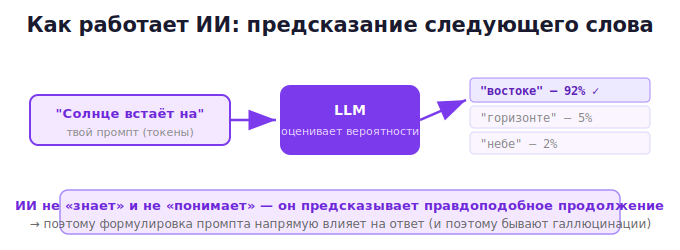

# 00 · Что такое ИИ и LLM 🖼️

> 🎯 **Цель блока:** понять, что такое современный ИИ (большие языковые модели), как он
> «думает» и почему от этого зависит, как с ним разговаривать.

---

## 📖 Что такое LLM

Когда говорят «ИИ» (ChatGPT, Claude, Gemini), почти всегда имеют в виду **большую языковую
модель** (LLM — Large Language Model). Это программа, обученная на огромном объёме текста,
которая умеет одно простое на вид действие:

> **Предсказывать следующее слово (точнее — токен) на основе предыдущих.**

```
   "Солнце встаёт на ___"  →  модель предсказывает: "востоке" (вероятнее всего)
```

🖼️ Как это работает по сути:



💡 ИИ **не «понимает»** в человеческом смысле и **не ищет** в базе данных. Он статистически
предсказывает, какой текст логично продолжает твой запрос, опираясь на закономерности из
обучения. Поэтому **то, как ты сформулируешь запрос, напрямую влияет на ответ**.

---

## ⭐ Токены — «кирпичики» текста

Модель работает не с буквами и не совсем со словами, а с **токенами** — кусочками текста
(примерно 3–4 символа или часть слова).

```
   "программирование"  →  ["программ", "ирование"]   (2 токена)
   "Hello world"        →  ["Hello", " world"]        (2 токена)
```

💡 Зачем это знать? Потому что **всё измеряется в токенах**: и сколько модель может
«удержать в голове» (контекст), и сколько стоит запрос через API. Грубая прикидка: 1000
токенов ≈ 750 слов ≈ 1.5 страницы текста.

---

## ⭐ Главное ограничение: «память» = контекст

У модели **нет постоянной памяти**. Она помнит только то, что находится в её **контекстном
окне** — текущем разговоре (твои сообщения + её ответы).

🖼️
```
   ┌─────────── Контекстное окно (память модели) ───────────┐
   │  твой промпт 1  →  ответ 1  →  твой промпт 2  →  ...    │
   │  всё это модель «видит» и учитывает                     │
   └─────────────────────────────────────────────────────────┘
   Новый разговор = чистый лист. Модель НЕ помнит прошлые чаты (по умолчанию).
```

💡 Это прямая параллель с памятью в программировании (ядро всего курса!). Контекст — это
«оперативная память» ИИ: что в неё попало, то модель учитывает; что вышло за пределы —
«забывается». Мы посвятим этому целый Уровень 2.

> ⚠️ Поэтому если начать новый чат, ИИ не вспомнит, о чём вы говорили вчера. И если разговор
> станет очень длинным — самое старое может «выпасть» из контекста. Управление контекстом —
> ключевой навык.

---

## 📖 Что ИИ умеет и не умеет

| ✅ Хорошо умеет | ⚠️ Плохо/осторожно |
|----------------|--------------------|
| писать и редактировать тексты | точные факты, цифры, даты (может выдумать) |
| объяснять, обучать, отвечать | свежие события (знает до даты обучения) |
| программировать, отлаживать код | сложная математика, точные вычисления |
| переводить, суммировать | «помнить» прошлые чаты |
| мозговой штурм, идеи | гарантировать правду без проверки |
| структурировать информацию | действия в реальном мире (без инструментов) |

> ⚠️ **Галлюцинации.** ИИ может уверенно выдать **неправду** — выдуманный факт, источник,
> цитату. Это не баг, а следствие того, как он работает (предсказывает правдоподобный
> текст). Всегда проверяй важные факты. Подробно — в Уровне 2.

---

## 📖 Какие бывают модели

- **ChatGPT** (OpenAI), **Claude** (Anthropic), **Gemini** (Google) — ведущие чат-ИИ.
- Бывают **разные версии**: побыстрее/попроще и помощнее/«поумнее». Для сложных задач бери
  самую сильную доступную.
- Есть **специализированные**: для картинок (Midjourney, DALL-E), кода, голоса.

💡 Принципы промптинга из этого курса работают **со всеми** текстовыми ИИ — они
универсальны.

---

## ❓ Проверь себя

1. Что такое LLM и что она по сути делает?
2. Что такое токен? Зачем знать про токены?
3. Что такое контекстное окно и почему это «память» модели?
4. Помнит ли ИИ прошлые разговоры по умолчанию?
5. Что такое галлюцинация и почему она возникает?
6. Назови 2 вещи, которые ИИ делает хорошо, и 2 — плохо.

---

## ✅ Чек-лист

- [ ] Понимаю, что ИИ предсказывает текст, а не «знает» и «понимает»
- [ ] Знаю про токены и их роль
- [ ] Понимаю контекст как память модели
- [ ] Знаю про галлюцинации и необходимость проверки
- [ ] Понимаю, что промптинг универсален для всех ИИ

➡️ Следующий: [01 · Инструменты и где работать](01-tools.md)
