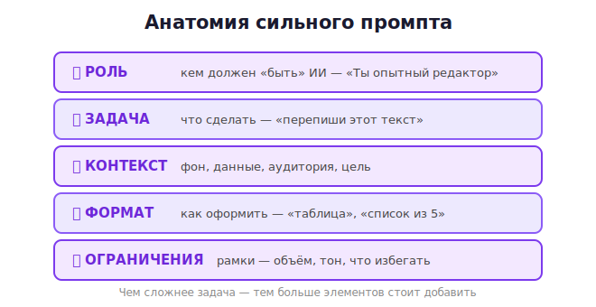

# 03 · Анатомия хорошего промпта 🖼️⭐

> 🎯 **Цель блока:** освоить «формулу» сильного промпта. Это самый практичный навык курса —
> используется в каждом запросе.

---

## ⭐ Пять элементов сильного промпта

Хороший промпт можно разложить на части. Не все нужны всегда, но чем сложнее задача — тем
больше элементов стоит добавить:

| Элемент | Что это | Пример |
|---------|---------|--------|
| **Роль** | кем должен «быть» ИИ | «Ты опытный редактор» |
| **Задача** | что сделать | «перепиши этот текст» |
| **Контекст** | фон, детали, данные | «текст для лендинга, аудитория — мамы» |
| **Формат** | как оформить ответ | «в виде маркированного списка» |
| **Ограничения** | рамки | «не длиннее 100 слов, без сложных терминов» |



---

## ⭐ Сравни: до и после

**❌ Без структуры:**
```
Помоги написать пост про наш новый кофе
```

**✅ Со структурой:**
```
Роль: ты SMM-специалист кофейни.
Задача: напиши пост для Instagram о новом сорте кофе «Эфиопия».
Контекст: вкус — ягодный, с нотками черники; аудитория — молодёжь 20–30 лет,
          любит уют и эстетику.
Формат: 3–4 коротких абзаца + 5 хештегов в конце.
Ограничения: дружелюбный тон, без канцелярита, добавь 1 эмодзи в начало.
```

💡 Второй промпт даст готовый к публикации пост. Первый — заготовку, которую придётся долго
дорабатывать. Разница — в структуре.

---

## 📖 Разбираем элементы

### 🎭 Роль
Задаёт «угол зрения» и стиль. ИИ подстраивает словарь и подход.
```
"Ты юрист — объясни договор простыми словами"
"Ты учитель математики для 5 класса — объясни дроби"
"Ты опытный программист — проверь этот код на ошибки"
```

### 🎯 Задача
Чёткий **глагол действия**: напиши, объясни, сравни, исправь, придумай, проанализируй,
переведи, суммируй. Одна основная задача за раз.

### 📋 Контекст
Всё, что помогает понять ситуацию: для кого, зачем, какие данные, какие ограничения
реальности. **Контекст — самый недооценённый элемент.** Чем больше релевантных деталей, тем
точнее ответ.

### 📐 Формат
Как должен выглядеть ответ: список, таблица, абзацы, JSON, по пунктам, с заголовками.
(Подробно — [модуль 05](05-output-format.md).)

### 🚧 Ограничения
Рамки: объём, тон, что включить/исключить, уровень сложности, язык.

---

## 📖 Шаблон, который всегда работает

Запомни этот каркас — он покрывает 90% задач:

```
Ты [роль].
[Задача] на тему [тема].
Контекст: [важные детали, аудитория, цель].
Формат: [как оформить].
Ограничения: [объём, тон, что избегать].
```

💡 Не нужно каждый раз заполнять все поля — для простых задач хватит задачи + контекста. Но
держи этот каркас в голове: когда ответ не устраивает, обычно не хватает одного из элементов.

---

## 🧪 Эксперимент: добавляй по одному элементу

Возьми задачу «напиши приветственное письмо новому сотруднику» и отправляй промпт, добавляя
по элементу:
1. Только задача.
2. + роль («ты HR-менеджер»).
3. + контекст («компания — IT-стартап, неформальная культура»).
4. + формат («3 абзаца»).
5. + ограничения («тёплый тон, упомяни первый рабочий день в понедельник»).

Смотри, как с каждым шагом ответ становится точнее. Это и есть сила структуры.

---

## ✅ Задачи

1. **Пять элементов.** Напиши промпт со всеми пятью элементами для задачи из своей работы/учёбы.
2. **Роль меняет ответ.** Задай один вопрос три раза с разными ролями (например «объясни
   блокчейн» как профессору, как другу в баре, как ребёнку). Сравни.
3. **Эксперимент с добавлением.** Выполни эксперимент выше (письмо сотруднику).
4. **Переделай слабый промпт.** Возьми любой свой старый расплывчатый запрос, перепиши по
   формуле, сравни результаты.
5. **Свой шаблон.** Составь личный шаблон-каркас под частую задачу (например «написать
   email»), сохрани в коллекцию.

---

## ❓ Проверь себя

1. Назови пять элементов сильного промпта.
2. Что делает элемент «роль»?
3. Почему контекст так важен?
4. Обязательно ли использовать все пять элементов всегда?
5. Что делать, если ответ ИИ не устраивает (с точки зрения структуры)?

---

## ✅ Чек-лист

- [ ] Знаю пять элементов промпта
- [ ] Использую роль для настройки стиля
- [ ] Даю достаточно контекста
- [ ] Держу в голове шаблон-каркас
- [ ] Умею усиливать промпт, добавляя недостающий элемент

➡️ Следующий: [04 · Ясность и конкретность](04-clarity.md)
