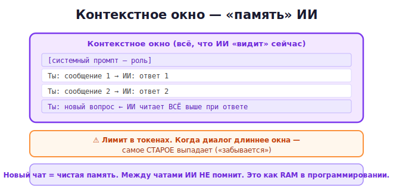

# 08 · Контекстное окно 🖼️⭐⭐

> 🎯 **Цель блока:** до конца понять «память» ИИ — контекстное окно. Это ядро курса и
> ключ к работе с ИИ на серьёзном уровне.

---

## 📖 Что такое контекстное окно

**Контекстное окно** — это всё, что ИИ «видит» и учитывает в данный момент: твои сообщения
+ его ответы в текущем разговоре. Это **вся память модели** на время диалога.



💡 Это прямая параллель с **оперативной памятью** из языков программирования (ядро всего
курса!). Что попало в контекст — ИИ учитывает. Что вышло за пределы — «забыто». Управление
этой памятью — главный навык эксперта.

---

## ⭐ Размер измеряется в токенах

У контекстного окна есть **лимит** — максимальное число токенов (модуль 00), которое
помещается. Разные модели — разные лимиты:

```
   небольшие модели:   ~4 000–8 000 токенов   (~3–6 страниц)
   современные:        ~128 000 токенов        (~целая книга)
   топовые:            ~1 000 000+ токенов      (~несколько книг)
```

💡 В лимит входит **всё**: системный промпт + вся история диалога + твой новый вопрос + сам
ответ. Когда разговор приближается к лимиту — начинаются проблемы (см. ниже).

---

## ⭐⭐ Что происходит при переполнении

Когда диалог становится длиннее контекстного окна, **самое старое выпадает** из памяти:

🖼️
```
   Длинный диалог растёт →→→→→→→→→→→→→→→→→→→→→
   ┌─────────────────────────────────────────┐
   │ [выпало] начало забыто │ ...середина... │ конец (помнит) │
   └─────────────────────────────────────────┘
        ▲                                    ▲
   модель уже НЕ видит это            видит и учитывает
```

> ⚠️ Признаки переполнения контекста:
> - ИИ «забывает» что обсуждали в начале;
> - перестаёт следовать инструкции, данной давно;
> - повторяется или противоречит сказанному ранее.
>
> Это не «глупость» модели — это вышедшая за окно память.

---

## 📖 Ключевое: между чатами памяти НЕТ

```
   Чат A: рассказал ИИ о своём проекте, всё обсудили
   Чат B (новый): "продолжим про мой проект" → ИИ НЕ ЗНАЕТ, о чём речь
```

💡 Каждый новый чат = чистая память. ИИ не помнит прошлые разговоры (если только у сервиса
нет отдельной функции «памяти» — но это надстройка, не само контекстное окно).

> 💡 Некоторые ИИ (ChatGPT, Claude) имеют функцию **долговременной памяти** — сохраняют
> факты о тебе между чатами. Но это ограниченная надстройка: основной рабочий инструмент —
> контекстное окно текущего диалога.

---

## 📖 Почему это меняет всё

Понимание контекста объясняет, **как правильно работать с ИИ**:

| Понимание | Практический вывод |
|-----------|--------------------|
| контекст = память | вся нужная инфа должна быть в текущем диалоге |
| лимит токенов | очень длинные документы не влезут целиком |
| старое выпадает | в долгом чате важное стоит повторять/напоминать |
| между чатами пусто | для новой темы — новый чат с полным вводом |
| ИИ читает контекст заново | порядок и структура информации важны |

💡 Эти выводы мы превратим в конкретные приёмы в следующих модулях: как структурировать
контекст, как использовать системные промпты, как вести долгие диалоги.

---

## 🧪 Эксперименты

1. **Забывание между чатами.** Расскажи ИИ факт о себе, начни новый чат, спроси этот факт —
   убедись, что не помнит.
2. **Длинный диалог.** Веди долгий разговор на одну тему, периодически спрашивая про самое
   первое сообщение. Заметь, если в какой-то момент начнёт «забывать».
3. **Прикинь токены.** Возьми текст на страницу (~500 слов ≈ ~700 токенов), оцени, сколько
   таких страниц влезет в окно твоей модели.

---

## ✅ Задачи

1. **Объясни своими словами**, что такое контекстное окно, как другу.
2. **Найди лимит** своей модели (спроси у ИИ или в документации). Прикинь в страницах.
3. **Воспроизведи забывание** между чатами.
4. **Спровоцируй переполнение** (очень длинный диалог) и зафиксируй признаки.
5. ⭐ **Сравни с памятью в программировании** — напиши, чем контекст ИИ похож на
   оперативную память (RAM) из языков курса.

---

## ❓ Проверь себя

1. Что такое контекстное окно?
2. В чём измеряется его размер? Что входит в лимит?
3. Что происходит, когда диалог превышает контекст?
4. Помнит ли ИИ информацию между разными чатами?
5. Почему понимание контекста меняет подход к работе с ИИ?
6. Чем контекст похож на оперативную память компьютера?

---

## ✅ Чек-лист

- [ ] Понимаю контекстное окно как память модели
- [ ] Знаю, что лимит измеряется в токенах и что в него входит
- [ ] Понимаю, что старое выпадает при переполнении
- [ ] Знаю, что между чатами памяти нет
- [ ] Вижу параллель с памятью в программировании

➡️ Следующий: [09 · Управление контекстом](09-managing-context.md)
