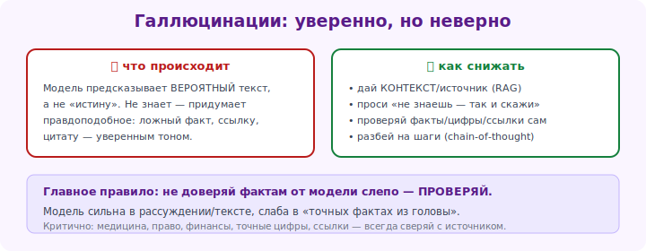

# 12 · Галлюцинации и достоверность 🖼️⭐

> 🎯 **Цель блока:** понять, почему ИИ выдаёт неправду, как это распознавать и снижать.
> Это критически важно: слепое доверие ИИ — главная причина серьёзных ошибок пользователей.

---

## 📖 Что такое галлюцинация

**Галлюцинация** — это когда ИИ **уверенно выдаёт ложную информацию**: выдуманный факт,
несуществующий источник, неверную цитату, ошибочную цифру.

```
   "Кто написал книгу 'Тени Венеры'?"
   ИИ: "Эту книгу написал Артур Кларк в 1962 году."   ← звучит уверенно,
                                                          но книги может не существовать
```

> ⚠️ Самое опасное — ИИ говорит неправду **тем же уверенным тоном**, что и правду. Нет
> «честного» сигнала «я не уверен». Поэтому важные факты нужно проверять.

---

## ⭐ Почему это происходит

Вспомни модуль 00: ИИ **предсказывает правдоподобный текст**, а не «знает факты». Если
правдоподобный ответ существует, но он неверен — ИИ всё равно его выдаст.

🖼️
```
   Вопрос  →  ИИ генерирует наиболее ВЕРОЯТНОЕ продолжение
                         ↓
              вероятное ≠ всегда правдивое
                         ↓
              получается уверенная, но ложная информация
```



💡 ИИ не врёт нарочно и не «знает», что ошибается. Он не отличает «вспомнил факт» от
«сгенерировал правдоподобную выдумку» — для него это один процесс.

---

## ⚠️ Где галлюцинации особенно вероятны

```
   ⚠️ Точные факты:     даты, цифры, статистика, имена
   ⚠️ Источники:        ссылки, названия книг/статей, цитаты (часто выдуманы!)
   ⚠️ Свежие события:   модель знает мир до даты обучения
   ⚠️ Узкие темы:       редкие, нишевые вопросы
   ⚠️ Математика:       сложные вычисления
   ⚠️ «А есть ли...?»:   ИИ склонен подтверждать, даже если нет
```

> ⚠️ **Особенно осторожно с источниками и цитатами.** ИИ часто генерирует
> правдоподобно выглядящие, но **несуществующие** ссылки и цитаты. Всегда проверяй их.

---

## ⭐ Как снижать галлюцинации

### 1. Разреши «не знаю»
```
"Если ты не уверен или не знаешь — так и скажи, не выдумывай."
"Отвечай только на основе предоставленного текста. Если ответа там нет — напиши
 'в тексте нет информации'."
```

### 2. Давай ИИ источник (заземление)
```
"Ответь на вопрос ТОЛЬКО на основе этого документа: [текст].
 Не используй внешние знания."
```
💡 Когда ИИ работает с данным ему текстом, а не «из головы», галлюцинаций гораздо меньше.
Это основа RAG (Senior-уровень, модуль 20).

### 3. Проси рассуждение и проверку
```
"Решай по шагам, показывая ход рассуждения."
"Проверь свой ответ на ошибки."
```

### 4. Запрашивай уровень уверенности
```
"Оцени, насколько ты уверен в каждом факте (высокая/средняя/низкая уверенность)."
```

### 5. Перепроверяй критичное
Для важных решений — **проверяй факты у первоисточника** (официальные сайты, документы),
сравнивай ответы разных ИИ, гугли спорное.

---

## 📖 Правило «доверяй, но проверяй»

| Можно довериться (низкий риск) | Обязательно проверять (высокий риск) |
|--------------------------------|--------------------------------------|
| черновик текста, идеи | медицинские, юридические, финансовые советы |
| объяснение общей концепции | конкретные цифры, даты, статистика |
| мозговой штурм | источники, цитаты, ссылки |
| структура, формулировки | факты для публикации/работы |
| код (но протестируй!) | всё, от чего зависят важные решения |

💡 Используй ИИ как **умного, но иногда ошибающегося ассистента**, а не как оракула.
Финальная ответственность — на тебе.

---

## 🧪 Эксперименты

1. **Поймай галлюцинацию.** Спроси про что-то очень нишевое или попроси «10 цитат
   писателя X с источниками» — проверь, существуют ли они.
2. **Заземление.** Дай ИИ короткий текст и задай вопрос, ответа на который в нём нет, с
   инструкцией «отвечай только по тексту». Убедись, что он не выдумывает.
3. **Разреши не знать.** Сравни ответы на сложный вопрос с инструкцией «можешь сказать не
   знаю» и без неё.

---

## ✅ Задачи

1. **Объясни своими словами**, почему ИИ галлюцинирует.
2. **Список риска.** Выпиши 5 типов задач, где особенно нужна проверка.
3. **Заземли ИИ** — заставь отвечать только по данному тексту, проверь, что не выдумывает.
4. **Проверка источников.** Попроси факты с источниками, проверь хотя бы один источник.
5. **Снизь галлюцинации** — собери промпт с приёмами (разреши не знать + источник + проверка).
6. ⭐ **Кейс из жизни.** Найди реальную задачу, где ошибка ИИ дорого обошлась бы, и опиши,
   как ты бы проверял ответ.

---

## ❓ Проверь себя

1. Что такое галлюцинация? Почему она опасна?
2. Почему ИИ галлюцинирует (связь с тем, как он работает)?
3. Где галлюцинации особенно вероятны?
4. Назови 3 способа снизить галлюцинации.
5. Что такое «заземление» на источник?
6. Какие задачи можно доверить ИИ, а какие — обязательно проверять?

---

## ✅ Чек-лист «Уровень 2 — КОНТЕКСТ — пройден» 🎉

- [ ] Понимаю контекстное окно как память модели
- [ ] Умею управлять контекстом (структура, перенос, новый чат)
- [ ] Использую системные промпты для постоянных ролей
- [ ] Веду сложные многошаговые диалоги
- [ ] Распознаю галлюцинации и умею их снижать
- [ ] Применяю правило «доверяй, но проверяй»

> 🏆 Это было ядро курса. Ты понимаешь «память» ИИ и умеешь ею управлять — это отличает
> уверенного пользователя от новичка, который удивляется, «почему ИИ меня не понял».

➡️ ✅ [Задачи уровня 2](TASKS.md) → 🚀 [Пет-проект: свой ИИ-ассистент](PROJECT.md)
