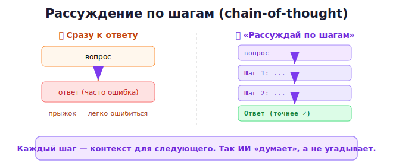

# 13 · Рассуждение по шагам (chain-of-thought) 🖼️⭐

> 🎯 **Цель блока:** освоить самый мощный приём для сложных задач — заставить ИИ
> **рассуждать по шагам**, а не выдавать ответ сразу. Это резко повышает точность.

---

## 📖 Проблема: ИИ «спешит» с ответом

Когда ИИ отвечает на сложный вопрос сразу, он чаще ошибается — особенно в логике, математике,
многоступенчатых задачах. Причина: он генерирует ответ «на лету», без обдумывания.

```
❌ "В корзине 3 яблока, ты добавил 2, потом съел половину. Сколько осталось?"
   ИИ (сразу): "2 яблока"   ← может ошибиться, прыгнув к ответу
```

---

## ⭐⭐ Решение: «думай по шагам»

Попроси ИИ **рассуждать пошагово** перед ответом:

```
✅ "В корзине 3 яблока, ты добавил 2, потом съел половину. Сколько осталось?
    Рассуждай по шагам."

   ИИ:
   Шаг 1: было 3 яблока.
   Шаг 2: добавили 2 → стало 5.
   Шаг 3: съели половину → 5 / 2 = 2.5.
   Ответ: 2.5 яблока.
```



💡 Магическая фраза: **«Рассуждай шаг за шагом»** (think step by step). Заставляя ИИ
проговаривать логику, ты резко повышаешь точность на задачах с рассуждением.

---

## 📖 Почему это работает

ИИ генерирует текст последовательно. Когда он сначала пишет рассуждение, **каждый шаг
становится контекстом для следующего** — и финальный ответ опирается на выстроенную логику,
а не на «угадывание». Рассуждение буквально помогает модели «думать».

---

## ⭐ Варианты приёма

### Простой
```
"...Объясни ход решения по шагам."
"Прежде чем ответить, разбери задачу пошагово."
```

### С планом
```
"Сначала составь план решения, затем выполни его по пунктам, потом дай ответ."
```

### Самопроверка
```
"Реши задачу, затем проверь своё решение и укажи, нет ли ошибок."
```

### Несколько подходов
```
"Реши эту задачу двумя разными способами и сравни результаты."
```

---

## ⭐ Когда применять chain-of-thought

| Задача | Помогает? |
|--------|-----------|
| математика, логика | ⭐⭐⭐ сильно |
| многоступенчатые рассуждения | ⭐⭐⭐ сильно |
| анализ, сравнение вариантов | ⭐⭐ заметно |
| планирование | ⭐⭐ заметно |
| принятие решений | ⭐⭐ заметно |
| простой факт / короткий текст | — не нужно |

💡 Для простых задач рассуждение избыточно. Для сложных — обязательно.

> 💡 **Важно:** многие современные «рассуждающие» модели (reasoning models) делают это
> **автоматически** — внутренне думают перед ответом. Но явная просьба «по шагам» всё равно
> полезна, особенно для обычных моделей и для прозрачности (ты видишь логику и можешь
> проверить).

---

## ⭐ Бонус: рассуждение помогает находить ошибки

Когда ИИ показывает ход мысли, **ты можешь проверить логику** и указать, где он свернул не
туда:

```
"В шаге 3 ты неправильно посчитал — пересмотри с этого места."
```

💡 Видимое рассуждение = прозрачность. Ты не просто получаешь ответ, а видишь, **как** ИИ к
нему пришёл, и можешь поправить.

---

## 🧪 Эксперимент: с рассуждением и без

1. Возьми логическую задачу или головоломку.
2. Попроси ответ сразу.
3. Попроси «рассуждай по шагам».
4. Сравни правильность. Обычно второй надёжнее.

---

## ✅ Задачи

1. **Сравни подходы** — реши логическую задачу с рассуждением и без, сравни.
2. **План + решение** — заставь ИИ сначала составить план, потом решить.
3. **Самопроверка** — попроси решить и проверить себя.
4. **Два способа** — реши задачу двумя методами, сравни результаты.
5. **Поймай ошибку** — найди в рассуждении ИИ ошибочный шаг и попроси исправить с него.
6. ⭐ **Сложное решение** — примени chain-of-thought к реальному решению из жизни (выбор,
   планирование), оцени, помогло ли структурированное рассуждение.

---

## ❓ Проверь себя

1. Почему ИИ ошибается, отвечая сразу?
2. Что такое chain-of-thought и какая «магическая фраза» его запускает?
3. Почему пошаговое рассуждение повышает точность?
4. Для каких задач это особенно полезно, а для каких — нет?
5. Как видимое рассуждение помогает находить ошибки?

---

## ✅ Чек-лист

- [ ] Прошу ИИ рассуждать по шагам для сложных задач
- [ ] Использую варианты: план, самопроверка, два способа
- [ ] Понимаю, почему рассуждение повышает точность
- [ ] Проверяю логику по видимым шагам
- [ ] Не применяю там, где не нужно

➡️ Следующий: [14 · Few-shot и шаблоны промптов](14-few-shot.md)
