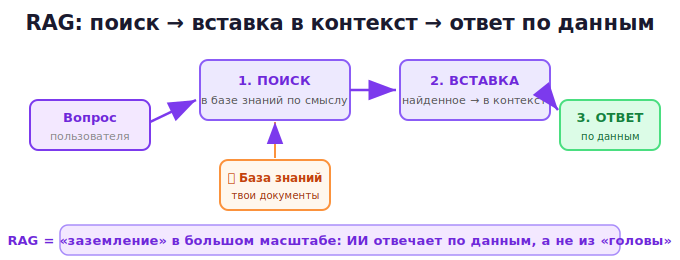

# 20 · RAG и базы знаний 🖼️⭐

> 🎯 **Цель блока:** понять RAG — способ дать ИИ доступ к **твоим** данным и актуальной
> информации, преодолевая лимиты памяти и устаревание знаний.

---

## 📖 Проблема: ИИ не знает твои данные и свежие факты

Два ограничения из ядра курса:
- ИИ знает мир только **до даты обучения** (свежего не знает);
- в контекст **не влезут** все твои документы (лимит окна, модуль 08);
- ИИ **галлюцинирует** на узких темах (модуль 12).

🎯 Решение — **RAG** (Retrieval-Augmented Generation, «генерация с поиском»): найти нужные
куски информации и **вложить их в контекст** перед ответом.

---

## ⭐ Как работает RAG



Промпт превращается в:
```
"Ответь на вопрос, используя ТОЛЬКО эту информацию:
[найденные релевантные куски документов]

Вопрос: [вопрос пользователя]"
```

💡 RAG — это **заземление** (модуль 12) в большом масштабе: ИИ отвечает по реальным данным,
а не по памяти. Это резко снижает галлюцинации и даёт доступ к твоим/свежим данным.

---

## 📖 Где ты уже встречал RAG

Многие ИИ-функции — это RAG под капотом:
- **«Чат с PDF/документом»** — ищет в твоём файле, отвечает по нему;
- **поиск в интернете** у ИИ — находит свежие страницы, отвечает по ним;
- **корпоративные ассистенты** — отвечают по базе знаний компании;
- **ИИ в Notion/документах** — работают с твоими записями.

💡 Когда ИИ «знает» то, чего нет в его обучении (твой документ, сегодняшние новости) — почти
всегда это RAG: информацию нашли и положили в контекст.

---

## ⭐ Зачем это знать как пользователю

Даже без программирования понимание RAG делает тебя сильнее:

```
✅ Понимаешь, почему «чат с документом» надёжнее обычного вопроса (заземление).
✅ Знаешь: чтобы ИИ ответил по свежим/своим данным — нужно их ему ДАТЬ.
✅ Понимаешь ограничения: ИИ отвечает по тому, что НАШЛОСЬ — если поиск промахнулся,
   ответ будет неполным.
✅ Умеешь проверять: «на основе чего ты это сказал?» — хороший RAG укажет источник.
```

---

## 📖 Простейший «ручной RAG»

Ты можешь делать RAG руками, без всякого программирования:

```
1. Собери релевантные документы/заметки.
2. Вставь нужные куски в промпт.
3. Попроси: "Отвечай только на основе этого. Указывай, откуда взял."
```

💡 Это ровно то, что ты делал в модуле 17 (работа с документами). RAG-системы просто
**автоматизируют шаг поиска** для больших баз знаний.

---

## 📖 Как устроены настоящие RAG-системы (обзор)

> 💡 Для тех, кто хочет глубже (часто требует программирования — связь с твоими языковыми
> треками):

```
1. Документы разбивают на куски (chunks).
2. Каждый кусок превращают в «эмбеддинг» — вектор, отражающий смысл.
3. Векторы хранят в векторной базе данных.
4. На вопрос находят куски с ближайшим смыслом (семантический поиск).
5. Найденное вкладывают в промпт.
```

Инструменты: LangChain, LlamaIndex, векторные БД (Pinecone, Chroma, pgvector). Это уже
программирование с использованием API (модуль 22).

---

## ✅ Задачи

1. **Объясни RAG** своими словами, как другу — зачем и как.
2. **Ручной RAG** — реши задачу, дав ИИ конкретные документы и инструкцию «только по ним».
3. **Чат с документом** — если доступна загрузка файлов, загрузи документ, задай вопросы,
   проверь заземление (спроси то, чего в документе нет).
4. **Источники** — попроси ИИ указывать, на основе чего он отвечает.
5. **Ограничения RAG** — придумай случай, где RAG даст неполный ответ (поиск промахнулся).
6. ⭐ **Дизайн базы знаний** — опиши, как бы ты построил ИИ-ассистента по своим
   материалам (что в базе, как искать, как проверять).

---

## ❓ Проверь себя

1. Какие проблемы решает RAG?
2. Опиши 3 шага RAG (поиск → вставка → ответ).
3. Как RAG связан с «заземлением» из модуля 12?
4. Где ты уже встречал RAG (примеры функций)?
5. Как сделать «ручной RAG» без программирования?
6. В чём ограничение RAG (когда ответ будет неполным)?

---

## ✅ Чек-лист

- [ ] Понимаю, что RAG = поиск + вставка в контекст + ответ по данным
- [ ] Вижу связь RAG с заземлением
- [ ] Узнаю RAG в функциях ИИ (чат с PDF, поиск)
- [ ] Умею делать «ручной RAG»
- [ ] Понимаю ограничения и важность проверки источников

➡️ Следующий: [21 · Агенты и инструменты](21-agents-tools.md)
