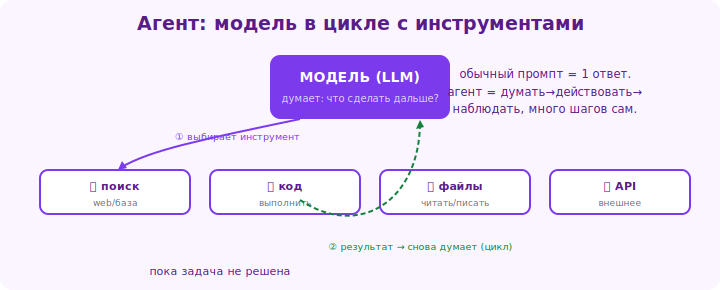

# 21 · Агенты и инструменты 🖼️⭐

> 🎯 **Цель блока:** понять, как ИИ выходит за рамки текста — использует **инструменты**
> (поиск, калькулятор, код, API) и действует как **агент**, решая многошаговые задачи.

---

## 📖 Проблема: чистый ИИ только генерирует текст

Сам по себе ИИ не умеет: искать в интернете, считать точно, запускать код, отправлять
письма, читать файлы. Он только предсказывает текст (модуль 00). Чтобы **действовать** в
мире, ему дают **инструменты**.

---

## ⭐ Инструменты (function calling / tools)

ИИ можно подключить **инструменты** — функции, которые он вызывает, когда нужно:

🖼️
```
   Вопрос: "Какая сейчас погода в Москве и сколько это по Фаренгейту?"
        │
        ▼
   ИИ понимает: нужны инструменты
        ├──► [инструмент: погода] → получает 15°C
        └──► [инструмент: калькулятор] → 15°C = 59°F
        │
        ▼
   ИИ собирает ответ из результатов инструментов
```

Типичные инструменты:
```
🔍 веб-поиск       — свежая информация
🧮 калькулятор/код — точные вычисления
📂 чтение файлов   — работа с документами
🌐 вызов API       — данные из сервисов
✉️ действия        — отправить письмо, создать задачу
```



💡 Инструменты решают слабости ИИ: точные вычисления (калькулятор), свежесть (поиск),
действия в мире (API). ИИ становится не «болталкой», а **исполнителем**.

---

## ⭐ Как это работает (механика)

```
1. Разработчик описывает ИИ доступные инструменты (что умеют, какие параметры).
2. ИИ сам решает, когда какой инструмент нужен.
3. ИИ формирует «вызов»: инструмент + параметры.
4. Система выполняет вызов, возвращает результат ИИ.
5. ИИ использует результат для ответа (или вызывает ещё инструменты).
```

💡 Решение «какой инструмент и когда» принимает **сам ИИ** на основе задачи. Это и
называется **function calling** (вызов функций). Технически — через API (модуль 22).

---

## ⭐⭐ Агенты — ИИ, который действует в цикле

**Агент** — это ИИ, который решает сложную задачу **сам, в несколько шагов**, используя
инструменты и оценивая результаты:

🖼️
```
   Цель: "Собери отчёт о конкурентах и сохрани в файл"
        │
        ▼
   ┌─────── цикл агента ────────┐
   │ 1. Думает: что делать?      │
   │ 2. Выбирает инструмент      │
   │ 3. Выполняет действие       │
   │ 4. Смотрит результат        │
   │ 5. Решает: дальше или готово?│ ──нет──┐
   └─────────────▲────────────────┘        │
                 └────────────────────────┘
        │ готово
        ▼
   Результат
```

```
   Агент сам: ищет конкурентов → собирает данные о каждом →
              анализирует → форматирует → сохраняет в файл
   Без пошаговых команд от человека — только финальная цель.
```

💡 Агент = ИИ + инструменты + цикл «думай → действуй → наблюдай». Это передовая область:
на ней строят автоматизацию, ИИ-ассистентов, «ИИ-сотрудников».

> ⚠️ Агенты мощны, но **могут ошибаться на каждом шаге**, и ошибки накапливаются. Чем
> больше автономии — тем важнее контроль, ограничения и проверка результатов. Не давай
> агенту необратимых действий без подтверждения.

---

## 📖 Где ты встречаешь агентов и инструменты

- **ИИ с веб-поиском** (Perplexity, ChatGPT search) — инструмент поиска;
- **ИИ, пишущий и запускающий код** (Code Interpreter / анализ данных);
- **ИИ-ассистенты в коде** (как Claude Code, Cursor) — читают/пишут файлы, запускают команды;
- **автоматизация** (Zapier AI, агенты в n8n) — действия в сервисах;
- **«операторы»** — ИИ, управляющий браузером/компьютером.

💡 Тренд индустрии — от «чат-бота, который пишет текст» к «агенту, который выполняет
задачи». Понимать это — значит видеть, куда движется работа с ИИ.

---

## 📖 Как пользователю работать с агентами

```
✅ Ставь чёткую цель и критерии готовности.
✅ Задавай ограничения («не трать больше X», «спроси перед удалением»).
✅ Проверяй промежуточные результаты на важных задачах.
✅ Понимай: больше автономии = больше риск ошибок.
✅ Начинай с малого, расширяй доверие по мере проверки.
```

---

## ✅ Задачи

1. **Объясни** разницу между обычным чат-ИИ и агентом.
2. **Инструменты на практике** — задай ИИ с веб-поиском вопрос о свежем событии; задай ИИ
   с кодом точный расчёт. Сравни с ответом «чистого» ИИ.
3. **Точность вычислений** — попроси обычный ИИ и ИИ-с-инструментом посчитать что-то
   сложное, сравни.
4. **Цель для агента** — сформулируй задачу для агента с чёткой целью, критериями и
   ограничениями.
5. ⭐ **Дизайн агента** — опиши, какого ИИ-агента ты бы построил под свою рутину: цель,
   инструменты, ограничения, проверки.

---

## ❓ Проверь себя

1. Почему чистому ИИ нужны инструменты?
2. Что такое function calling? Кто решает, какой инструмент вызвать?
3. Что такое агент? Опиши его цикл.
4. Чем агент отличается от обычного чат-ИИ?
5. Почему у агентов накапливаются ошибки и как с этим быть?
6. Где ты уже встречал инструменты/агентов?

---

## ✅ Чек-лист

- [ ] Понимаю, зачем ИИ инструменты
- [ ] Знаю, что такое function calling
- [ ] Понимаю агента как цикл «думай → действуй → наблюдай»
- [ ] Вижу инструменты/агентов в реальных продуктах
- [ ] Знаю принципы безопасной работы с агентами

➡️ Следующий: [22 · Работа через API](22-api.md)
