# 🤖 Дорожная карта: работа с ИИ и промпты

Путь от «никогда не пользовался ИИ» до «эксперт, который выжимает из ИИ максимум» —
промпт-инжиниринг, контекст, агенты, API.

> 💡 **Связь с остальным курсом.** Во всех языках программирования ядро — это **память**.
> У ИИ тоже есть память — это **контекст** (контекстное окно). Научиться работать с ИИ —
> значит научиться управлять его контекстом: что модель «помнит», что «забывает» и как
> подать ей информацию, чтобы получить нужный результат. Этот курс — про это.

> 📌 Этот трек **не требует** знания программирования (кроме Senior-блока про API). Он
> полезен всем: студентам, специалистам, разработчикам, людям любой профессии.

---

## 🧠 Главная идея: ИИ — мощный, но «без памяти между разговорами»

| Заблуждение новичка | Как на самом деле |
|---------------------|-------------------|
| «ИИ всё знает и понимает меня» | ИИ предсказывает текст; качество зависит от **промпта** |
| «ИИ помнит наш прошлый разговор» | По умолчанию — только в рамках **текущего контекста** |
| «Достаточно задать вопрос» | Хороший результат = чёткая роль + задача + контекст + формат |
| «Если ошибся — это глупая модель» | Чаще дело в **нечётком промпте** |

🎯 Главный навык курса: **формулировать промпты так, чтобы ИИ давал именно то, что нужно** —
и понимать, как работает контекст (его «память»), её пределы и как ею управлять.

---

## 🗺️ Карта курса

```mermaid
flowchart TD
    Start([🥚 Старт: никогда не пользовался ИИ]) --> S0

    subgraph LVL0 [🥚 Уровень 0 — Знакомство]
        S0[00 · Что такое ИИ и LLM]
        S1[01 · Инструменты и где работать]
        S2[02 · Первый промпт]
    end

    subgraph LVL1 [🐣 Уровень 1 — Основы промптинга]
        B1[03 · Анатомия промпта]
        B2[04 · Ясность и конкретность]
        B3[05 · Формат вывода]
        B4[06 · Контекст и примеры]
        B5[07 · Итеративное улучшение]
    end

    subgraph LVL2 [🐥 Уровень 2 — КОНТЕКСТ ⭐ память ИИ]
        M1[08 · Контекстное окно]
        M2[09 · Управление контекстом]
        M3[10 · Системные промпты и роли]
        M4[11 · Многошаговые диалоги]
        M5[12 · Галлюцинации и достоверность]
    end

    subgraph LVL3 [🐥 Уровень 3 — Продвинутые техники]
        D1[13 · Рассуждение по шагам]
        D2[14 · Few-shot и шаблоны]
        D3[15 · Роли и персоны]
        D4[16 · Декомпозиция задач]
        D5[17 · Работа с данными и документами]
        D6[18 · Промпты для кода и творчества]
    end

    subgraph LVL4 [🦅 Уровень 4 — Эксперт]
        Z1[19 · Промпт-инжиниринг как дисциплина]
        Z2[20 · RAG и базы знаний]
        Z3[21 · Агенты и инструменты]
        Z4[22 · Работа через API]
        Z5[23 · Оценка и тестирование]
        Z6[24 · Этика, безопасность, ограничения]
    end

    S0-->S1-->S2-->B1
    B1-->B2-->B3-->B4-->B5-->M1
    M1-->M2-->M3-->M4-->M5-->D1
    D1-->D2-->D3-->D4-->D5-->D6-->Z1
    Z1-->Z2-->Z3-->Z4-->Z5-->Z6-->Done
    Done([🦅 Эксперт по работе с ИИ])
```

---

## 📂 Содержание

### 🥚 Уровень 0 — Знакомство
- [00 · Что такое ИИ и LLM](00-setup/00-what-is-ai.md)
- [01 · Инструменты и где работать](00-setup/01-tools.md)
- [02 · Первый промпт](00-setup/02-first-prompt.md)

### 🐣 Уровень 1 — Основы промптинга
- [03 · Анатомия хорошего промпта](01-basics/03-prompt-anatomy.md)
- [04 · Ясность и конкретность](01-basics/04-clarity.md)
- [05 · Формат вывода](01-basics/05-output-format.md)
- [06 · Контекст и примеры](01-basics/06-context-examples.md)
- [07 · Итеративное улучшение](01-basics/07-iteration.md)
- ✅ [Задачи уровня 1](01-basics/TASKS.md)
- 🚀 [Пет-проект: личный набор промптов](01-basics/PROJECT.md)

### 🐥 Уровень 2 — КОНТЕКСТ ⭐ (память ИИ)
- [08 · Контекстное окно](02-context/08-context-window.md)
- [09 · Управление контекстом](02-context/09-managing-context.md)
- [10 · Системные промпты и роли](02-context/10-system-prompts.md)
- [11 · Многошаговые диалоги](02-context/11-multistep-dialogs.md)
- [12 · Галлюцинации и достоверность](02-context/12-hallucinations.md)
- ✅ [Задачи уровня 2](02-context/TASKS.md)
- 🚀 [Пет-проект: свой ИИ-ассистент (системный промпт)](02-context/PROJECT.md)

### 🐥 Уровень 3 — Продвинутые техники
- [13 · Рассуждение по шагам (chain-of-thought)](03-middle/13-chain-of-thought.md)
- [14 · Few-shot и шаблоны промптов](03-middle/14-few-shot.md)
- [15 · Роли и персоны](03-middle/15-roles-personas.md)
- [16 · Декомпозиция задач](03-middle/16-decomposition.md)
- [17 · Работа с данными и документами](03-middle/17-working-with-data.md)
- [18 · Промпты для кода и творчества](03-middle/18-code-creative.md)
- ✅ [Задачи уровня 3](03-middle/TASKS.md)
- 🚀 [Пет-проект: автоматизация рутины](03-middle/PROJECT.md)

### 🦅 Уровень 4 — Эксперт
- [19 · Промпт-инжиниринг как дисциплина](04-senior/19-prompt-engineering.md)
- [20 · RAG и базы знаний](04-senior/20-rag.md)
- [21 · Агенты и инструменты](04-senior/21-agents-tools.md)
- [22 · Работа через API](04-senior/22-api.md)
- [23 · Оценка и тестирование промптов](04-senior/23-evaluation.md)
- [24 · Этика, безопасность, ограничения](04-senior/24-ethics-safety.md)
- ✅ [Задачи уровня 4](04-senior/TASKS.md)
- 🚀 [Финальные пет-проекты](04-senior/PROJECT.md)

---

## 🧭 Легенда значков

📖 теория · 🖼️ схема · 🛠️ практика · 💡 мысль · ⚠️ опасность · ✅ задача · 🚀 проект · ❓ самопроверка

> 💡 **Как учиться:** этот курс на 80% — практика. У каждого блока есть промпты для
> повторения. Бери любой бесплатный ИИ (ChatGPT, Claude, Gemini) и **сразу пробуй** каждый
> приём. Теория без практики тут бесполезна.

Начни здесь 👉 [00 · Что такое ИИ и LLM](00-setup/00-what-is-ai.md)
