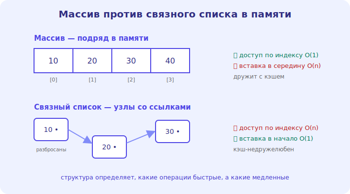

# 03 · Массивы и динамические массивы 🖼️⭐

> 🎯 **Цель блока:** понять массив — базовую структуру данных, лежащую в памяти **непрерывно**,
> и как работает динамический массив (list/vector).

---

## ⭐ Массив — данные подряд в памяти

**Массив** — набор элементов, лежащих в памяти **непрерывно**, один за другим. Доступ к любому
элементу — по **индексу**, мгновенно.

🖼️


```
   индекс:   0    1    2    3    4
           [ 10 ][ 20 ][ 30 ][ 40 ][ 50 ]   ← лежат подряд в памяти
   доступ a[2] = 30 → мгновенно (адрес = начало + 2 × размер элемента)
```

💡 ⭐ Непрерывность — ключ: чтобы получить `a[i]`, компьютер вычисляет адрес арифметикой
(начало + i × размер) — это **O(1)**, мгновенно, независимо от размера массива. Это прямая связь
с указателями и памятью из [C](../../C/02-memory/10-arrays-strings.md): массив — это адрес начала
+ смещение. Непрерывность ещё и дружит с кэшем (соседние элементы рядом).

---

## ⭐ Сложность операций массива

```
   доступ по индексу a[i]      → O(1)   мгновенно ✅
   изменение a[i] = x          → O(1)   мгновенно ✅
   поиск элемента (есть ли x)  → O(n)   перебор 😐
   вставка/удаление в КОНЕЦ    → O(1)   (для динамического, амортизированно) ✅
   вставка/удаление в СЕРЕДИНУ → O(n)   надо сдвигать все следующие элементы 😟
```

💡 ⭐ Запомни профиль массива: **быстрый доступ по индексу, медленная вставка в середину**.
Вставить в середину = сдвинуть все элементы после неё → O(n). Это определяет, когда массив
подходит (часто читаешь по индексу), а когда нет (часто вставляешь в середину — бери список,
модуль 04).

---

## ⭐ Динамический массив (list, vector, ArrayList)

Обычный массив имеет **фиксированный** размер. **Динамический массив** растёт автоматически:

```
   внутри — обычный массив с запасом ёмкости (capacity > size)
   добавляешь элемент → если место есть, кладёшь (O(1))
   место кончилось → выделяет НОВЫЙ массив вдвое больше, копирует всё (O(n)), кладёт
```

🖼️
```
   [10][20][30][__][__]   size=3, capacity=5 → push(40): [10][20][30][40][__]  O(1)
   [10][20][30][40][50]   полный → push(60): новый ×2, копируем → [10][20][30][40][50][60][__]...[__]
```

💡 ⭐ **Амортизированная O(1)** для добавления в конец: иногда дорого (копирование при росте), но
**в среднем** дёшево, потому что удвоение происходит редко. Это `list` в Python, `vector` в C++,
`ArrayList` в Java — все так устроены. Помнишь «свой Vector» из [C-трека](../../C/02-memory/PROJECT.md)?
Вот его теория сложности.

---

## 📖 Когда использовать массив

```
   ✅ часто обращаешься по индексу / читаешь по позиции
   ✅ добавляешь в основном в конец
   ✅ важна скорость и компактность (дружит с кэшем)
   ❌ часто вставляешь/удаляешь в начале или середине (бери связный список)
```

💡 Массив — структура по умолчанию для большинства задач: он простой, быстрый по индексу и
кэш-эффективный. К другим структурам переходят, когда профиль операций не подходит.

---

## ⚠️ Ловушки

- ❌ Вставлять/удалять в середине массива в цикле — это O(n) на операцию, легко получить O(n²).
- ❌ Думать, что динамический массив «бесплатно» растёт — рост = копирование (амортизированно ок,
  но всплески есть).
- ❌ Выход за границы индекса (off-by-one, обращение к a[n]).
- ❌ Игнорировать, что массив дружит с кэшем, а список — нет (важно для производительности).

---

## 🛠️ Практика

1. Реализуй поиск элемента в массиве (O(n)) и доступ по индексу (O(1)) — прочувствуй разницу.
2. Реализуй «удаление по индексу» сдвигом — увидь, что это O(n).
3. Добавляй элементы в динамический массив и наблюдай (если язык позволяет), как растёт ёмкость.

---

## ✅ Задачи

1. **Объясни**, почему доступ по индексу — O(1) (непрерывность + арифметика адреса).
2. **Перечисли** сложность операций массива.
3. **Объясни** динамический массив и амортизированную O(1).
4. **Назови**, когда массив подходит, а когда нет.

---

## ❓ Проверь себя

1. Почему массив даёт мгновенный доступ по индексу?
2. Почему вставка в середину — O(n)?
3. Как работает рост динамического массива?
4. Когда лучше не использовать массив?

---

## ✅ Чек-лист

- [ ] Понимаю массив как непрерывную память + доступ по индексу O(1)
- [ ] Знаю сложность всех операций массива
- [ ] Понимаю динамический массив и амортизацию
- [ ] Знаю, когда массив подходит

➡️ Следующий: [04 · Связные списки](04-linked-lists.md)
