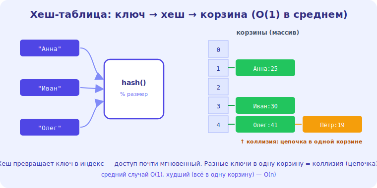

# 06 · Хеш-таблицы 🖼️⭐⭐

> 🎯 **Цель блока:** освоить хеш-таблицу — структуру, дающую **мгновенный** доступ по ключу.
> Это, возможно, самая полезная структура в практическом программировании.

---

## ⭐⭐ Хеш-таблица — мгновенный доступ по ключу

**Хеш-таблица** хранит пары «ключ → значение» и даёт доступ к значению по ключу за **O(1)** — в
среднем мгновенно, независимо от размера. Это `dict` в Python, `HashMap` в Java, `map` в C++,
объекты в JS.

🖼️
```
   ключ "Аня" ──► ХЕШ-ФУНКЦИЯ ──► число (индекс) ──► ячейка массива со значением
        "Боб" ──► хеш ──► другой индекс ──► другая ячейка

   доступ d["Аня"] → посчитал хеш → прыгнул в ячейку → O(1) ✅
```

💡 ⭐⭐ Магия в **хеш-функции**: она превращает ключ (строку, число) в индекс массива. Вместо
перебора («где же Аня?») — мгновенный прыжок в нужную ячейку. Поэтому проверка «есть ли элемент»,
которая в списке O(n), в хеш-таблице (множестве) — **O(1)**. Это меняет правила игры для огромного
числа задач.

---

## ⭐⭐ Сложность — почему это супероружие

```
   вставка d[key] = val       → O(1) в среднем ✅
   доступ   d[key]            → O(1) в среднем ✅
   проверка key in d          → O(1) в среднем ✅
   удаление del d[key]        → O(1) в среднем ✅
```

💡 ⭐⭐ Почти всё за O(1)! Поэтому хеш-таблица — **первое, о чём думают** при задачах вида «найти»,
«посчитать частоту», «проверить наличие», «сгруппировать». Очень часто задача с наивным решением
O(n²) превращается в O(n) добавлением хеш-таблицы. Это главный приём ускорения (уровень 4).

```
   пример: «найти два числа с суммой = target»
   наивно: двойной цикл O(n²)
   с хешем: один проход, проверяя «есть ли (target − x) в множестве» → O(n) ✅
```

---

## 📖 Коллизии — когда ключи дают один индекс

```
   КОЛЛИЗИЯ — два разных ключа дали ОДИН индекс (хеш-функция не идеальна)
   решения:
   - ЦЕПОЧКИ (chaining): в ячейке — связный список элементов с этим индексом
   - ОТКРЫТАЯ АДРЕСАЦИЯ: ищем следующую свободную ячейку
```



💡 Коллизии неизбежны (ключей больше, чем ячеек). Их разрешают цепочками или поиском соседней
ячейки. При **плохой** хеш-функции или переполнении много коллизий → операции деградируют к O(n)
(худший случай). Хорошая реализация (и языковые `dict`) держат это под контролем, поэтому на
практике — O(1).

⚠️ Поэтому говорят «O(1) **в среднем**»: в худшем случае (много коллизий) — O(n), но это редко.

---

## ⭐ Множество (set) — хеш-таблица без значений

```
   МНОЖЕСТВО (set) — хеш-таблица, хранящая только КЛЮЧИ (без значений)
   быстрая проверка «есть ли элемент» O(1), уникальность элементов
```

💡 `set` — это хеш-таблица для задач «есть ли?», «убрать дубли», «пересечение/объединение». Те же
O(1)-операции. Связь с [dict/set в Python](../../Python/03-middle/14-dict-set-hashing.md) и
[HashMap в Rust](../../Rust/03-middle/17-collections.md) — там это разобрано на конкретных языках.

---

## ⚠️ Ловушки

- ❌ Забывать, что O(1) — **в среднем**; в худшем случае (коллизии) — O(n).
- ❌ Использовать изменяемый объект как ключ (ключ должен быть хешируемым/неизменяемым).
- ❌ Полагаться на порядок элементов (классическая хеш-таблица порядок не гарантирует).
- ❌ Не видеть, что хеш-таблица превращает O(n²) в O(n) — это главный пропускаемый приём.

---

## 🛠️ Практика

1. Посчитай частоту слов в тексте через хеш-таблицу (`dict`) — O(n).
2. Реши «два числа с суммой target» за O(n) с помощью множества (вместо двойного цикла).
3. Убери дубликаты из списка через `set` и сравни скорость с наивным способом.

---

## ✅ Задачи

1. **Объясни** хеш-таблицу и роль хеш-функции (мгновенный доступ).
2. **Перечисли** сложность операций (и почему «в среднем»).
3. **Объясни** коллизии и как их разрешают.
4. **Покажи**, как хеш-таблица превращает O(n²) в O(n).

---

## ❓ Проверь себя

1. Как хеш-таблица даёт O(1) доступ по ключу?
2. Что такое коллизия и как её разрешают?
3. Почему сложность «в среднем O(1)», а не «всегда»?
4. Чем set отличается от dict?

---

## ✅ Чек-лист

- [ ] Понимаю хеш-таблицу и хеш-функцию
- [ ] Знаю O(1)-операции (в среднем) и про коллизии
- [ ] Понимаю set как хеш без значений
- [ ] Вижу, как хеш ускоряет задачи (O(n²)→O(n))

➡️ Следующий: [07 · Строки](07-strings.md)
