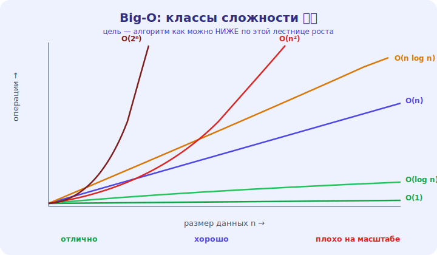

# 08 · Big-O: язык сложности 🖼️⭐⭐

> 🎯 **Цель блока (ЯДРО трека):** освоить Big-O — нотацию, которой измеряют эффективность
> алгоритмов. Это главный язык, на котором инженеры говорят о производительности.

---

## 📖 Зачем Big-O

Нельзя сравнивать алгоритмы по «секундам» — они зависят от компьютера, языка, данных. Нужна мера,
которая отвечает на вопрос: **как растёт время/память с ростом размера данных?** Это и есть
**Big-O**.

```
   не «алгоритм работает 3 секунды» (на чём? на каких данных?)
   а «алгоритм работает за O(n²)» → понятно, как он поведёт себя на любом размере
```

💡 ⭐⭐ Big-O — про **рост**, а не про абсолютное время. Он отбрасывает детали (константы,
железо) и оставляет главное: как алгоритм масштабируется. Это позволяет сравнивать алгоритмы
**объективно**, не запуская их.

---

## ⭐⭐ Что такое O(...)

**O(f(n))** означает: время (или память) растёт **не быстрее**, чем f(n), при больших n.
Записывают, как зависит число операций от размера входа **n**.

🖼️


```
   O(1)       — константа: не зависит от n (доступ по индексу, хеш-доступ)
   O(log n)   — логарифм: делим задачу пополам (бинарный поиск)
   O(n)       — линейно: один проход (поиск перебором, сумма)
   O(n log n) — «хорошие» сортировки (быстрая, слиянием)
   O(n²)      — квадрат: двойной вложенный цикл (наивные сортировки, пары)
   O(2ⁿ)      — экспонента: перебор всех подмножеств (очень медленно!)
   O(n!)      — факториал: перебор всех перестановок (катастрофа)
```

💡 ⭐⭐ Это **лестница эффективности** от лучшего (O(1)) к худшему (O(n!)). Цель — найти алгоритм
как можно **выше** в этом списке. Разница между соседними классами на больших n — колоссальна
(см. таблицу из модуля 01).

---

## ⭐⭐ Правила Big-O: отбрасываем лишнее

```
   1. ОТБРАСЫВАЙ КОНСТАНТЫ:  O(2n) → O(n),  O(n/2) → O(n)
      (нас интересует РОСТ, а не множитель)

   2. ОСТАВЛЯЙ СТАРШИЙ ЧЛЕН:  O(n² + n) → O(n²)
      (при больших n n² доминирует, n незначим)

   3. СЛОЖЕНИЕ (последовательные блоки): O(n) + O(n) → O(n)
   4. УМНОЖЕНИЕ (вложенные циклы): цикл в цикле → O(n × n) = O(n²)
```

💡 ⭐⭐ Big-O — это **грубая** оценка асимптотики. `O(5n² + 100n + 7)` = просто **O(n²)**, потому
что на больших n всё остальное незначимо. Это упрощение — сила нотации: она показывает класс
поведения, не отвлекаясь на детали.

---

## ⭐ Лучший, средний, худший случай

```
   худший случай (worst case)   — O(...) обычно про НЕГО (гарантия «не хуже чем»)
   средний случай (average)     — типичное поведение (хеш-таблица: средний O(1))
   лучший случай (best)         — повезло (искомое — первый элемент)
```

💡 ⭐ Обычно под «сложностью» имеют в виду **худший случай** — это гарантия. Но иногда важен
средний (хеш-таблица: средний O(1), худший O(n)). Указывай, о каком случае речь, когда это важно.

---

## 📖 Big-Θ и Big-Ω (коротко)

```
   O   — верхняя граница («не хуже чем»)        ← используется чаще всего
   Ω   — нижняя граница («не лучше чем»)
   Θ   — точная оценка («ровно такого порядка»)
```

💡 На практике почти везде говорят «O(...)», подразумевая порядок роста. Глубокие различия
важны в теории; для инженерной работы достаточно уверенно владеть O-нотацией.

---

## ⚠️ Ловушки

- ❌ Сравнивать алгоритмы по секундам вместо Big-O (зависит от железа/данных).
- ❌ Не отбрасывать константы/младшие члены (O(n²) и O(2n²) — один класс).
- ❌ Путать, что меньше: O(log n) < O(n) < O(n log n) < O(n²) — выучи порядок.
- ❌ Игнорировать, для какого случая (худший/средний) оценка.

---

## 🛠️ Практика

1. Упрости в Big-O: `3n + 5`, `n² + n`, `100`, `2n³ + n²`, `n + log n`.
2. Расставь по возрастанию: O(n²), O(1), O(n log n), O(log n), O(n), O(2ⁿ).
3. Для двух своих решений задачи из уровня 1 определи их Big-O и сравни.

---

## ✅ Задачи

1. **Объясни**, зачем Big-O и почему он про рост, а не секунды.
2. **Перечисли** классы сложности по возрастанию.
3. **Примени** правила (отбросить константы, оставить старший член).
4. **Разведи** худший/средний/лучший случай.

---

## ❓ Проверь себя

1. Что измеряет Big-O?
2. Какой порядок классов от лучшего к худшему?
3. Почему O(2n²) = O(n²)?
4. Про какой случай обычно говорят «сложность»?

---

## ✅ Чек-лист

- [ ] Понимаю Big-O как меру роста
- [ ] Знаю классы сложности и их порядок
- [ ] Умею упрощать (константы, старший член)
- [ ] Различаю худший/средний/лучший случай

➡️ Следующий (ядро): [09 · Временная сложность](09-time-complexity.md)
