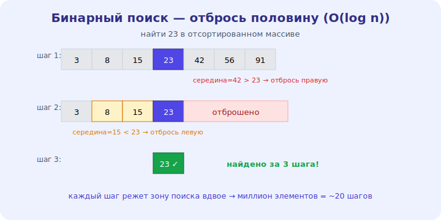

# 13 · Поиск 🖼️⭐

> 🎯 **Цель блока:** освоить линейный и бинарный поиск — и понять, почему бинарный поиск
> O(log n) так мощно ускоряет работу с отсортированными данными.

---

## ⭐ Линейный поиск — O(n)

Самый простой: проходим по всем элементам, пока не найдём.

```python
def linear_search(arr, target):
    for i, x in enumerate(arr):
        if x == target:
            return i        # нашли
    return -1               # нет
```

```
   сложность: O(n) — в худшем случае проверим все n элементов
   ✅ работает на ЛЮБЫХ данных (отсортированных или нет)
   ✅ просто
   ❌ медленно на больших данных
```

💡 Линейный поиск — база. Он неизбежен, когда данные не отсортированы и нет хеш-таблицы. Но если
данные **отсортированы** — есть способ намного быстрее.

---

## ⭐⭐ Бинарный поиск — O(log n)

Если массив **отсортирован**, можно искать, отбрасывая **половину** на каждом шаге.

🖼️


```python
def binary_search(arr, target):    # arr ОТСОРТИРОВАН!
    lo, hi = 0, len(arr) - 1
    while lo <= hi:
        mid = (lo + hi) // 2
        if arr[mid] == target:
            return mid
        elif arr[mid] < target:
            lo = mid + 1           # цель справа → отбросили левую половину
        else:
            hi = mid - 1           # цель слева → отбросили правую
    return -1
```

💡 ⭐⭐ Идея: смотрим **середину**. Если цель больше — она в правой половине, левую **отбрасываем**
целиком. Каждый шаг **вдвое** уменьшает зону поиска → **O(log n)**. Из миллиона элементов — ~20
шагов вместо миллиона! Это как искать слово в словаре: открываешь посередине, понимаешь, в какой
половине искать дальше.

⚠️ Обязательное условие — **отсортированные** данные. На неотсортированных бинарный поиск не
работает (нельзя понять, какую половину отбросить).

---

## 📖 Линейный vs бинарный vs хеш

```
   ЛИНЕЙНЫЙ  — O(n)     — любые данные, просто
   БИНАРНЫЙ  — O(log n) — только ОТСОРТИРОВАННЫЕ, очень быстро
   ХЕШ-ТАБЛИЦА — O(1)   — нужна хеш-структура, мгновенно (модуль 06)

   ищешь ОДИН раз в неотсортированном → линейный
   ищешь МНОГО раз → отсортируй (O(n log n)) + бинарный, ИЛИ построй хеш (O(n)) + O(1) поиск
```

💡 ⭐ Выбор зависит от ситуации. Разовый поиск в неотсортированном — линейный. Много поисков —
выгодно один раз подготовиться (сортировка или хеш), потом искать быстро. Это компромисс
«подготовка vs запрос» (модуль 12).

---

## ⭐ Бинарный поиск — не только «найти элемент»

```
   бинарный поиск применим ВЕЗДЕ, где можно «отбросить половину»:
   - найти первое/последнее вхождение
   - найти точку, где условие меняется (граница)
   - «бинарный поиск по ответу» — угадывать значение, сужая диапазон
```

💡 ⭐ Бинарный поиск — мощный **паттерн мышления**, а не только функция. Любая задача, где можно
сказать «ответ слева или справа от середины», решается за O(log n). Это частая тема собеседований
(уровень 4, паттерны).

---

## ⚠️ Ловушки

- ❌ Применять бинарный поиск к **неотсортированным** данным (не работает).
- ❌ Ошибки с границами (`lo <= hi`, `mid ± 1`) — классические off-by-one, бесконечный цикл.
- ❌ Сортировать ради одного поиска (сортировка O(n log n) дороже линейного O(n)).
- ❌ Забывать про хеш-таблицу как O(1) альтернативу.

---

## 🛠️ Практика

1. Реализуй линейный и бинарный поиск; проверь оба на отсортированном массиве.
2. Замерь: на миллионе элементов сколько шагов делает каждый? (бинарный — около 20).
3. Реши «найти первое вхождение target в отсортированном массиве с дублями» бинарным поиском.

---

## ✅ Задачи

1. **Объясни** линейный поиск и его O(n).
2. **Объясни** бинарный поиск и почему он O(log n).
3. **Сравни** линейный/бинарный/хеш и когда что выбрать.
4. **Объясни** бинарный поиск как паттерн «отбрось половину».

---

## ❓ Проверь себя

1. Какова сложность линейного поиска?
2. Почему бинарный поиск O(log n) и что ему нужно?
3. Когда выгодна подготовка (сортировка/хеш) ради быстрого поиска?
4. Где ещё применим бинарный поиск, кроме «найти элемент»?

---

## ✅ Чек-лист

- [ ] Реализую линейный и бинарный поиск
- [ ] Понимаю O(log n) бинарного поиска и его условие
- [ ] Выбираю между линейным/бинарным/хешем
- [ ] Вижу бинарный поиск как паттерн

➡️ Следующий: [14 · Сортировки](14-sorting.md)
