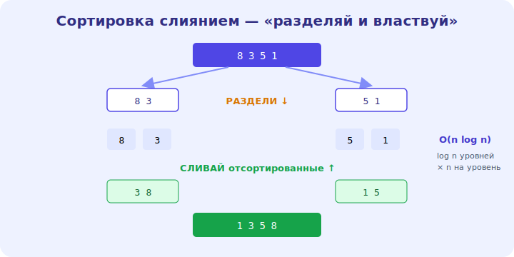

# 14 · Сортировки 🖼️⭐

> 🎯 **Цель блока:** понять алгоритмы сортировки — от простых O(n²) до эффективных O(n log n) —
> и почему сортировка так важна как «подготовка» для других алгоритмов.

---

## 📖 Зачем сортировка

Отсортированные данные открывают эффективные приёмы: бинарный поиск O(log n) (модуль 13), быстрое
нахождение дубликатов, медианы, группировок. Сортировка — частая **подготовка** перед основным
алгоритмом.

🖼️


💡 Сортировок много, но важно понять: **простые** (O(n²)) — для обучения и крошечных данных,
**эффективные** (O(n log n)) — для реальных. И что языковые `sort()` уже реализуют эффективную
сортировку — обычно её не пишут руками, но **понимать** надо.

---

## ⭐ Простые сортировки — O(n²)

```
   ПУЗЫРЬКОВАЯ — много раз проходим, меняя соседние, пока не отсортируется
   ВЫБОРОМ     — на каждом шаге находим минимум и ставим на место
   ВСТАВКАМИ   — берём элемент и вставляем в нужное место отсортированной части
```

```python
def bubble_sort(arr):
    for i in range(len(arr)):
        for j in range(len(arr) - 1 - i):     # вложенный цикл → O(n²)
            if arr[j] > arr[j+1]:
                arr[j], arr[j+1] = arr[j+1], arr[j]
```

💡 ⭐ Все три — **O(n²)** (вложенные циклы). Они простые и наглядные (хороши для понимания), но
**медленные** на больших данных. Сортировка **вставками** интересна: на почти отсортированных
данных близка к O(n) — поэтому её используют для маленьких массивов внутри быстрых сортировок.

---

## ⭐⭐ Эффективные сортировки — O(n log n)

```
   СОРТИРОВКА СЛИЯНИЕМ (merge sort):
   - дели массив пополам, сортируй половины, СЛИВАЙ две отсортированные части
   - O(n log n) всегда, стабильная, но O(n) памяти

   БЫСТРАЯ СОРТИРОВКА (quicksort):
   - выбери «опорный» (pivot), раздели на меньше/больше, сортируй части
   - O(n log n) в среднем, O(1) доп. памяти, но O(n²) в худшем случае (редко)
```

🖼️
```
   merge sort: [8 3 5 1] → [8 3][5 1] → [3 8][1 5] → СЛИЯНИЕ → [1 3 5 8]
               дели до одиночек, потом сливай отсортированные
```

💡 ⭐⭐ Обе используют **«разделяй и властвуй»** (модуль 15): делим задачу пополам (log n уровней),
на каждом обрабатываем все n элементов → **O(n log n)**. Это намного быстрее O(n²): для миллиона
элементов ~20 млн операций против триллиона. Языковые сортировки — гибриды (Timsort в Python:
слияние + вставки).

---

## 📖 Сравнение сортировок

```
   алгоритм        время (сред.)  время (худш.)  память   стабильность
   ─────────────────────────────────────────────────────────────────────
   пузырьковая     O(n²)          O(n²)          O(1)     да
   вставками       O(n²)          O(n²)          O(1)     да (быстра на почти-сорт.)
   слиянием        O(n log n)     O(n log n)     O(n)     да
   быстрая         O(n log n)     O(n²)*         O(log n) нет
   *худший случай редок при хорошем выборе pivot
```

💡 **Стабильность** — сохраняет ли порядок равных элементов (важно при сортировке по нескольким
ключам). Для практики: используй **встроенную** сортировку языка (она оптимизирована и O(n log
n)), а эти алгоритмы понимай, чтобы знать, что внутри и какие гарантии.

---

## ⭐ Сортировка без сравнений (кратко)

```
   подсчётом (counting sort) — для чисел в малом диапазоне → O(n + k), быстрее O(n log n)!
   поразрядная (radix) — по цифрам
   (обходят границу O(n log n), но только для специальных данных)
```

💡 Сравнительные сортировки не могут быть быстрее O(n log n) (это доказано). Но если данные
особые (целые в узком диапазоне), специальные сортировки дают **O(n)**. Знать о существовании
полезно — иногда это лучший выбор.

---

## ⚠️ Ловушки

- ❌ Писать пузырьковую сортировку в продакшене (O(n²)) вместо встроенной O(n log n).
- ❌ Сортировать заново то, что уже отсортировано (используй вставки или проверку).
- ❌ Забывать про память слияния (O(n)) при ограничениях.
- ❌ Думать, что quicksort всегда O(n log n) (худший O(n²), хоть и редко).

---

## 🛠️ Практика

1. Реализуй сортировку вставками (O(n²)) — на почти отсортированных данных она быстра.
2. Реализуй сортировку слиянием (O(n log n)) — раздели, сортируй, сливай.
3. Сравни время своей O(n²) сортировки и встроенной O(n log n) на растущих данных.

---

## ✅ Задачи

1. **Объясни** простые сортировки и их O(n²).
2. **Объясни** сортировку слиянием и почему она O(n log n).
3. **Сравни** сортировки по времени/памяти/стабильности.
4. **Объясни**, когда возможна сортировка за O(n) (подсчётом).

---

## ❓ Проверь себя

1. Почему простые сортировки O(n²)?
2. Как «разделяй и властвуй» даёт O(n log n)?
3. Что такое стабильность сортировки?
4. Можно ли сортировать быстрее O(n log n) и когда?

---

## ✅ Чек-лист

- [ ] Понимаю простые сортировки (O(n²))
- [ ] Понимаю слияние/быструю (O(n log n), divide & conquer)
- [ ] Знаю сравнение по времени/памяти/стабильности
- [ ] Использую встроенную сортировку, понимаю, что внутри

➡️ Следующий: [15 · Рекурсия и «разделяй и властвуй»](15-recursion.md)
