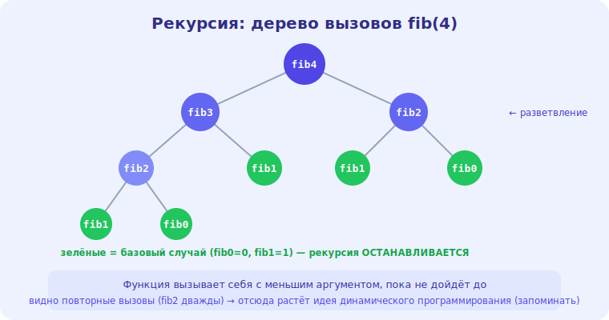

# 15 · Рекурсия и «разделяй и властвуй» 🖼️⭐

> 🎯 **Цель блока:** понять рекурсию — функцию, вызывающую саму себя — и приём «разделяй и
> властвуй», лежащий в основе многих эффективных алгоритмов.

---

## ⭐ Рекурсия — задача через саму себя

**Рекурсия** — когда функция решает задачу, вызывая **себя** на меньшей подзадаче, пока не дойдёт
до **базового случая** (который решается напрямую).

```python
def factorial(n):
    if n <= 1:              # БАЗОВЫЙ случай (без рекурсии)
        return 1
    return n * factorial(n - 1)   # РЕКУРСИВНЫЙ случай (меньшая подзадача)
```

🖼️
```
   factorial(4)
   = 4 × factorial(3)
       = 3 × factorial(2)
           = 2 × factorial(1)
               = 1            ← базовый случай, разворачиваемся обратно
           = 2
       = 6
   = 24
```

💡 ⭐ Два обязательных элемента: **базовый случай** (когда остановиться) и **движение к нему**
(каждый вызов на меньших данных). Без базового случая — бесконечная рекурсия → переполнение стека.
Рекурсия использует **стек вызовов** (модуль 05): каждый вызов — кадр в памяти → глубина n = O(n)
памяти (модуль 10).

---

## ⭐ Когда рекурсия естественна

```
   ✅ структуры, определённые через себя: деревья (модуль 16), вложенные данные
   ✅ «разделяй и властвуй»: сортировка слиянием, бинарный поиск
   ✅ перебор вариантов (backtracking): комбинации, перестановки, лабиринты
   ✅ задачи, которые ЕСТЕСТВЕННО распадаются на похожие подзадачи
```

💡 Рекурсия делает код **коротким и понятным** для рекурсивных по природе задач (обход дерева
рекурсией — 3 строки, циклом — сложно). Но не всё стоит писать рекурсивно: простой цикл часто
лучше (быстрее, без риска переполнения стека).

---

## ⭐⭐ «Разделяй и властвуй» (divide and conquer)

Мощный приём: **раздели** задачу на меньшие подзадачи, **реши** их (рекурсивно), **объедини**
результаты.

```
   1. РАЗДЕЛИ — разбей задачу на части (обычно пополам)
   2. ВЛАСТВУЙ — реши каждую часть рекурсивно
   3. ОБЪЕДИНИ — собери ответы частей в общий
```

🖼️
```
   сортировка слиянием:
   [8 3 5 1 9 2]
   РАЗДЕЛИ → [8 3 5] [1 9 2]
   ВЛАСТВУЙ → сортируй каждую → [3 5 8] [1 2 9]
   ОБЪЕДИНИ → слей отсортированные → [1 2 3 5 8 9]
```

💡 ⭐⭐ «Разделяй и властвуй» часто даёт **O(n log n)**: деление пополам создаёт log n уровней, на
каждом — работа O(n). Так устроены сортировка слиянием, быстрая сортировка, бинарный поиск.
Понимание этого приёма — ключ к эффективным алгоритмам.

---

## ⚠️ Главная ловушка: пересчёт (наивный fib)

```python
# O(2ⁿ) — КАТАСТРОФА: пересчитывает одно и то же много раз!
def fib(n):
    if n <= 1: return n
    return fib(n-1) + fib(n-2)     # два вызова → дерево вызовов растёт экспоненциально
```

🖼️
```
   fib(5) → fib(4) + fib(3)
            fib(4) → fib(3) + fib(2)   ← fib(3) считается ДВАЖДЫ
            ... и так каждое значение пересчитывается многократно → O(2ⁿ)
```



💡 ⚠️ Рекурсия с **двумя** ветвями без сохранения результатов → **экспонента O(2ⁿ)**. `fib(50)`
наивно — миллиарды вызовов. Решение — **мемоизация** (запоминать вычисленное) → O(n). Это прямой
мост к **динамическому программированию** (уровень 4). Всегда проверяй: не пересчитывает ли твоя
рекурсия одно и то же?

---

## 📖 Рекурсия vs итерация

```
   РЕКУРСИЯ — короче для рекурсивных задач, но: память стека O(глубина), риск переполнения
   ИТЕРАЦИЯ (цикл) — быстрее, O(1) памяти, но иногда сложнее для древовидных задач

   любую рекурсию МОЖНО переписать циклом (иногда со своим стеком)
```

💡 Для глубоких/линейных задач (factorial большого n) цикл безопаснее (нет переполнения стека).
Для древовидных (обход дерева, перебор) — рекурсия чище. Выбор — по задаче и ограничениям.

---

## ⚠️ Ловушки

- ❌ Забыть базовый случай → бесконечная рекурсия → stack overflow.
- ❌ Наивная двойная рекурсия без мемоизации → O(2ⁿ).
- ❌ Глубокая рекурсия на больших n → переполнение стека (бери цикл).
- ❌ Использовать рекурсию там, где простой цикл проще и быстрее.

---

## 🛠️ Практика

1. Реализуй рекурсивно: факториал, сумму списка, разворот строки. Найди базовый случай каждого.
2. Реализуй наивный `fib` и замерь, на каком n он «зависает». Добавь мемоизацию — сравни.
3. Реализуй сортировку слиянием как «разделяй и властвуй».

---

## ✅ Задачи

1. **Объясни** рекурсию (базовый + рекурсивный случай) и роль стека.
2. **Объясни** «разделяй и властвуй» и почему часто O(n log n).
3. **Покажи**, почему наивный fib — O(2ⁿ), и как мемоизация чинит.
4. **Сравни** рекурсию и итерацию.

---

## ❓ Проверь себя

1. Что обязательно нужно в рекурсии?
2. Как «разделяй и властвуй» даёт O(n log n)?
3. Почему наивная двойная рекурсия экспоненциальна?
4. Когда выбрать цикл вместо рекурсии?

---

## ✅ Чек-лист

- [ ] Понимаю рекурсию (базовый случай, стек, память)
- [ ] Владею «разделяй и властвуй»
- [ ] Вижу ловушку пересчёта (O(2ⁿ)) и решение мемоизацией
- [ ] Выбираю между рекурсией и итерацией

➡️ Следующий: [16 · Деревья](16-trees.md)
