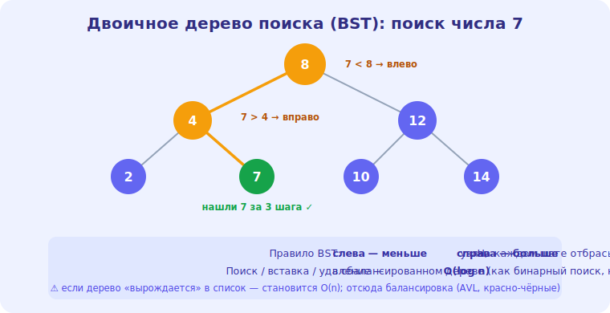

# 16 · Деревья 🖼️⭐⭐

> 🎯 **Цель блока:** освоить деревья — иерархические структуры — и бинарное дерево поиска (BST),
> дающее O(log n) операции.

---

## ⭐ Дерево — иерархия узлов

**Дерево** — структура, где узлы образуют иерархию: у каждого узла есть **дети**, и ровно один
**родитель** (кроме корня).

🖼️
```
            [корень]
           /        \
       [узел]      [узел]
       /    \          \
   [лист] [лист]      [лист]   ← листья: узлы без детей
```

```
   терминология:
   КОРЕНЬ — верхний узел (без родителя)
   ЛИСТ — узел без детей
   ВЫСОТА — длина пути от корня до самого глубокого листа
   ПОДДЕРЕВО — любой узел со своими потомками
```

💡 ⭐ Деревья **повсюду**: файловая система (папки), DOM веб-страницы, оглавление, дерево
процессов ОС, дерево решений в ИИ. Дерево рекурсивно по природе (поддерево — тоже дерево),
поэтому алгоритмы на деревьях обычно **рекурсивные** (модуль 15).

---

## ⭐⭐ Бинарное дерево поиска (BST)

**Бинарное дерево** — у каждого узла **не более двух** детей (левый, правый). **Бинарное дерево
поиска (BST)** добавляет правило упорядоченности:

```
   ПРАВИЛО BST: для каждого узла
   - всё в ЛЕВОМ поддереве МЕНЬШЕ узла
   - всё в ПРАВОМ поддереве БОЛЬШЕ узла
```

🖼️
```
            [ 8 ]
           /     \
        [ 3 ]    [ 10 ]      поиск 6: 6<8 → влево, 6>3 → вправо, 6<7? нашли путь
        /   \        \       как бинарный поиск, но в структуре!
     [ 1 ] [ 6 ]    [ 14 ]
```



💡 ⭐⭐ Магия BST: поиск/вставка/удаление — **O(log n)** (если дерево сбалансировано), потому что
на каждом шаге **отбрасываем половину** (как бинарный поиск, модуль 13). Сравнил с узлом → пошёл
влево или вправо. Это структура для «отсортированных данных с быстрыми вставками».

```
   поиск/вставка/удаление в сбалансированном BST → O(log n) ✅
```

---

## ⚠️ Проблема: несбалансированное дерево

```
   если вставлять отсортированные данные подряд (1,2,3,4,5) →
   дерево вырождается в «список»:
   [1]→[2]→[3]→[4]→[5]   высота = n → поиск O(n)! 😟
```

💡 ⚠️ BST даёт O(log n) **только если сбалансирован** (высота ~log n). В худшем случае
вырождается в список → O(n). Поэтому существуют **самобалансирующиеся** деревья (AVL,
красно-чёрные) — они автоматически держат высоту ~log n. Языковые «упорядоченные» структуры (map
в C++, TreeMap в Java) на них основаны.

---

## ⭐ Обходы дерева

Обойти все узлы дерева можно по-разному (обычно рекурсией):

```
   IN-ORDER (симметричный):   левое → УЗЕЛ → правое   → для BST даёт ОТСОРТИРОВАННЫЙ порядок!
   PRE-ORDER (прямой):        УЗЕЛ → левое → правое   → копирование дерева, префиксная запись
   POST-ORDER (обратный):     левое → правое → УЗЕЛ   → удаление дерева, постфиксная запись
   BFS (по уровням):          уровень за уровнем (через очередь, модуль 17)
```

```python
def inorder(node):
    if node:
        inorder(node.left)      # левое
        print(node.value)       # узел
        inorder(node.right)     # правое
```

💡 ⭐ **In-order обход BST даёт элементы по возрастанию** — красивое свойство. Выбор обхода зависит
от задачи: in-order для сортировки, post-order для удаления (сначала дети, потом узел), BFS для
«по уровням». Обходы — частая тема собеседований.

---

## ⚠️ Ловушки

- ❌ Считать, что BST всегда O(log n) — несбалансированный вырождается в O(n).
- ❌ Вставлять отсортированные данные в простой BST (получишь «список»).
- ❌ Путать обходы (in/pre/post-order) и их применения.
- ❌ Забыть базовый случай (пустой узел) в рекурсивном обходе.

---

## 🛠️ Практика

1. Реализуй BST: вставка, поиск, in-order обход (должен дать отсортированный порядок).
2. Вставь отсортированные данные подряд — увидь вырождение в «список» (высота = n).
3. Реализуй три обхода (in/pre/post-order) и сравни их вывод на одном дереве.

---

## ✅ Задачи

1. **Объясни** дерево и его терминологию (корень, лист, высота).
2. **Объясни** BST и почему операции O(log n).
3. **Объясни** проблему несбалансированности и решение (самобалансирующиеся деревья).
4. **Опиши** обходы и их применения (особенно in-order для BST).

---

## ❓ Проверь себя

1. Что такое дерево, корень, лист, высота?
2. Какое правило у BST и почему оно даёт O(log n)?
3. Когда BST вырождается в O(n)?
4. Какой обход BST даёт отсортированный порядок?

---

## ✅ Чек-лист

- [ ] Понимаю деревья и их терминологию
- [ ] Понимаю BST и O(log n) операции
- [ ] Знаю проблему баланса и самобалансирующиеся деревья
- [ ] Владею обходами (in/pre/post-order, BFS)

➡️ Следующий: [17 · Графы (BFS и DFS)](17-graphs.md)
