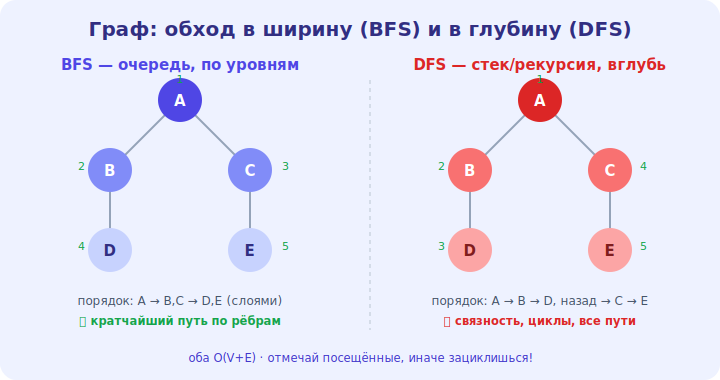

# 17 · Графы (BFS и DFS) 🖼️⭐⭐

> 🎯 **Цель блока:** освоить графы — структуру связей — и два главных обхода: в ширину (BFS) и в
> глубину (DFS). Графы моделируют огромное число реальных задач.

---

## ⭐ Граф — узлы и связи

**Граф** — набор **вершин** (узлов), соединённых **рёбрами** (связями). В отличие от дерева, в
графе могут быть циклы, и любой узел может быть связан с любым.

🖼️


```
   [A]───[B]
    │  ╲  │
    │   ╲ │
   [C]───[D]───[E]

   вершины: A, B, C, D, E
   рёбра: связи между ними
```

```
   виды графов:
   НАПРАВЛЕННЫЙ (ориентированный) — рёбра имеют направление (A→B, односторонняя дорога)
   НЕНАПРАВЛЕННЫЙ — связь в обе стороны (дружба)
   ВЗВЕШЕННЫЙ — у рёбер есть «вес»/стоимость (расстояние, цена)
```

💡 ⭐ Графы моделируют **связи**: социальные сети (люди↔дружба), карты (города↔дороги), интернет
(страницы↔ссылки), зависимости (задачи↔«сначала это»). Дерево — частный случай графа (без циклов).
Огромное число задач — это «задача на графе».

---

## 📖 Как представить граф

```
   СПИСОК СМЕЖНОСТИ — для каждой вершины список соседей (экономно, чаще используется)
        { A: [B, C], B: [A, D], C: [A, D], D: [B, C, E], E: [D] }

   МАТРИЦА СМЕЖНОСТИ — таблица n×n: связаны ли i и j (быстрая проверка ребра, но O(n²) памяти)
```

💡 ⭐ **Список смежности** — основной способ (память O(V+E), где V вершины, E рёбра). Матрица
удобна для плотных графов и быстрой проверки «есть ли ребро», но ест O(n²) памяти. Выбор —
компромисс память/скорость (модуль 12).

---

## ⭐⭐ Обход в ширину (BFS) — по уровням

**BFS** (Breadth-First Search) обходит граф **слоями**: сначала всех соседей, потом соседей
соседей. Использует **очередь** (модуль 05).

```python
def bfs(graph, start):
    visited = {start}
    queue = deque([start])
    while queue:
        node = queue.popleft()          # из ОЧЕРЕДИ (FIFO)
        for neighbor in graph[node]:
            if neighbor not in visited:
                visited.add(neighbor)
                queue.append(neighbor)
```

💡 ⭐⭐ BFS идёт «вширь», уровень за уровнем. Главное свойство: **находит КРАТЧАЙШИЙ путь** (по
числу рёбер) в невзвешенном графе — потому что доходит до вершин в порядке близости. Применения:
кратчайший путь, «друзья друзей», распространение (волной). Сложность O(V+E).

---

## ⭐⭐ Обход в глубину (DFS) — вглубь

**DFS** (Depth-First Search) идёт **как можно глубже** по одному пути, потом возвращается.
Использует **стек** (или рекурсию — модуль 15).

```python
def dfs(graph, node, visited):
    visited.add(node)
    for neighbor in graph[node]:
        if neighbor not in visited:
            dfs(graph, neighbor, visited)   # рекурсия = стек
```

💡 ⭐⭐ DFS «ныряет» по одной ветке до конца, потом отступает (backtrack) и пробует другую.
Применения: проверка связности, поиск циклов, топологическая сортировка (уровень 4), перебор
путей, решение лабиринтов. Сложность O(V+E). Стек DFS — это рекурсия (или явный стек).

---

## ⭐ BFS vs DFS — когда что

```
   BFS (очередь, вширь):              DFS (стек/рекурсия, вглубь):
   ✅ кратчайший путь (невзвешенный)   ✅ есть ли путь / связность
   ✅ «ближайшие» сначала              ✅ поиск циклов, топосортировка
   ✅ распространение слоями           ✅ перебор всех путей (backtracking)
   память: O(ширина)                  память: O(глубина)
```

💡 ⭐ Оба обходят весь граф за O(V+E), но в **разном порядке**, и это определяет применение.
«Нужен кратчайший путь по рёбрам?» → BFS. «Нужно глубоко обойти / найти цикл / все варианты?» →
DFS. Не забывай **отмечать посещённые** (`visited`) — иначе в графе с циклами получишь бесконечный
обход!

---

## ⚠️ Ловушки

- ❌ Не отмечать посещённые вершины → бесконечный цикл (граф ≠ дерево, есть циклы).
- ❌ Использовать DFS, когда нужен кратчайший путь (DFS его не гарантирует — нужен BFS).
- ❌ Путать структуры: BFS — очередь, DFS — стек/рекурсия.
- ❌ Матрица смежности для разреженного графа — лишняя O(n²) память.

---

## 🛠️ Практика

1. Представь граф списком смежности. Реализуй BFS и DFS, выведи порядок обхода.
2. Найди кратчайший путь между двумя вершинами через BFS (по числу рёбер).
3. Проверь через DFS, связен ли граф (достижимы ли все вершины из одной).

---

## ✅ Задачи

1. **Объясни** граф, его виды и применения.
2. **Сравни** список и матрицу смежности.
3. **Объясни** BFS (очередь, кратчайший путь) и DFS (стек, вглубь).
4. **Выбери** BFS или DFS для разных задач.

---

## ❓ Проверь себя

1. Чем граф отличается от дерева?
2. Как представляют граф и какой способ экономнее?
3. Почему BFS находит кратчайший путь, а DFS — нет?
4. Зачем отмечать посещённые вершины?

---

## ✅ Чек-лист

- [ ] Понимаю графы, их виды и представления
- [ ] Владею BFS (очередь, кратчайший путь)
- [ ] Владею DFS (стек/рекурсия, вглубь)
- [ ] Выбираю BFS/DFS по задаче, отмечаю посещённые

➡️ Следующий: [18 · Жадные алгоритмы и приёмы](18-greedy.md)
