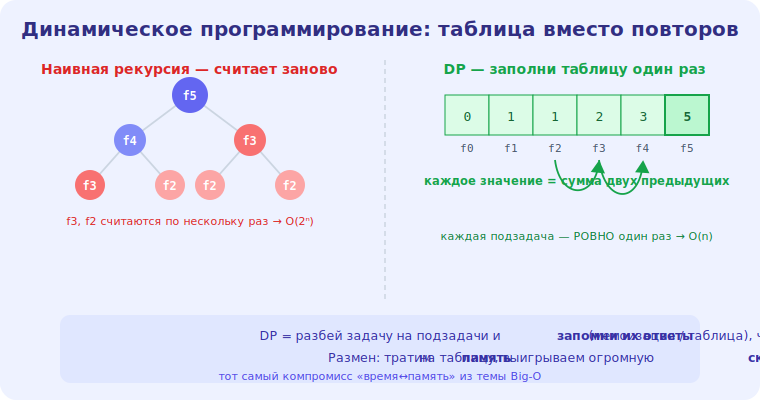

# 19 · Динамическое программирование 🖼️⭐⭐

> 🎯 **Цель блока:** освоить динамическое программирование (ДП) — приём, превращающий
> экспоненциальные задачи в полиномиальные через сохранение результатов подзадач.

---

## ⭐⭐ Идея ДП: не считай дважды

Из модуля 15: наивный fib — O(2ⁿ), потому что **пересчитывает** одни и те же подзадачи. **ДП**
устраняет это: считаем каждую подзадачу **один раз** и **сохраняем** результат.

🖼️
```
   наивно fib(5): дерево вызовов, fib(2) считается 3 раза, fib(3) — дважды... → O(2ⁿ)
   с ДП: считаем fib(0), fib(1), ..., fib(5) ОДИН раз, храним → O(n)
```



💡 ⭐⭐ ДП применимо, когда задача:
1. **разбивается на подзадачи** (как «разделяй и властвуй»);
2. подзадачи **перекрываются** (одни и те же встречаются много раз);
3. есть **оптимальная подструктура** (оптимум целого строится из оптимумов частей).

ДП — это «умный перебор с памятью»: вместо повторного счёта — заглянул в таблицу.

---

## ⭐ Два подхода: сверху вниз и снизу вверх

```
   МЕМОИЗАЦИЯ (top-down) — рекурсия + кэш результатов
   def fib(n, memo={}):
       if n <= 1: return n
       if n not in memo:
           memo[n] = fib(n-1, memo) + fib(n-2, memo)   # сохраняем
       return memo[n]
   → O(n) время, O(n) память

   ТАБУЛЯЦИЯ (bottom-up) — заполняем таблицу от базовых случаев вверх
   def fib(n):
       dp = [0, 1]
       for i in range(2, n+1):
           dp.append(dp[i-1] + dp[i-2])
       return dp[n]
   → O(n) время; память можно ужать до O(1) (хранить 2 последних)
```

💡 ⭐ Мемоизация = рекурсия + запоминание (естественнее из наивного решения). Табуляция = цикл,
заполняющий таблицу снизу вверх (часто эффективнее по памяти). Оба дают одну сложность; выбор — по
вкусу и задаче. Часто табуляцию можно **оптимизировать по памяти** (хранить не всю таблицу, а
нужное окно).

---

## ⭐⭐ Классические задачи ДП

```
   ЛЕСТНИЦА — сколькими способами подняться на n ступеней (по 1-2)? → как fib
   РЮКЗАК (knapsack) — максимальная ценность при ограничении веса
   НАИБОЛЬШАЯ ОБЩАЯ ПОДПОСЛЕДОВАТЕЛЬНОСТЬ (LCS) — для строк/диффов
   РАЗМЕН МОНЕТ — минимум монет на сумму (где жадность подводит, модуль 18!)
   ПУТИ В СЕТКЕ — сколько путей из угла в угол
```

💡 ⭐⭐ Помнишь «странные монеты», где жадность ошибалась (модуль 18)? **ДП решает её правильно**:
для каждой суммы храним минимум монет, строим от 0 вверх. ДП — это инструмент, когда жадность не
работает, а перебор слишком медленный. Распознавать ДП-задачи — навык, который приходит с
практикой (видишь «перекрывающиеся подзадачи» → думаешь о ДП).

---

## 📖 Как подойти к ДП-задаче

```
   1. ОПРЕДЕЛИ состояние — что описывает подзадачу? (dp[i] = ... что это значит?)
   2. НАЙДИ переход — как dp[i] выражается через предыдущие? (рекуррентная формула)
   3. ЗАДАЙ базовые случаи — dp[0], dp[1] = ...
   4. ПОРЯДОК вычисления — снизу вверх или мемоизация
   5. ОТВЕТ — где в таблице итог? (dp[n])
```

💡 ⭐ Самое трудное — шаги 1–2 (определить состояние и переход). Это требует практики. Совет: начни
с наивного рекурсивного решения, заметь перекрытие подзадач, добавь мемоизацию — и ты уже сделал
ДП. Потом, если нужно, перепиши в табуляцию.

---

## ⚠️ Ловушки

- ❌ Применять ДП там, где подзадачи **не** перекрываются (тогда обычная рекурсия/разделяй-и-властвуй).
- ❌ Неправильно определить состояние (тогда формула перехода не выводится).
- ❌ Забыть базовые случаи.
- ❌ Хранить всю таблицу, когда хватает «окна» (лишняя память).

---

## 🛠️ Практика

1. Реши задачу «лестница» (способы подняться на n ступеней) мемоизацией и табуляцией.
2. Реши «минимум монет на сумму» через ДП (там, где жадность ошибается). Сравни с жадным.
3. Возьми наивный рекурсивный fib, добавь мемоизацию — увидь O(2ⁿ)→O(n) на замерах.

---

## ✅ Задачи

1. **Объясни** идею ДП (не считать подзадачи дважды) и условия применимости.
2. **Сравни** мемоизацию (top-down) и табуляцию (bottom-up).
3. **Реши** ДП-задачу и выпиши состояние, переход, базовые случаи.
4. **Покажи**, как ДП решает «размен монет», где жадность подвела.

---

## ❓ Проверь себя

1. Какую проблему решает ДП и когда оно применимо?
2. Чем мемоизация отличается от табуляции?
3. Какие шаги в подходе к ДП-задаче?
4. Почему ДП решает «размен монет» правильно, а жадность — нет?

---

## ✅ Чек-лист

- [ ] Понимаю идею ДП (перекрывающиеся подзадачи + память)
- [ ] Владею мемоизацией и табуляцией
- [ ] Умею определять состояние и переход
- [ ] Распознаю ДП-задачи

➡️ Следующий: [20 · Продвинутые алгоритмы на графах](20-advanced-graphs.md)
