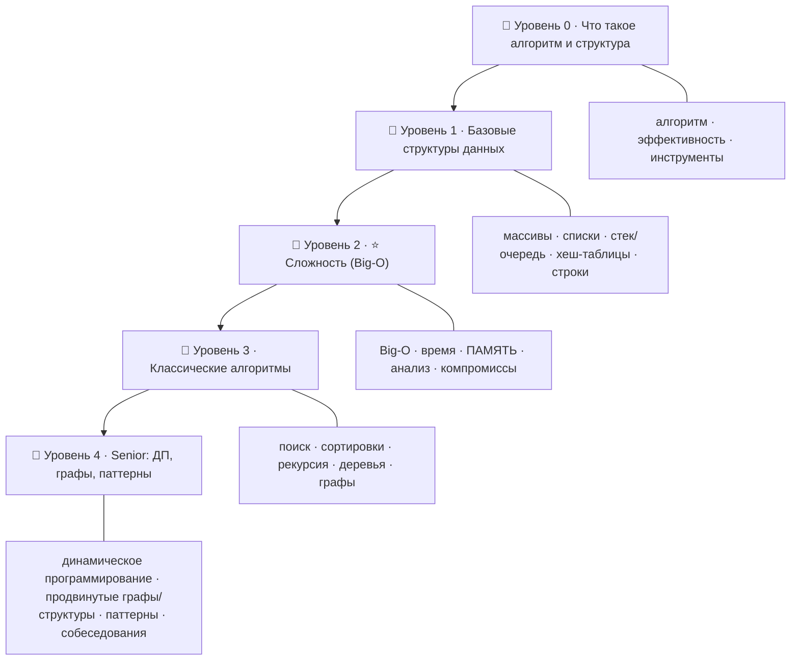

# 🧮 Дорожная карта: Алгоритмы и структуры данных — от новичка до Senior

> 🎯 **Цель трека:** научиться выбирать **правильную структуру данных** и **эффективный
> алгоритм** — и доказывать их эффективность через анализ сложности. Ядро трека —
> **сложность (Big-O)**: язык, на котором измеряют время и память алгоритмов.

Это трек, который отделяет «код, который работает» от «кода, который работает **на масштабе**».
Алгоритмы — основа технических собеседований и фундамент для оптимизации, БД, систем.

🧠 **Связь с курсом.** Сложность измеряется по **двум** осям — **время** и **память**. Структуры
данных физически живут в памяти (массив — непрерывно, список — вразброс), а это напрямую связано
с темой памяти языков, кэшем (C) и виртуальной памятью (ОС). Эффективность — это во многом про то,
**как данные лежат в памяти**.

---

## 🗺️ Карта трека

| Уровень | Папка | О чём |
|--------|-------|-------|
| 🥚 0 · Знакомство | `00-setup` | Что такое алгоритм и структура данных, зачем эффективность, где практиковать. |
| 🐣 1 · Структуры | `01-structures` | Массивы, связные списки, стек/очередь, хеш-таблицы, строки. |
| 🐥 2 · ⭐ Сложность | `02-complexity` | **Big-O, временная и пространственная сложность, анализ кода, компромиссы.** |
| 🦅 3 · Алгоритмы | `03-algorithms` | Поиск, сортировки, рекурсия, деревья, графы (BFS/DFS), жадные. |
| 🚀 4 · Senior | `04-advanced` | Динамическое программирование, продвинутые графы/структуры, паттерны задач, собеседования. |

---

## 🎯 Чему ты научишься

- Понимать **структуры данных** и выбирать подходящую под задачу.
- Владеть **Big-O** — ядром трека — и анализировать **время и память** своего кода.
- Знать классические **алгоритмы**: поиск, сортировки, рекурсия, обходы деревьев и графов.
- Решать задачи **динамическим программированием** и продвинутыми приёмами.
- Применять **паттерны решения** (два указателя, скользящее окно, и др.).
- Готовиться к **техническим собеседованиям** и писать эффективный код.

---

## 🧩 Как устроен каждый модуль

1. **📖 Теория** — простым языком, со схемами.
2. **🖼️ Схема** — как структура/алгоритм устроены.
3. **🛠️ Практика** — код (читаемый Python-стиль) и задачи.
4. **⚠️ Ловушки** — типичные ошибки и неэффективности.
5. **✅ Задачи** и **❓ Проверка себя**.
6. **Чек-лист** «готов идти дальше».

➡️ Начать: [00 · Что такое алгоритм и структура данных](00-setup/00-what-is-algorithm.md)

> 💡 Примеры — в читаемом псевдо/Python-стиле; идеи переносятся на любой язык. Практикуйся на
> [LeetCode](https://leetcode.com), [Codewars](https://www.codewars.com) и подобных.
