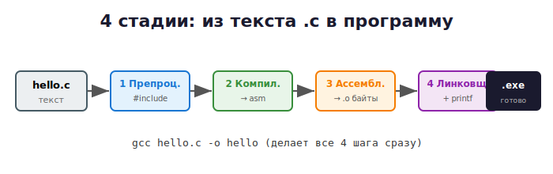

# 02 · Первая программа и как её собрать 🛠️

> 🎯 **Цель блока:** написать, скомпилировать и запустить свою первую программу на C.
> И главное — понять, **что происходит** при компиляции.

---

## 📖 Пишем «Hello, world!»

Создай в рабочей папке файл `hello.c` и напиши:

```c
#include <stdio.h>

int main(void)
{
    printf("Hello, world!\n");
    return 0;
}
```

### Разбираем построчно

| Строка | Что значит |
|--------|-----------|
| `#include <stdio.h>` | Подключаем «стандартную библиотеку ввода-вывода». Без неё нет `printf`. |
| `int main(void)` | Главная функция. **С неё начинается выполнение** любой программы на C. |
| `{ ... }` | Тело функции — то, что выполнится. |
| `printf("...")` | Печатает текст в консоль. |
| `\n` | Спецсимвол «новая строка» (перевод курсора вниз). |
| `return 0;` | Сообщаем ОС «программа завершилась успешно» (0 = всё ок). |
| `;` | Точка с запятой — **конец инструкции**. В C она обязательна. |

💡 `int main` означает, что функция возвращает **целое число** (`int`). Это число —
«код возврата» для операционной системы. 0 = успех, любое другое = ошибка.

---

## 🛠️ Компилируем и запускаем

Открой терминал **в папке с файлом** (в VS Code: **Terminal → New Terminal**).

### Шаг 1. Скомпилировать

```bash
gcc hello.c -o hello
```

Разбор команды:
```
gcc      hello.c       -o      hello
 │          │           │        │
 │      что компилируем │   имя готовой программы
компилятор          "output ->"  (на Windows будет hello.exe)
```

Если ошибок нет — терминал просто вернёт пустую строку. Рядом с `hello.c` появится
файл **`hello.exe`** (на Windows).

### Шаг 2. Запустить

**Windows (PowerShell):**
```powershell
.\hello.exe
```

**macOS / Linux:**
```bash
./hello
```

Вывод:
```
Hello, world!
```

🎉 Ты запустил свою первую программу!

---

## 🖼️ Что на самом деле произошло: 4 стадии сборки

`gcc` за одну команду выполняет **4 шага**. Понимать их полезно уже сейчас:



```
  hello.c
 (твой текст)
     │
     ▼
┌──────────────┐   1. ПРЕПРОЦЕССОР
│ Препроцессор │   Подставляет #include, разворачивает макросы.
└──────┬───────┘   Результат: один большой .i файл.
       │
       ▼
┌──────────────┐   2. КОМПИЛЯТОР
│  Компилятор  │   Переводит C → язык ассемблера (.s).
└──────┬───────┘
       │
       ▼
┌──────────────┐   3. АССЕМБЛЕР
│  Ассемблер   │   Переводит ассемблер → машинный код (.o, байты).
└──────┬───────┘
       │
       ▼
┌──────────────┐   4. ЛИНКОВЩИК (linker)
│  Линковщик   │   Связывает твой код с библиотеками (например printf)
└──────┬───────┘   в одну готовую программу.
       │
       ▼
  hello.exe
 (программа, которую понимает процессор)
```

💡 Можешь увидеть каждый шаг сам:

```bash
gcc -E hello.c -o hello.i     # 1. только препроцессор (открой hello.i — огромный!)
gcc -S hello.c -o hello.s     # 2. до ассемблера (открой hello.s — это инструкции CPU)
gcc -c hello.c -o hello.o     # 3. машинный код (бинарь, не читается глазами)
gcc hello.o -o hello          # 4. линковка
```

Открой `hello.s` в редакторе — увидишь «настоящий» язык, на котором говорит процессор.
Пока не нужно его понимать, но полезно знать, что **C превращается вот в это**.

---

## ⚠️ Полезные флаги компилятора (включай их ВСЕГДА)

```bash
gcc -Wall -Wextra -g hello.c -o hello
```

| Флаг | Что делает |
|------|-----------|
| `-Wall` | Включает **предупреждения** (warnings) — компилятор подскажет о подозрительных местах. |
| `-Wextra` | Ещё больше предупреждений. |
| `-g` | Добавляет отладочную информацию (понадобится для отладчика). |
| `-o имя` | Имя выходного файла. |
| `-std=c11` | Использовать стандарт языка C11 (современный). |

💡 **Привычка профи:** всегда компилируй с `-Wall -Wextra`. Предупреждения — это
друг, который ловит ошибки до того, как они станут багами.

---

## 🧪 Эксперимент: сломай программу специально

Чтобы понять, как компилятор сообщает об ошибках — убери точку с запятой:

```c
printf("Hello, world!\n")   // ← забыли ;
```

Скомпилируй. Прочитай сообщение об ошибке. GCC напишет что-то вроде:
```
error: expected ';' before 'return'
```

💡 Учись **читать ошибки компилятора** — он почти всегда говорит, в какой строке и что
не так. Это навык №1 начинающего программиста.

---

## ✅ Задачи

1. Сделай так, чтобы программа печатала **три строки**: твоё имя, любимый язык и год.
2. Выведи «ёлочку» из звёздочек с помощью нескольких `printf`:
   ```
     *
    ***
   *****
   ```
3. Скомпилируй программу с `-Wall -Wextra`. Появились ли предупреждения?
4. Запусти `gcc -S hello.c -o hello.s` и открой `hello.s`. Найди в нём строку `Hello, world`.

---

## ❓ Проверь себя

1. С какой функции начинается выполнение программы на C?
2. Что делает `#include <stdio.h>`?
3. Зачем нужна `\n`?
4. Назови 4 стадии компиляции по порядку.
5. Что означает `return 0;`?

---

## ✅ Чек-лист «я готов идти дальше»

- [ ] Скомпилировал и запустил `hello.c`
- [ ] Понимаю, что делает каждая строка программы
- [ ] Знаю про 4 стадии компиляции
- [ ] Умею компилировать с `-Wall -Wextra -g`
- [ ] Умею читать сообщение об ошибке компилятора

🎉 Ты прошёл **Уровень 0**! Теперь ты 🐣 **Junior-новичок**. Дальше — синтаксис языка.

➡️ Следующий: [03 · Переменные и типы данных](../01-basics/03-variables-types.md)
