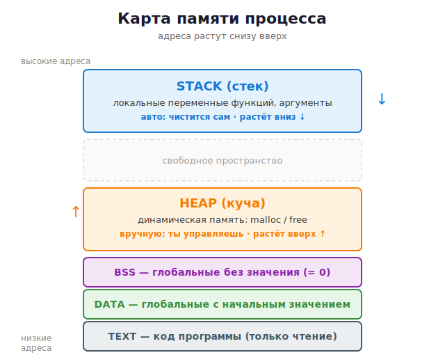
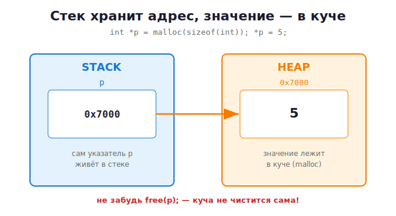

# 08 · Модель памяти: stack / heap / data / text 🖼️⭐

> 🎯 **Цель блока:** увидеть, **как программа разложена в памяти**. Это карта, по которой
> ты будешь ориентироваться весь оставшийся курс. Прочитай очень внимательно.

---

## 📖 Память запущенной программы делится на области

Когда ты запускаешь программу, ОС даёт ей кусок памяти, разбитый на **сегменты**.
У каждого — своя роль.

🖼️ **Карта памяти процесса** (упрощённо, адреса растут снизу вверх):



<details><summary>📝 та же схема текстом (ASCII)</summary>

```
   ВЫСОКИЕ АДРЕСА
  ┌────────────────────────────┐
  │          STACK             │  ← локальные переменные функций,
  │   (стек) растёт ВНИЗ ↓      │    аргументы, адреса возврата
  │            │               │    Автоматически: создаётся/удаляется
  │            ▼               │
  │                            │
  │      (свободное место)     │
  │                            │
  │            ▲               │
  │            │               │
  │    растёт ВВЕРХ ↑ HEAP     │  ← динамическая память (malloc/free)
  │   (куча)                   │    Управляешь ВРУЧНУЮ ты
  ├────────────────────────────┤
  │   BSS  (неинициализир.     │  ← глобальные/static переменные
  │         глобальные = 0)    │    без начального значения
  ├────────────────────────────┤
  │   DATA (инициализир.       │  ← глобальные/static с начальным
  │         глобальные)        │    значением
  ├────────────────────────────┤
  │   TEXT (код программы)     │  ← сами машинные инструкции
  │   только чтение            │    (твои функции в виде байт)
  └────────────────────────────┘
   НИЗКИЕ АДРЕСА
```

</details>

---

## 📦 Разбираем каждый сегмент

### 1. TEXT (код)
Здесь лежат **сами инструкции** программы — то, что получилось после компиляции.
Только для чтения (нельзя случайно перезаписать свой код).

### 2. DATA и BSS (глобальные данные)
- **DATA** — глобальные и `static` переменные, у которых есть **начальное значение**:
  ```c
  int counter = 100;   // живёт в DATA
  ```
- **BSS** — глобальные/`static` **без** значения (обнуляются автоматически):
  ```c
  int total;           // живёт в BSS, равно 0
  ```
Эти переменные живут **всё время работы программы**.

### 3. STACK (стек) — ⭐ автоматическая память
Здесь живут **локальные переменные функций**. Ты уже видел стек вызовов в блоке про
функции.

```c
void foo(void) {
    int x = 5;       // x живёт в стеке
    char c = 'A';    // c живёт в стеке
}                    // конец функции → x и c автоматически удалены
```

✅ **Плюсы стека:** очень быстрый, чистится сам.
⚠️ **Минусы:** маленький (обычно 1–8 МБ), переменная умирает при выходе из функции.

### 4. HEAP (куча) — ⭐ ручная память
Здесь ты выделяешь память **сам** через `malloc` и **сам** освобождаешь через `free`.
Об этом — модуль [11 · Динамическая память](11-dynamic-memory.md).

✅ **Плюсы кучи:** большая, переменная живёт сколько нужно (пока не освободишь).
⚠️ **Минусы:** медленнее, надо освобождать **вручную** (забыл → утечка памяти).

---

## ⚖️ Стек vs Куча — главное сравнение курса

| | **STACK (стек)** | **HEAP (куча)** |
|--|------------------|-----------------|
| Кто управляет | компилятор автоматически | **ты вручную** (malloc/free) |
| Скорость | 🚀 очень быстро | 🐢 медленнее |
| Размер | маленький (МБ) | большой (вся свободная RAM) |
| Время жизни | до конца функции | пока не вызовешь `free` |
| Типичная ошибка | stack overflow (слишком глубокая рекурсия) | утечка памяти, забыл `free` |
| Когда использовать | небольшие данные, известный размер | большие данные, размер неизвестен заранее |

🖼️ Наглядно:

```c
void example(void) {
    int a = 5;                          // STACK: умрёт в конце функции
    int *p = malloc(sizeof(int));       // p в стеке, но указывает в КУЧУ
    *p = 5;                             // значение 5 лежит в КУЧЕ
    free(p);                            // освобождаем кучу вручную
}
```



```
   STACK              HEAP
  ┌──────┐          ┌──────┐
  │ a=5  │          │  5   │ ←─┐
  ├──────┤          └──────┘   │
  │ p ●──┼────────────────────┘
  └──────┘   p хранит АДРЕС ячейки в куче
```

---

## 🧪 Эксперимент: посмотри адреса своими глазами

```c
#include <stdio.h>
#include <stdlib.h>

int global_var = 10;          // DATA

void func(void) {
    int local = 1;            // STACK
    printf("stack  (local):  %p\n", (void*)&local);
}

int main(void) {
    int *heap = malloc(sizeof(int));   // HEAP
    printf("data   (global): %p\n", (void*)&global_var);
    printf("heap   (malloc): %p\n", (void*)heap);
    func();
    printf("code   (main):   %p\n", (void*)main);
    free(heap);
    return 0;
}
```

Запусти и сравни адреса. Ты **физически увидишь**, что разные виды памяти лежат в
разных диапазонах адресов. Это уже не абстракция!

> 💡 `%p` печатает адрес. `(void*)` — приведение типа, чтобы `printf` был доволен.

---

## ⚠️ Классические катастрофы (увидим их подробно дальше)

```c
// 1. Возврат адреса локальной переменной — она УЖЕ удалена!
int* bad(void) {
    int x = 5;
    return &x;       // ⚠️ x живёт в стеке и умрёт → висячий указатель
}

// 2. Stack overflow — бесконечная рекурсия съедает стек
void boom(void) { boom(); }   // ⚠️ упадёт
```

---

## ❓ Проверь себя

1. Назови 4 основных сегмента памяти и что в каждом лежит.
2. В чём разница между стеком и кучей? Кто чистит каждый?
3. Где живёт локальная переменная функции? А глобальная?
4. Почему нельзя возвращать адрес локальной переменной?
5. Что быстрее — стек или куча? Что больше?
6. Где находится значение, если написать `int *p = malloc(...)`? А где сам `p`?

---

## ✅ Чек-лист

- [ ] Могу нарисовать карту памяти по памяти 🙂
- [ ] Понимаю различие stack / heap
- [ ] Запустил эксперимент и увидел разные адреса
- [ ] Понимаю, почему стек чистится сам, а куча — нет

➡️ Следующий: [09 · Указатели — фундамент](09-pointers.md)
