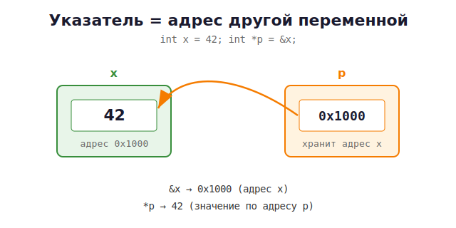

# 09 · Указатели — фундамент 🖼️⭐

> 🎯 **Цель блока:** понять указатели раз и навсегда. Это **самая важная тема** во всём C.
> Не спеши. Перечитай. Нарисуй на бумаге. Указатели — это просто адреса.

---

## 📖 Что такое указатель

Помнишь карту памяти — ряд пронумерованных байтов? Так вот:

> **Указатель — это переменная, которая хранит АДРЕС другой переменной.**

Обычная переменная хранит **значение**. Указатель хранит **адрес** (номер домика).

```c
int x = 42;        // обычная переменная: хранит ЗНАЧЕНИЕ 42
int *p = &x;       // указатель: хранит АДРЕС переменной x
```

🖼️ В памяти:



---

## ⭐ Два главных оператора

| Оператор | Название | Что делает | Пример |
|----------|----------|-----------|--------|
| `&` | «адрес чего-то» | берёт адрес переменной | `&x` → 0x1000 |
| `*` | «значение по адресу» (разыменование) | идёт по адресу и берёт значение | `*p` → 42 |

💡 Запомни как фразы:
- `&x` = «**адрес** x» (ты уже видел это в `scanf`!)
- `*p` = «**значение, на которое указывает** p»

```c
int x = 42;
int *p = &x;       // p = адрес x

printf("%d\n", x);    // 42  — само значение
printf("%p\n", (void*)&x);   // 0x1000 — адрес x
printf("%p\n", (void*)p);    // 0x1000 — p хранит тот же адрес
printf("%d\n", *p);   // 42  — идём по адресу p и читаем значение
```

---

## ⭐ Разыменование работает в обе стороны

Через `*p` можно не только **читать**, но и **менять** значение по адресу:

```c
int x = 42;
int *p = &x;

*p = 100;            // записать 100 ПО АДРЕСУ, на который указывает p
printf("%d\n", x);   // 100 ! Мы изменили x через указатель
```

🖼️

```
ДО:   p ●──► x [ 42 ]
*p = 100
ПОСЛЕ: p ●──► x [ 100 ]      сам x изменился!
```

💡 Вот она — суперсила указателей: **менять переменную, находясь в другом месте кода**.

---

## 🧩 Объявление указателей

```c
int    *pi;     // указатель на int
char   *pc;     // указатель на char
double *pd;     // указатель на double
```

Тип важен: он говорит, **сколько байт** читать по адресу и как их трактовать.
`int*` читает 4 байта как целое, `double*` — 8 байт как дробное.

> ⚠️ `*` относится к переменной, а не к типу:
> ```c
> int* a, b;   // a — указатель, b — ОБЫЧНЫЙ int! Ловушка!
> int *a, *b;  // оба указатели — пиши так
> ```

---

## ⭐ NULL — «указатель в никуда»

Указатель, который пока никуда не указывает, должен быть `NULL`:

```c
int *p = NULL;       // явно: "пока ни на что не указываю"

if (p != NULL) {
    printf("%d\n", *p);   // безопасно разыменовать только если не NULL
}
```

> ⚠️ Разыменование `NULL` (`*p` когда `p == NULL`) → программа **падает**
> (segmentation fault). Это, как ни странно, хорошо: лучше явный краш, чем тихая порча
> памяти. Всегда инициализируй указатели — либо адресом, либо `NULL`.

---

## ⭐ Главное применение №1: изменить переменную из функции

Помнишь из блока про функции — аргументы передаются **по значению** (копией), и оригинал
не меняется? Указатели решают эту проблему!

```c
// ❌ НЕ работает — меняет копию
void swap_bad(int a, int b) {
    int t = a; a = b; b = t;
}

// ✅ Работает — меняем оригиналы через адреса
void swap(int *a, int *b) {
    int t = *a;     // прочитать значение по адресу a
    *a = *b;        // записать в a значение из b
    *b = t;
}

int main(void) {
    int x = 1, y = 2;
    swap(&x, &y);            // передаём АДРЕСА
    printf("%d %d\n", x, y); // 2 1 — сработало!
    return 0;
}
```

🖼️

```
main:  x[1]  y[2]
         │     │
   &x ───┘     └─── &y     передаём адреса
         ▼     ▼
swap:  a●    b●            a и b указывают на x и y
       работаем через *a, *b → меняем ОРИГИНАЛЫ
```

💡 Именно поэтому в `scanf("%d", &x)` стоит `&` — `scanf` должен записать в твою
переменную, поэтому ему нужен её адрес. Теперь это очевидно!

---

## 📖 Указатель тоже лежит в памяти

Сам указатель — это переменная, занимает место (обычно 8 байт на 64-битной системе):

```c
printf("%zu\n", sizeof(int*));   // 8 (на 64-битной системе)
```

Можно сделать **указатель на указатель**:

```c
int x = 5;
int *p = &x;        // p указывает на x
int **pp = &p;      // pp указывает на p

printf("%d\n", **pp);   // 5 — двойное разыменование
```

🖼️ `pp ●──► p ●──► x [5]`

---

## ⚠️ Главные опасности указателей (запомни сейчас)

```c
// 1. Неинициализированный (дикий) указатель
int *p;          // указывает в случайное место!
*p = 5;          // ⚠️ запись в неизвестно куда → краш или порча памяти
// Лечение: int *p = NULL;  или сразу присвой адрес

// 2. Разыменование NULL
int *p = NULL;
*p = 5;          // ⚠️ segmentation fault

// 3. Висячий указатель (dangling) — указывает на удалённую память
int *bad(void) {
    int x = 5;
    return &x;   // ⚠️ x умрёт, адрес станет невалидным
}
```

Эти ошибки — главные источники багов в C. Мы научимся их ловить в
[модуле 12 · Ошибки памяти](12-memory-errors-tools.md).

---

## ✅ Задачи

1. **Базовое.** Объяви `int x = 10`, указатель на него. Выведи: значение x, адрес x,
   значение указателя, значение по указателю. Убедись, что адрес x и значение указателя
   совпадают.
2. **Изменение через указатель.** Через указатель увеличь значение переменной на 5.
3. **swap.** Реализуй `swap` для двух `int` через указатели. Проверь.
4. **Минимум и максимум.** Напиши функцию `void min_max(int arr_a, int arr_b, int *min,
   int *max)`, которая возвращает **два** значения через указатели.
5. **Деление с остатком.** Функция `void divmod(int a, int b, int *q, int *r)` — возвращает
   частное и остаток через указатели.
6. **Указатель на указатель.** Создай `int x`, `int *p`, `int **pp`. Измени `x` через
   `**pp`. Выведи.
7. **NULL-защита.** Напиши функцию, которая принимает указатель и безопасно печатает
   значение (или «нет данных», если `NULL`).

---

## ❓ Проверь себя

1. Что хранит указатель?
2. Что делают операторы `&` и `*`?
3. Как через указатель изменить значение переменной?
4. Почему `swap` работает через указатели, а через обычные параметры — нет?
5. Что такое `NULL` и почему опасно его разыменовывать?
6. Что такое висячий (dangling) указатель?
7. Теперь объясни своими словами, зачем `&` в `scanf`.

---

## ✅ Чек-лист

- [ ] Понимаю: указатель = адрес
- [ ] Свободно использую `&` и `*`
- [ ] Умею менять переменную через указатель
- [ ] Написал `swap` и понял, почему он работает
- [ ] Знаю про `NULL` и три главные опасности

> 💪 Если указатели «щёлкнули» — ты прошёл главный барьер C. Дальше всё проще!

➡️ Следующий: [10 · Массивы и строки](10-arrays-strings.md)
