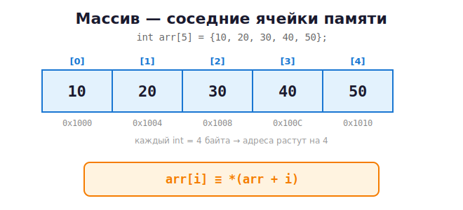

# 10 · Массивы и строки 🖼️⭐

> 🎯 **Цель блока:** понять, что массив — это **подряд идущие ячейки памяти**, а строка —
> это массив символов. И увидеть глубокую связь массивов с указателями.

---

## 📖 Массив — это соседние ячейки в памяти

```c
int arr[5] = {10, 20, 30, 40, 50};
```

🖼️ В памяти это **5 ячеек подряд**:



Обращение по **индексу** (нумерация **с нуля**!):

```c
printf("%d\n", arr[0]);   // 10  — первый элемент
printf("%d\n", arr[4]);   // 50  — последний (для размера 5 это индекс 4!)
arr[2] = 99;              // изменить третий элемент
```

> ⚠️ **Индексация с 0!** В массиве из 5 элементов индексы `0,1,2,3,4`. `arr[5]` —
> выход за границы!

---

## ⭐ Самая важная связь: массив ≈ указатель

Имя массива по сути является **адресом его первого элемента**:

```c
int arr[5] = {10, 20, 30, 40, 50};

printf("%p\n", (void*)arr);      // адрес начала массива
printf("%p\n", (void*)&arr[0]);  // тот же адрес!

// Эти две записи эквивалентны:
arr[2]   ==   *(arr + 2)
```

🖼️ Как работает `*(arr + 2)` — **арифметика указателей**:

```
arr ──► [10][20][30][40][50]
         ↑       ↑
       arr+0   arr+2  (шаг = размер типа = 4 байта)

*(arr + 2)  =  иди от начала на 2 элемента вперёд и возьми значение  =  30
```

💡 **Гениально:** `arr[i]` — это просто красивая запись для `*(arr + i)`. Компилятор сам
умножает `i` на размер типа. Поэтому массивы и указатели — почти одно и то же.

```c
int *p = arr;        // указатель на начало массива
printf("%d\n", p[2]);     // 30 — к указателю можно применять []!
printf("%d\n", *(p + 2)); // 30 — то же самое
p++;                 // теперь p указывает на arr[1]
printf("%d\n", *p);  // 20
```

---

## ⚠️ Выход за границы массива — частая катастрофа

```c
int arr[3] = {1, 2, 3};
arr[5] = 100;        // ⚠️ записали ЗА пределы массива!
```

🖼️ Что происходит:

```
        ┌────┬────┬────┐  ← твой массив (3 элемента)
arr:    │ 1  │ 2  │ 3  │ ?? ?? [100] ??
        └────┴────┴────┘       ↑
         [0]  [1]  [2]        arr[5] — чужая память!
```

C **не проверяет** границы! Ты молча портишь соседнюю память. Это:
- может ничего не сломать сразу (бомба замедленного действия),
- может испортить другую переменную,
- может уронить программу.

> 💡 Запомни размер массива в отдельной переменной и **всегда проверяй индекс**.
> Инструменты из модуля 12 (AddressSanitizer) ловят такие ошибки.

---

## 📖 Размер массива

```c
int arr[5];
size_t n = sizeof(arr) / sizeof(arr[0]);   // 20 байт / 4 байта = 5 элементов
```

> ⚠️ Этот трюк работает **только** для настоящего массива в той же функции. Если передать
> массив в функцию — он «распадается» (decay) в указатель, и `sizeof` даст размер
> указателя (8), а не массива! Поэтому размер передают **отдельным параметром**:
> ```c
> void print_array(int *arr, size_t n) { ... }
> ```

---

## 📖 Перебор массива циклом

```c
int arr[5] = {10, 20, 30, 40, 50};
int sum = 0;
for (size_t i = 0; i < 5; i++) {
    sum += arr[i];
}
printf("Сумма: %d\n", sum);
```

---

## 🔤 Строки — это массивы char с нулём на конце

В C **нет отдельного типа «строка»**. Строка — это массив `char`, заканчивающийся
**нулевым символом** `'\0'` (терминатором).

```c
char name[] = "Cat";
```

🖼️ В памяти:

```
        ┌─────┬─────┬─────┬──────┐
name:   │ 'C' │ 'a' │ 't' │ '\0' │   ← 4 байта! Невидимый '\0' в конце
        └─────┴─────┴─────┴──────┘
          67    97   116    0      (коды символов)
```

💡 `'\0'` (код 0) — это **метка конца строки**. Все функции работы со строками
(`printf %s`, `strlen`) идут по символам, **пока не встретят `'\0'`**.

> ⚠️ Если потерять `'\0'` — функции уйдут читать чужую память за концом строки! Поэтому
> для строки `"Cat"` нужен массив минимум на 4 символа.

---

## 📖 Работа со строками

```c
#include <stdio.h>
#include <string.h>     // библиотека строк

int main(void) {
    char str[20] = "Hello";

    printf("%s\n", str);            // Hello
    printf("Длина: %zu\n", strlen(str));   // 5 (без учёта '\0')

    strcat(str, " C!");             // дописать: "Hello C!"
    printf("%s\n", str);

    char copy[20];
    strcpy(copy, str);              // скопировать строку

    if (strcmp(str, copy) == 0)     // сравнить (0 = равны)
        printf("Строки равны\n");

    return 0;
}
```

| Функция | Что делает |
|---------|-----------|
| `strlen(s)` | длина (без `'\0'`) |
| `strcpy(dst, src)` | копировать строку |
| `strcat(dst, src)` | склеить строки |
| `strcmp(a, b)` | сравнить (0 = равны) |
| `strchr(s, c)` | найти символ |

> ⚠️ Эти функции **не проверяют размер** буфера-приёмника! Если `dst` мал — переполнение
> буфера (одна из главных уязвимостей в истории ПО). Есть безопасные версии `strncpy`,
> `snprintf` — о них в продвинутых блоках.

---

## 🧪 Перебор строки вручную (увидь '\0')

```c
char str[] = "ABC";
for (int i = 0; str[i] != '\0'; i++) {     // идём ДО терминатора
    printf("Символ %d: %c (код %d)\n", i, str[i], str[i]);
}
```

Так работают **все** строковые функции внутри.

---

## 📐 Двумерные массивы

```c
int grid[2][3] = {
    {1, 2, 3},
    {4, 5, 6}
};
printf("%d\n", grid[1][2]);   // 6
```

🖼️ В памяти лежит **всё равно подряд** (по строкам):

```
grid:  [1][2][3][4][5][6]
        └─строка 0─┘└─строка 1─┘
```

---

## ✅ Задачи

1. **Сумма и среднее.** Заполни массив из 10 чисел, посчитай сумму, среднее, min и max.
2. **Реверс массива.** Переверни массив на месте (без второго массива).
3. **Поиск.** Найди индекс заданного значения в массиве (или -1, если нет).
4. **Через указатель.** Перебери массив, используя только указатель и `*(p + i)`, без `[]`.
5. **Своя strlen.** Напиши `size_t my_strlen(const char *s)` — считай символы до `'\0'`.
6. **Своя strcpy.** Реализуй копирование строки вручную.
7. **Палиндром-строка.** Проверь, читается ли строка одинаково в обе стороны.
8. **Счётчик слов.** Посчитай количество слов в строке (слова разделены пробелами).
9. **Перевод регистра.** Преврати строку в ВЕРХНИЙ регистр (только латиница).
10. ⭐ **Решето Эратосфена.** Найди все простые числа до 1000 через массив-«решето».

---

## ❓ Проверь себя

1. Как массив расположен в памяти?
2. Почему индексация начинается с 0?
3. Чему равно `arr[2]` через арифметику указателей?
4. Что такое `'\0'` и почему он критичен для строк?
5. Сколько байт занимает строка `"Hi"`?
6. Что произойдёт при выходе за границы массива? Проверяет ли это C?
7. Почему `sizeof` не работает для массива внутри функции?

---

## ✅ Чек-лист

- [ ] Понимаю массив как соседние ячейки памяти
- [ ] Знаю связь `arr[i] == *(arr + i)`
- [ ] Понимаю строку как массив char с `'\0'`
- [ ] Написал свои `my_strlen` / `my_strcpy`
- [ ] Понимаю опасность выхода за границы

➡️ Следующий: [11 · Динамическая память: malloc / free](11-dynamic-memory.md)
