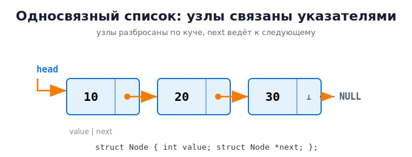

# 14 · Структуры данных на указателях 🖼️⭐

> 🎯 **Цель блока:** построить **связный список**, стек, очередь и дерево — структуры,
> где элементы разбросаны по куче и связаны указателями. Это «высший пилотаж» работы с
> памятью и фундамент всех языков.

---

## 📖 Массив vs связный список

| | **Массив** | **Связный список** |
|--|-----------|--------------------|
| Память | один сплошной блок | узлы разбросаны по куче |
| Размер | фиксированный/realloc | растёт по одному узлу |
| Вставка в начало | сдвигать всё 🐢 | мгновенно 🚀 |
| Доступ по индексу | мгновенно 🚀 | идти по цепочке 🐢 |

---

## ⭐ Односвязный список

Каждый **узел** хранит значение и **указатель на следующий узел**:

```c
typedef struct Node {
    int value;
    struct Node *next;     // указатель на следующий узел (или NULL в конце)
} Node;
```

🖼️ Список `10 → 20 → 30` в памяти (узлы в разных местах кучи!):



💡 `head` — указатель на первый узел. Идя по `next`, мы обходим список, пока не упрёмся
в `NULL`.

### Создание узла

```c
Node* create_node(int value) {
    Node *n = malloc(sizeof(Node));
    if (n == NULL) { exit(1); }
    n->value = value;
    n->next = NULL;
    return n;
}
```

### Добавление в начало (O(1) — мгновенно)

```c
void push_front(Node **head, int value) {
    Node *n = create_node(value);
    n->next = *head;     // новый узел указывает на старую голову
    *head = n;           // голова теперь — новый узел
}
```

🖼️

```
было:   head ──► [20]──►[30]
push 10:
        new[10]──┐
                 ▼
        head ──► [10]──►[20]──►[30]
```

> 💡 Почему `Node **head` (двойной указатель)? Потому что мы меняем **сам** указатель
> head, а не то, на что он указывает. Чтобы изменить переменную-указатель из функции —
> нужен указатель на неё. Вспомни модуль про указатели!

### Обход и печать

```c
void print_list(const Node *head) {
    for (const Node *cur = head; cur != NULL; cur = cur->next)
        printf("%d -> ", cur->value);
    printf("NULL\n");
}
```

### ⭐ Освобождение всего списка (не допусти утечку!)

```c
void free_list(Node *head) {
    while (head != NULL) {
        Node *next = head->next;   // ⚠️ сохрани next ДО free!
        free(head);
        head = next;
    }
}
```

> ⚠️ Частая ошибка: `free(head); head = head->next;` — после `free` читать `head->next`
> уже нельзя (use-after-free). Сначала сохрани `next`, потом освобождай.

---

## ⭐ Стек (LIFO — последним пришёл, первым ушёл)

Стек = список, где добавляем и забираем только с одного конца (вершины).

```c
// push — добавить на вершину (как push_front)
// pop  — снять с вершины и вернуть значение
int pop(Node **head) {
    if (*head == NULL) { /* пусто */ return -1; }
    Node *top = *head;
    int value = top->value;
    *head = top->next;
    free(top);
    return value;
}
```

🖼️ `push 1,2,3` → `pop` вернёт `3,2,1` (обратный порядок).

---

## ⭐ Очередь (FIFO — первым пришёл, первым ушёл)

Добавляем в **конец**, забираем из **начала**. Удобно хранить два указателя: `head` и `tail`.

```c
typedef struct {
    Node *head;   // откуда забираем
    Node *tail;   // куда добавляем
} Queue;
```

🖼️

```
enqueue →  [A]──►[B]──►[C]  → dequeue
          tail            head
добавляем в конец    забираем из начала
```

---

## 📖 Двусвязный список

Каждый узел знает и **следующего**, и **предыдущего** — можно ходить в обе стороны:

```c
typedef struct DNode {
    int value;
    struct DNode *prev;
    struct DNode *next;
} DNode;
```

🖼️

```
 NULL ◄──┬────┬──► ◄──┬────┬──► ◄──┬────┬──► NULL
         │ 10 │       │ 20 │       │ 30 │
      ◄──┴────┴──  ◄──┴────┴──  ◄──┴────┴──
```

---

## 📖 Бинарное дерево поиска (BST)

Каждый узел имеет до двух детей: слева — меньше, справа — больше. Быстрый поиск.

```c
typedef struct TreeNode {
    int value;
    struct TreeNode *left;
    struct TreeNode *right;
} TreeNode;
```

🖼️

```
            [50]
           /    \
        [30]    [70]
        /  \    /  \
     [20][40][60][80]
```

💡 Поиск/вставка — O(log n) для сбалансированного дерева. Идеально для рекурсии.

---

## ✅ Задачи

1. **Базовый список.** Реализуй `push_front`, `push_back`, `print_list`, `free_list`.
   Проверь под ASan — никаких утечек!
2. **Длина и поиск.** Функции `length(head)` и `find(head, value)` (вернуть узел или NULL).
3. **Удаление узла.** `remove_value(head, value)` — удалить первый узел с данным значением.
4. **Реверс списка.** Переверни связный список (поменяй направление всех `next`).
5. **Стек на списке.** Реализуй стек push/pop/peek/is_empty. Проверь на скобках:
   правильно ли расставлены `()[]{}` в строке.
6. **Очередь.** Реализуй очередь enqueue/dequeue с head и tail.
7. ⭐ **Двусвязный список.** Добавление в оба конца, удаление, обход в обе стороны.
8. ⭐⭐ **Бинарное дерево поиска.** Вставка, поиск, обход «слева-направо» (in-order даёт
   отсортированный порядок!), подсчёт высоты, освобождение дерева (рекурсивно).
9. ⭐⭐ **Объединение списков.** Слей два отсортированных списка в один отсортированный.

---

## ❓ Проверь себя

1. Чем связный список отличается от массива по расположению в памяти?
2. Почему добавление в начало списка — O(1), а в массив — дороже?
3. Зачем функции `push_front` нужен `Node **head`?
4. Как правильно освободить список, чтобы не было use-after-free?
5. В чём разница между стеком (LIFO) и очередью (FIFO)?
6. Зачем в очереди хранить указатель `tail`?

---

## ✅ Чек-лист

- [ ] Реализовал односвязный список с корректным освобождением
- [ ] Понимаю, зачем двойной указатель `Node **`
- [ ] Сделал стек и очередь
- [ ] Под ASan нет утечек ни в одной структуре
- [ ] Понимаю идею дерева поиска

➡️ Следующий: [15 · Указатели на функции](15-function-pointers.md)
