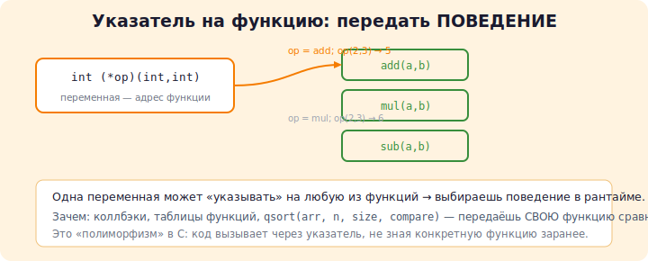

# 15 · Указатели на функции 🖼️

> 🎯 **Цель блока:** понять, что функция — это тоже адрес в памяти (в сегменте TEXT),
> и его можно хранить в переменной. Это открывает callback-и и гибкую архитектуру.

---

## 📖 Функция живёт в памяти, у неё есть адрес

Помнишь карту памяти? Код функций лежит в сегменте **TEXT**. Значит, у каждой функции
есть адрес — и его можно сохранить в указатель.

```c
int add(int a, int b) { return a + b; }

int main(void) {
    printf("%p\n", (void*)add);   // адрес функции add в памяти!
    return 0;
}
```

---

## ⭐ Синтаксис указателя на функцию

```c
int add(int a, int b) { return a + b; }

int (*operation)(int, int);    // указатель на функцию (int, int) -> int
operation = add;               // сохранили адрес функции (без скобок!)

int result = operation(2, 3);  // вызов через указатель → 5
```

🖼️ Разбор объявления:

```
   int   (*operation) (int, int)
    │        │          └──┬──┘
    │     имя указателя  типы параметров
 тип возвращаемого значения

Читается: "operation — указатель на функцию,
           принимающую (int, int) и возвращающую int"
```

> ⚠️ Скобки вокруг `*operation` обязательны! Без них `int *operation(int,int)` — это
> объявление функции, возвращающей `int*`, а не указатель.

💡 Совет: упрости через `typedef`:
```c
typedef int (*BinaryOp)(int, int);   // BinaryOp — тип "указатель на (int,int)->int"
BinaryOp op = add;
```

---



## ⭐ Зачем это нужно: callback-и

Указатель на функцию позволяет **передать поведение** в другую функцию.

```c
// функция, которая применяет ЛЮБУЮ операцию к каждому элементу
void map(int *arr, size_t n, int (*fn)(int)) {
    for (size_t i = 0; i < n; i++)
        arr[i] = fn(arr[i]);
}

int square(int x) { return x * x; }
int negate(int x) { return -x; }

int main(void) {
    int a[] = {1, 2, 3};
    map(a, 3, square);   // [1, 4, 9]
    map(a, 3, negate);   // [-1, -4, -9]
}
```

💡 Одна функция `map` — разное поведение, в зависимости от переданной функции. Это
основа функционального стиля и многих библиотек.

---

## ⭐ Главный пример: `qsort` из стандартной библиотеки

`qsort` сортирует **что угодно**, потому что ты передаёшь ей функцию сравнения:

```c
#include <stdlib.h>

int compare_int(const void *a, const void *b) {
    int x = *(const int*)a;
    int y = *(const int*)b;
    return x - y;        // <0 если a<b, 0 если равны, >0 если a>b
}

int main(void) {
    int arr[] = {5, 2, 8, 1, 9};
    qsort(arr, 5, sizeof(int), compare_int);
    // arr теперь отсортирован: 1 2 5 8 9
}
```

💡 Меняешь функцию сравнения — меняешь порядок (по убыванию, по модулю, по полю
структуры). Один `qsort` — бесконечно гибкий.

---

## 📖 Таблица функций (вместо длинного switch)

Массив указателей на функции — элегантная замена `switch`:

```c
int add(int a, int b) { return a + b; }
int sub(int a, int b) { return a - b; }
int mul(int a, int b) { return a * b; }

int main(void) {
    int (*ops[3])(int, int) = { add, sub, mul };   // таблица функций
    char *names[3] = { "+", "-", "*" };

    for (int i = 0; i < 3; i++)
        printf("10 %s 3 = %d\n", names[i], ops[i](10, 3));
    return 0;
}
```

🖼️

```
ops[0] ●──► add
ops[1] ●──► sub      выбираем поведение по индексу
ops[2] ●──► mul
```

💡 Так устроены интерпретаторы команд, виртуальные машины, обработчики событий.

---

## ✅ Задачи

1. **Калькулятор на таблице функций.** Перепиши калькулятор из уровня 1, заменив `switch`
   на массив указателей на функции.
2. **map / filter.** Реализуй `map` (применить функцию к каждому) и `filter` (оставить
   элементы, для которых функция вернула истину).
3. **qsort разными способами.** Отсортируй массив `int` по возрастанию, по убыванию и
   по модулю — тремя разными функциями сравнения.
4. **Сортировка структур.** Создай массив `struct Person { char name[50]; int age; }`,
   отсортируй `qsort`-ом по возрасту и по имени.
5. ⭐ **Простой обработчик команд.** Структура `{ char *name; void (*handler)(void); }`.
   Массив команд, поиск по имени и вызов нужного обработчика (мини-CLI).

---

## ❓ Проверь себя

1. Где в памяти живёт код функции?
2. Как объявить указатель на функцию `(double)->double`?
3. Зачем нужны callback-и? Приведи пример.
4. Как `qsort` сортирует любой тип данных?
5. Чем таблица функций лучше длинного `switch`?

---

## ✅ Чек-лист

- [ ] Понимаю, что функция имеет адрес
- [ ] Умею объявлять и вызывать указатель на функцию
- [ ] Использовал `qsort` со своей функцией сравнения
- [ ] Сделал таблицу функций
- [ ] Понимаю идею callback-ов

➡️ Следующий: [16 · Препроцессор и модульность](16-preprocessor-modularity.md)
