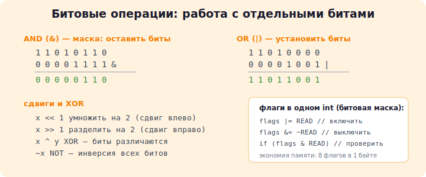

# 18 · Битовые операции 🖼️

> 🎯 **Цель блока:** работать с **отдельными битами** в байтах. Это экономит память,
> ускоряет код и нужно для системного программирования, графики, сетей, шифрования.

---

## 📖 Вспомним: число — это биты

Любое число хранится как набор битов. Например `int` 13:

```
13 в двоичном:  0000...0000 1101
                            └┬┘
                       8 + 4 + 0 + 1 = 13
```

Битовые операции работают с этими нулями и единицами напрямую.

---



## ⭐ Шесть битовых операторов

| Оператор | Название | Что делает |
|----------|----------|-----------|
| `&` | AND (И) | бит = 1, если **оба** бита 1 |
| `\|` | OR (ИЛИ) | бит = 1, если **хотя бы один** 1 |
| `^` | XOR (исключ. ИЛИ) | бит = 1, если биты **разные** |
| `~` | NOT (инверсия) | переворачивает все биты |
| `<<` | сдвиг влево | сдвигает биты влево (умножение на 2ⁿ) |
| `>>` | сдвиг вправо | сдвигает биты вправо (деление на 2ⁿ) |

🖼️ Примеры на 8 битах:

```
   a = 12 = 0000 1100
   b = 10 = 0000 1010

a & b =     0000 1000  = 8     (1 только где оба 1)
a | b =     0000 1110  = 14    (1 где хоть один 1)
a ^ b =     0000 0110  = 6     (1 где биты разные)
~a    =     1111 0011  = ...   (всё перевернулось)
```

### Сдвиги — быстрое умножение/деление на степени двойки

```c
1 << 3      // 0000 0001 → 0000 1000 = 8   (1 * 2³)
5 << 1      // 0000 0101 → 0000 1010 = 10  (5 * 2)
20 >> 2     // 0001 0100 → 0000 0101 = 5   (20 / 4)
```

🖼️

```
  5 << 1:   0000 0101
            ◄── сдвиг влево на 1
            0000 1010  = 10
```

---

## ⭐ Битовые маски и флаги — главное применение

Представь: у объекта есть набор свойств (вкл/выкл). Вместо 8 переменных `bool` — один
байт, где каждый бит = один флаг. **Экономия памяти в 8 раз!**

```c
#define FLAG_BOLD      (1 << 0)   // 0000 0001
#define FLAG_ITALIC    (1 << 1)   // 0000 0010
#define FLAG_UNDERLINE (1 << 2)   // 0000 0100

unsigned char style = 0;

style |= FLAG_BOLD;             // УСТАНОВИТЬ бит (включить жирный)
style |= FLAG_ITALIC;           // включить курсив

if (style & FLAG_BOLD)          // ПРОВЕРИТЬ бит
    printf("Жирный включён\n");

style &= ~FLAG_BOLD;            // СБРОСИТЬ бит (выключить жирный)

style ^= FLAG_ITALIC;           // ПЕРЕКЛЮЧИТЬ бит (вкл↔выкл)
```

🖼️ Шпаргалка операций с битами:

```
УСТАНОВИТЬ бит:    x |=  (1 << n)
СБРОСИТЬ бит:      x &= ~(1 << n)
ПЕРЕКЛЮЧИТЬ бит:   x ^=  (1 << n)
ПРОВЕРИТЬ бит:     (x &  (1 << n)) != 0
```

💡 Так хранятся права доступа в файловых системах, настройки в играх, флаги состояния
в железе. Один `int` = 32 независимых флага.

---

## 📖 Полезные битовые трюки

```c
// Чётность: младший бит = 0 → чётное
if ((n & 1) == 0) printf("чётное\n");

// Умножить/разделить на 2
n << 1;    // *2
n >> 1;    // /2

// Поменять два числа без временной переменной (через XOR)
a ^= b; b ^= a; a ^= b;

// Проверить, что число — степень двойки
if (n > 0 && (n & (n - 1)) == 0) printf("степень двойки\n");
```

🖼️ Почему `n & (n-1)` обнуляет младший единичный бит:

```
   n   = 1000  (8)
   n-1 = 0111  (7)
n&(n-1)= 0000  → было ровно 1 бит → степень двойки!
```

---

## 📖 Битовые поля в структурах

Можно явно указать, сколько бит занимает поле структуры:

```c
struct Color {
    unsigned red   : 5;   // 5 бит
    unsigned green : 6;   // 6 бит
    unsigned blue  : 5;   // 5 бит
};                        // всего 16 бит = 2 байта (формат RGB565)
```

💡 Используется в форматах данных, протоколах, работе с железом, где важен каждый бит.

---

## ✅ Задачи

1. **Двоичный вывод.** Напиши функцию, печатающую число в двоичном виде (побитно).
2. **Подсчёт единиц.** Посчитай количество установленных битов (единиц) в числе
   (population count).
3. **Флаги прав.** Реализуй систему прав `READ/WRITE/EXECUTE` через биты. Функции выдать,
   отнять, проверить право.
4. **Степень двойки.** Проверь, является ли число степенью двойки (через `n & (n-1)`).
5. **Своп через XOR.** Поменяй два числа местами без временной переменной.
6. ⭐ **Простой шифр.** Зашифруй строку, применив XOR каждого символа с ключом. Проверь,
   что повторное применение расшифровывает (свойство XOR).
7. ⭐ **Упаковка даты.** Упакуй день (5 бит), месяц (4 бита) и год (например 12 бит) в
   одно число. Напиши функции упаковки и распаковки.
8. ⭐⭐ **RGB.** Упакуй три байта (R, G, B) в один `int` и распакуй обратно. Реализуй
   осветление цвета.

---

## ❓ Проверь себя

1. Что делают `&`, `|`, `^`, `~`?
2. Чему равно `5 << 2`? А `20 >> 1`?
3. Как установить, сбросить, переключить и проверить N-й бит?
4. Зачем нужны битовые маски/флаги? Какая экономия памяти?
5. Как быстро проверить чётность через биты?
6. Что делает `n & (n - 1)`?

---

## ✅ Чек-лист «Уровень 3 — Middle — пройден» 🎉

- [ ] Создаю свои типы (struct/union/enum), понимаю их в памяти
- [ ] Реализовал связный список, стек, очередь без утечек
- [ ] Использую указатели на функции и `qsort`
- [ ] Разбиваю проект на `.h`/`.c`, собираю через Makefile
- [ ] Читаю и пишу файлы (текст и бинарь)
- [ ] Работаю с битами: маски, флаги, сдвиги

➡️ ✅ [Задачи уровня 3](TASKS.md) → 🚀 [Пет-проект: менеджер задач](PROJECT.md)
