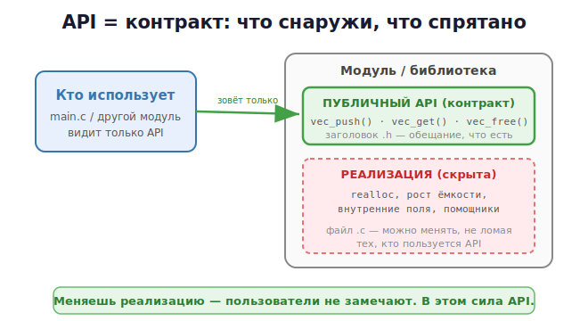

# 2 · Проектирование API библиотеки 🖼️⭐

> 🎯 **Цель блока:** научиться проектировать **API** — то «лицо» твоего модуля, которым
> пользуются другие. Хороший API легко использовать правильно и трудно — неправильно.

---

## 📖 Что такое API (на уровне кода)

**API** твоего модуля — это набор функций и типов из его `.h`, через которые с ним
работают. Это **контракт**: «вот что я обещаю делать, а как — моё дело».



💡 Заголовок `.h` — это и есть твой API. Всё, что в `.c` и помечено `static`, — скрытая
реализация, которую можно переписать, не ломая пользователей.

---

## ⭐ Принцип №1: скрывай реализацию (инкапсуляция)

Сравни два подхода к типу `Stack`.

### ❌ Плохо: всё наружу
```c
// stack.h
typedef struct {
    int *data;
    size_t size, cap;
} Stack;
```
Пользователь видит поля и **полезет в них напрямую**: `s.size = 100;`. Теперь ты не можешь
изменить внутреннее устройство — сломаешь чужой код.

### ✅ Хорошо: непрозрачный тип (opaque pointer)
```c
// stack.h — пользователь видит ТОЛЬКО имя типа, не поля
typedef struct Stack Stack;        // "неполный тип"
Stack *stack_create(void);
void   stack_push(Stack *s, int value);
int    stack_pop(Stack *s);
size_t stack_size(const Stack *s); // доступ к size — только через функцию
void   stack_destroy(Stack *s);
```
```c
// stack.c — поля известны только здесь
struct Stack { int *data; size_t size, cap; };
```

🖼️
```
   Пользователь:  Stack *s = stack_create();   // работает с УКАЗАТЕЛЕМ,
                  stack_push(s, 5);             // не зная, что внутри
                  // s->size  ← ❌ нельзя, поля не видны!

   Ты внутри:     можешь как угодно менять struct Stack —
                  пользователи не заметят
```

> 💡 **Opaque pointer** (непрозрачный указатель) — главный приём инкапсуляции в C. Так
> устроены `FILE*`, многие библиотеки. Пользователь держит указатель, а поля спрятаны.

---

## ⭐ Принцип №2: продумай жизненный цикл

Хороший API парный: на каждое «создать» — «уничтожить».

```c
Stack *s = stack_create();    // создание (выделяет память)
// ... работа ...
stack_destroy(s);             // освобождение — на каждый create один destroy
```

💡 Это как `malloc`/`free` (Уровень 2) или `fopen`/`fclose`: ресурс выдаёшь и забираешь
парами. Чёткий жизненный цикл = меньше утечек.

---

## ⭐ Принцип №3: понятные имена и единый стиль

```c
// ✅ единый префикс модуля + глагол: легко читать, не конфликтует
stack_create()  stack_push()  stack_pop()  stack_destroy()

// ❌ разнобой
createStack()   add()         RemoveItem()  free_the_stack()
```

Правила:
- **префикс модуля** у всех функций (`stack_…`) — нет конфликтов имён, видно
  принадлежность;
- глагол + существительное (`stack_push`, не `stack_pushing`);
- одинаковый порядок параметров (объект — первым: `stack_push(s, value)`).

---

## ⭐ Принцип №4: сообщай об ошибках предсказуемо

API должен честно говорить, что пошло не так. Распространённые способы в C:

```c
// 1. Возврат кода ошибки (0 = успех)
int stack_push(Stack *s, int value);   // вернёт 0 или код ошибки

// 2. Специальное значение
Stack *stack_create(void);             // вернёт NULL при нехватке памяти

// 3. Через выходной параметр
int stack_pop(Stack *s, int *out);     // out — результат, return — успех/ошибка
```

```c
// Пользователь обязан проверить:
Stack *s = stack_create();
if (s == NULL) { /* обработать */ }
```

> 💡 Выбери **один** стиль на всю библиотеку и придерживайся его. Документируй: что
> функция возвращает при ошибке.

---

## 📖 Принцип №5: const = обещание «не изменю»

```c
size_t stack_size(const Stack *s);   // const → функция только читает, не меняет стек
void   stack_push(Stack *s, int v);  // без const → может менять
```

💡 `const` в API — это документация для пользователя и защита от случайных изменений.
Помечай `const` всё, что только читаешь.

---

## 📖 Принцип №6: стабильность и версии

Когда твоей библиотекой пользуются — менять API больно (ломается чужой код). Поэтому:

- **семантическое версионирование** `MAJOR.MINOR.PATCH`:
  - PATCH (1.0.**1**) — починка, API не меняется;
  - MINOR (1.**1**.0) — добавили функции, старое работает;
  - MAJOR (**2**.0.0) — сломали совместимость (убрали/изменили функции).
- добавлять новое — безопасно; убирать/менять сигнатуры — ломает.

💡 Поэтому так важно скрывать реализацию: пока публичный API стабилен, ты свободно меняешь
внутренности и выпускаешь PATCH/MINOR, не ломая пользователей.

---

## 📋 Чек-лист хорошего API

```
   ✅ Реализация скрыта (opaque type / static), наружу — минимум
   ✅ Парный жизненный цикл (create/destroy)
   ✅ Единый префикс и стиль имён
   ✅ Предсказуемая обработка ошибок (один способ)
   ✅ const везде, где только читаем
   ✅ Заголовок документирован (что делает, что возвращает, кто освобождает память)
   ✅ Минимум публичных функций — «маленькая дверь, большой дом»
```

---

## ✅ Задачи

1. **Opaque-тип.** Перепиши свой `Stack` или `Vector` так, чтобы поля были скрыты
   (`typedef struct Stack Stack;` в `.h`, `struct Stack {...}` в `.c`). Убедись, что из
   `main.c` нельзя залезть в поля.
2. **Жизненный цикл.** Проверь, что на каждый `*_create` есть `*_destroy`, прогони под
   ASan — нет утечек.
3. **Коды ошибок.** Добавь в API единый способ сообщать об ошибках. Документируй в `.h`
   комментариями.
4. **const-аудит.** Пройди по своему API, расставь `const` везде, где функция только читает.
5. **Документация.** Напиши над каждой функцией в `.h` комментарий: что делает, параметры,
   что возвращает, кто отвечает за освобождение памяти.
6. ⭐ **API-ревью.** Дай свой `.h` другому человеку (или перечитай через день): понятно ли
   пользоваться, не заглядывая в `.c`? Если нет — улучшай.

---

## ❓ Проверь себя

1. Что такое API модуля и где он «живёт»?
2. Зачем скрывать реализацию? Что такое opaque pointer?
3. Почему важен парный жизненный цикл create/destroy?
4. Какие способы сообщать об ошибках есть в C?
5. Зачем `const` в сигнатурах API?
6. Что такое семантическое версионирование и зачем оно?

---

## ✅ Чек-лист

- [ ] Прячу реализацию через opaque type / static
- [ ] Проектирую парный жизненный цикл
- [ ] Держу единый стиль имён с префиксом
- [ ] Обрабатываю ошибки одним предсказуемым способом
- [ ] Расставляю const, документирую заголовок
- [ ] Понимаю версионирование и стабильность API

➡️ Следующий: [3 · Работа с внешними API (HTTP/JSON)](03-external-api.md)
