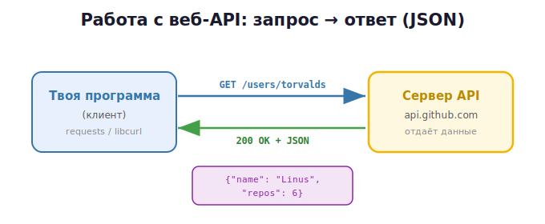

# 3 · Работа с внешними API (HTTP/JSON) 🖼️

> 🎯 **Цель блока:** понять, что такое веб-API, и обратиться к нему **из C**. Заодно ты
> увидишь, почему для таких задач часто берут Python — и оценишь оба подхода.

---

## 📖 Что такое веб-API

До этого «API» был интерфейсом твоего модуля. **Веб-API** — это интерфейс **чужого
сервиса в интернете**: ты посылаешь запрос по сети, он присылает данные (обычно в формате
JSON).



Примеры: погода, курсы валют, GitHub, карты, нейросети — у всех есть веб-API. Ты
отправляешь HTTP-запрос на адрес (URL) и получаешь ответ.

---

## 📖 HTTP-запрос: из чего состоит

```
   GET /users/torvalds HTTP/1.1        ← метод + путь
   Host: api.github.com                ← заголовки
   Authorization: token abc123         ← (если нужен ключ)

   ← в ответ: статус 200 OK + тело (JSON)
```

| Метод | Зачем |
|-------|-------|
| `GET` | получить данные |
| `POST` | отправить/создать |
| `PUT`/`PATCH` | изменить |
| `DELETE` | удалить |

**Коды ответа:** `200` OK · `201` создано · `404` не найдено · `401` нет доступа ·
`429` слишком много запросов · `500` ошибка сервера.

---

## 📖 JSON — формат обмена

Почти все API отвечают в **JSON** — это текст вида:

```json
{
  "name": "Linus Torvalds",
  "public_repos": 6,
  "followers": 200000
}
```

Это пары «ключ: значение», списки `[...]` и вложенность. Твоя задача — распарсить этот
текст и достать нужные поля.

---

## ⭐ Делаем GET-запрос на C через libcurl

В C нет сети «из коробки» — используют библиотеку **libcurl** (стандарт де-факто).

> 🛠️ Установка libcurl: на MSYS2 → `pacman -S mingw-w64-ucrt-x86_64-curl`. На Linux →
> `sudo apt install libcurl4-openssl-dev`. Компиляция с флагом `-lcurl`.

```c
#include <stdio.h>
#include <stdlib.h>
#include <string.h>
#include <curl/curl.h>

// libcurl отдаёт данные кусками в эту функцию — копим их в буфер
struct Buffer { char *data; size_t size; };

static size_t on_data(void *chunk, size_t sz, size_t n, void *userp) {
    size_t total = sz * n;
    struct Buffer *buf = userp;
    char *p = realloc(buf->data, buf->size + total + 1);   // привет, Уровень 2!
    if (!p) return 0;
    buf->data = p;
    memcpy(buf->data + buf->size, chunk, total);
    buf->size += total;
    buf->data[buf->size] = '\0';
    return total;
}

int main(void) {
    CURL *curl = curl_easy_init();
    if (!curl) return 1;

    struct Buffer buf = { malloc(1), 0 };
    buf.data[0] = '\0';

    curl_easy_setopt(curl, CURLOPT_URL, "https://api.github.com/users/torvalds");
    curl_easy_setopt(curl, CURLOPT_USERAGENT, "c-course/1.0");   // GitHub требует
    curl_easy_setopt(curl, CURLOPT_WRITEFUNCTION, on_data);
    curl_easy_setopt(curl, CURLOPT_WRITEDATA, &buf);

    CURLcode res = curl_easy_perform(curl);          // выполнить запрос
    if (res == CURLE_OK) {
        long code;
        curl_easy_getinfo(curl, CURLINFO_RESPONSE_CODE, &code);
        printf("Статус: %ld\n", code);
        printf("Тело:\n%s\n", buf.data);             // здесь JSON-текст
    } else {
        fprintf(stderr, "Ошибка сети: %s\n", curl_easy_strerror(res));
    }

    curl_easy_cleanup(curl);     // парный жизненный цикл, как мы учили!
    free(buf.data);
    return 0;
}
```
```bash
gcc -Wall main.c -o app -lcurl     # не забудь -lcurl
```

🖼️ Обрати внимание: данные приходят **кусками**, мы их копим в растущий буфер через
`realloc` — ровно та работа с памятью, что ты освоил в Уровне 2. Сеть = поток байтов.

---

## 📖 Парсинг JSON на C

`curl` дал тебе JSON как **строку**. Чтобы достать поля, нужен JSON-парсер. В стандарте C
его нет — берут маленькую библиотеку, например **cJSON**:

```c
#include "cJSON.h"

cJSON *root = cJSON_Parse(buf.data);
cJSON *name = cJSON_GetObjectItem(root, "name");
if (cJSON_IsString(name))
    printf("Имя: %s\n", name->valuestring);
cJSON_Delete(root);          // снова парный жизненный цикл
```

---

## ⚠️ Что всегда учитывать при работе с веб-API

```
   ✅ Проверяй код ответа (200? а если 404/500?)
   ✅ Обрабатывай ошибки сети (нет интернета, таймаут)
   ✅ Не храни ключи (API key) в коде — выноси в переменные окружения
   ✅ Уважай лимиты (rate limit) — не шли тысячи запросов в секунду
   ✅ Освобождай ресурсы (curl_cleanup, free, cJSON_Delete)
```

---

## 💡 Почему для веб-API чаще берут Python

Сравни: на C ты вручную управляешь буфером, подключаешь две библиотеки, следишь за
памятью. В Python то же самое — **три строки**:

```python
import requests
data = requests.get("https://api.github.com/users/torvalds").json()
print(data["name"])
```

> 💡 Это не значит, что C хуже — просто у каждого языка своя ниша. C незаменим там, где
> важны скорость и контроль (драйверы, встраиваемые системы). Для веб-интеграций удобнее
> Python. Понимая оба, ты выбираешь инструмент под задачу. Подробно про веб-API на Python —
> в [соответствующем модуле Python-курса](../../Python/03b-projects-api/03-web-api.md).

---

## ✅ Задачи

1. **Первый запрос.** Установи libcurl, сделай GET-запрос к
   `https://api.github.com/users/<любой_логин>`, выведи статус и тело.
2. **Буфер.** Разберись в функции `on_data`: почему данные приходят кусками и зачем
   `realloc`? Добавь печать размера каждого куска.
3. **Коды ответа.** Запроси несуществующий путь, поймай код 404, обработай его.
4. **Парсинг.** Подключи cJSON, достань из ответа конкретные поля (`name`,
   `public_repos`), выведи их.
5. **Жизненный цикл.** Проверь под ASan, что нет утечек (curl, буфер, cJSON освобождены).
6. ⭐ **Мини-клиент.** Оберни запрос в свою функцию с чистым API:
   `int github_get_user(const char *login, char **out_json);` — применив всё из модуля 2.

---

## ❓ Проверь себя

1. Чем веб-API отличается от API твоего модуля?
2. Из чего состоит HTTP-запрос? Что значат коды 200/404/500?
3. Что такое JSON?
4. Почему в `on_data` данные копятся через `realloc`?
5. Какие правила безопасности и вежливости при работе с API?
6. Почему для веб-интеграций часто выбирают Python?

---

## ✅ Чек-лист «раздел Проекты и API пройден» 🎉

- [ ] Раскладываю проект по файлам и папкам
- [ ] Проектирую чистый API со скрытой реализацией
- [ ] Понимаю, что такое веб-API, HTTP, JSON
- [ ] Сделал запрос к внешнему API из C через libcurl
- [ ] Парсю JSON и обрабатываю ошибки/коды ответа
- [ ] Понимаю, когда брать C, а когда Python

➡️ ✅ [Задачи раздела](TASKS.md) → 🚀 [Мини-проект: библиотека с чистым API](PROJECT.md)
