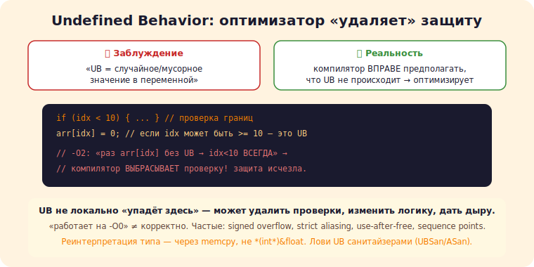

# 1 · Undefined behavior глубоко 🖼️⭐⭐

> 🎯 **Цель блока:** понять undefined behavior (UB) по-настоящему — почему оптимизатор «ломает»
> код с UB, и как избегать самых коварных видов (строгий алиасинг, переполнение, sequence points).

---

## 📖 UB — не «случайный результат», а «компилятор вправе на ВСЁ»

```
   распространённое заблуждение: «UB = непредсказуемое значение». НЕТ.
   UB = компилятор ВПРАВЕ ПРЕДПОЛАГАТЬ, что UB НЕ ПРОИСХОДИТ, и оптимизировать исходя из этого.
   результат: код может быть выброшен, переписан, «телепортироваться» — не просто «мусор в переменной».
```

```c
   int arr[10];
   if (idx < 10) { ... }
   arr[idx] = 0;            // если idx может быть >= 10 — это UB.
   // компилятор может ВЫБРОСИТЬ проверку idx<10, рассудив: «раз arr[idx] выполняется без UB,
   //   значит idx<10 ВСЕГДА» → проверка лишняя. защита исчезает!
```



💡 ⭐⭐ Ключевое осознание: **оптимизатор предполагает отсутствие UB и оптимизирует на этом**. UB не
локально «здесь упадёт» — оно может удалить проверки, изменить логику в другом месте, дать дыру
безопасности. Поэтому UB в C/C++ так опасно: не «иногда неверный результат», а «компилятор имел
право сделать что угодно». (Связь: [⚙️ оптимизатор](../../ComputerScience/04-performance/21-compiler-optimization.md).)

---

## ⭐ Частые виды UB

```
   • ВЫХОД ЗА ГРАНИЦЫ массива (чтение/запись).
   • РАЗЫМЕНОВАНИЕ NULL / висячего / неинициализированного указателя.
   • ПЕРЕПОЛНЕНИЕ ЗНАКОВОГО целого (signed overflow) — UB! (беззнаковое — определено, wraps).
   • USE-AFTER-FREE, double free.
   • ЧТЕНИЕ неинициализированной переменной.
   • СДВИГ на >= ширину типа / отрицательный.
   • НАРУШЕНИЕ СТРОГОГО АЛИАСИНГА (ниже).
   • ГОНКА ДАННЫХ (data race) в многопотоке.
   • деление на ноль, sequence-point нарушения (ниже).
```

💡 ⭐ Коварство: signed overflow — UB (поэтому `a + 1 > a` компилятор может счесть «всегда true»
для int). Беззнаковое переполнение — определено (оборачивается). Многие «логичные» предположения о
C неверны из-за UB. Санитайзеры (UBSan/ASan) ловят UB в рантайме — используй их.

---

## ⭐⭐ Строгий алиасинг (strict aliasing)

```
   ПРАВИЛО: компилятор предполагает, что указатели РАЗНЫХ типов НЕ указывают на одну память
   (кроме char* и совместимых). это позволяет оптимизации (не перечитывать память зря).

   ❌ НАРУШЕНИЕ (UB):
   float f = 1.0f;
   int i = *(int*)&f;        // читаем float через int* — РАЗНЫЕ типы → strict aliasing UB!
   // «работает» на -O0, но на -O2 компилятор может предположить, что int* и float* не пересекаются,
   //   и выдать неверный/неожиданный результат.

   ✅ ПРАВИЛЬНО (type punning):
   int i; memcpy(&i, &f, sizeof i);   // memcpy — легально для «переинтерпретации байтов».
   // или union (в C — легально; в C++ тонкости), или char* (всегда можно).
```

💡 ⭐⭐ Строгий алиасинг — один из самых коварных UB: код «работает» без оптимизации и ломается с
ней. Реинтерпретация типа через каст указателя (`*(int*)&float`) — UB. Правильно — `memcpy`
(компилятор оптимизирует его в ноль инструкций), union (в C), или `char*`. Это частая причина
«загадочных» багов при включении `-O2`.

---

## 📖 Sequence points и порядок вычисления

```
   ❌ int i = 0; arr[i] = i++;        // UB: чтение и изменение i без sequence point между ними.
   ❌ f(i++, i++);                     // UB: порядок вычисления аргументов не определён.
   ❌ i = i++ + 1;                     // UB.
   правило: не модифицируй переменную ДВАЖДЫ между sequence points, и не читай+пиши без упорядочивания.
   ✅ разбивай на отдельные операторы: arr[i] = i; i++;
   (C++17 уточнил часть правил, но привычка «одна модификация на выражение» — безопаснее.)
```

---

## ⚠️ Ловушки

- ❌ Думать «UB = мусорное значение» (на деле компилятор оптимизирует, предполагая отсутствие UB).
- ❌ Рассчитывать на «работает на -O0» (на -O2 UB проявится иначе).
- ❌ Реинтерпретация типа через каст указателя (нарушение strict aliasing) — используй memcpy.
- ❌ Полагаться на signed overflow как на «оборачивание» (это UB).
- ❌ Двойная модификация переменной в одном выражении (sequence points).
- ❌ Не использовать UBSan/ASan (они ловят UB, которое глаз не видит).

---

## ✅ Задачи

1. **UB исчезает.** Напиши код с выходом за границы после проверки. Скомпилируй -O0 и -O2 (godbolt) —
   сравни, исчезла ли проверка.
2. **Signed overflow.** Покажи, как `a+1 > a` для int компилятор считает «всегда true» на -O2. Почему UB?
3. ⭐ **Strict aliasing.** Реинтерпретируй float как int через каст указателя (UB) и через memcpy.
   Сравни поведение на -O2.
4. ⭐ **UBSan.** Прогони код с разными UB под `-fsanitize=undefined`. Что ловит?
5. **Sequence points.** Найди/напиши 3 выражения с UB по sequence points, исправь.

---

## ❓ Проверь себя

1. Что на самом деле означает UB (как ведёт себя оптимизатор)?
2. Почему signed overflow — UB, а unsigned — нет?
3. Что такое строгий алиасинг и как правильно реинтерпретировать типы?
4. Что такое нарушение sequence points?

---

## ✅ Чек-лист

- [ ] Понимаю UB как «оптимизатор предполагает его отсутствие»
- [ ] Знаю частые виды UB (overflow, aliasing, use-after-free…)
- [ ] Реинтерпретирую типы через memcpy/union, не каст указателя
- [ ] Избегаю двойной модификации в выражении
- [ ] Использую UBSan/ASan

➡️ Следующий: [2 · Обобщённое программирование в C](02-generic-c.md)
