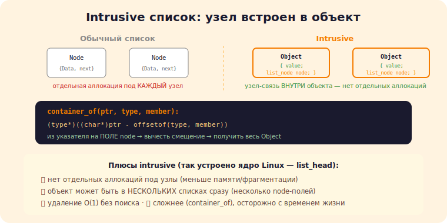

# 5 · Продвинутые структуры данных 🖼️⭐

> 🎯 **Цель блока:** освоить продвинутые приёмы C-структур — intrusive-структуры, гибкие массивы,
> tagged unions — то, что используют ядра ОС и высокопроизводительный код.

---

## 📖 Intrusive структуры данных

```
   обычный список: узел ХРАНИТ данные (struct Node { Data d; Node* next; }) — данные «внутри» узла.
   INTRUSIVE список: УЗЕЛ-ССЫЛКА встроен В САМ объект данных:
   struct Object { int value; struct list_node node; };   // node — часть объекта
   struct list_node { struct list_node *next, *prev; };

   список связывает объекты через встроенные node, не выделяя отдельные узлы.
```



```
   ✅ НЕТ отдельных аллокаций под узлы (узел уже в объекте) → меньше памяти/фрагментации, быстрее.
   ✅ объект может быть в НЕСКОЛЬКИХ списках сразу (несколько node-полей).
   ✅ удаление за O(1) без поиска (есть указатель на node).
   ❌ сложнее (макросы container_of, чтобы из node получить объект), менее «безопасно».
   так устроены списки в ЯДРЕ LINUX (list_head). это паттерн системного C.
```

💡 ⭐ Intrusive — «вывернутый наизнанку» список: связь встроена в объект, а не объект в узел. Из
указателя на встроенное поле `node` получают указатель на объект через макрос **`container_of`**
(арифметика смещений). Это даёт минимум аллокаций и максимум контроля — почему ядра используют это.

---

## ⭐ container_of: магия смещений

```c
// получить указатель на ОБЪЕМЛЮЩУЮ структуру по указателю на её ПОЛЕ:
#define container_of(ptr, type, member) \
    ((type*)((char*)(ptr) - offsetof(type, member)))

// ptr указывает на поле member внутри type → вычесть смещение поля → получить начало структуры.
struct Object* obj = container_of(node_ptr, struct Object, node);
```

💡 ⭐ `offsetof` даёт смещение поля в структуре; `container_of` вычитает его из адреса поля → адрес
всей структуры. Это позволяет intrusive-структурам и обобщённым контейнерам «подниматься» от
встроенного узла к объекту. Фундаментальный приём системного C (весь ядерный код на нём).

---

## ⭐⭐ Flexible array member и tagged union

```c
// FLEXIBLE ARRAY MEMBER (C99): массив переменной длины в КОНЦЕ структуры:
struct Packet {
    size_t len;
    char data[];          // гибкий массив — размер определяется при выделении
};
// одна аллокация под заголовок + данные:
struct Packet* p = malloc(sizeof(struct Packet) + len);
p->len = len;             // data[] лежит сразу за len, в том же блоке памяти

// ✅ одна аллокация (заголовок+данные вместе) → локальность, меньше malloc. так хранят пакеты/строки.
```

```c
// TAGGED UNION (size-safe variant): union + тег типа = типобезопасный «вариант»:
struct Value {
    enum { INT, FLOAT, STRING } tag;   // что внутри
    union { int i; float f; char* s; } as;  // данные (одно из)
};
// проверяй tag перед доступом → безопасно. это «enum с данными» (как Rust enum / std::variant).
```

💡 ⭐⭐ Два мощных приёма: **flexible array member** — хранить заголовок и данные переменной длины в
ОДНОЙ аллокации (локальность, эффективность; так делают сетевые пакеты, строки). **Tagged union** —
типобезопасный «вариант» (тег + union): храни одно из нескольких, проверяй тег. Это «sum type»
бедняка — то, что в Rust/C++ есть как enum/variant. Основа интерпретаторов (значения разных типов),
протоколов, AST.

---

## 📖 Прочие приёмы

```
   • НЕПРОЗРАЧНЫЕ ТИПЫ (opaque pointer) — struct в .c, в .h только typedef struct Foo Foo; →
     инкапсуляция (пользователь не видит внутренности). (из раздела «Проекты и API»).
   • ВЫРАВНИВАНИЕ И УПАКОВКА — порядок полей влияет на padding/размер (из Senior). компактные структуры =
     кэш-дружелюбнее.
   • БИТОВЫЕ ПОЛЯ (struct { unsigned flag : 1; }) — компактное хранение флагов.
   • МАССИВ СТРУКТУР vs СТРУКТУРА МАССИВОВ (AoS/SoA) — под кэш (из Senior/⚙️).
```

> 🧭 Эти приёмы — основа [своих структур данных в капстоуне](../../Capstone/01-data-structures/04-linked-list.md)
> и понимания, как устроены ядра/высокопроизводительный код.

---

## ⚠️ Ловушки

- ❌ container_of с неверным типом/полем → указатель в никуда (UB).
- ❌ Flexible array member: забыть учесть его размер в malloc → выход за границы.
- ❌ Tagged union: доступ к `as.f`, когда tag == INT → читаешь мусор (всегда проверяй тег!).
- ❌ Intrusive: объект освобождён, но ещё в списке → use-after-free.
- ❌ Битовые поля: переносимость (порядок/упаковка зависит от компилятора).
- ❌ Игнорировать выравнивание/порядок полей (раздувание структур).

---

## ✅ Задачи

1. **container_of.** Реализуй `container_of` через `offsetof`. Получи объект из указателя на его поле.
2. **Intrusive список.** Сделай intrusive-список (node в объекте). Добавь объект в ДВА списка сразу.
3. ⭐ **Flexible array.** Структура «пакет» с гибким массивом; одна аллокация под заголовок+данные.
4. ⭐ **Tagged union.** Тип-значение (int/float/string) с тегом. Безопасная печать с проверкой тега
   (мостик к интерпретатору — капстоун).
5. **Упаковка.** Возьми структуру, переставь поля для минимума padding. Замерь sizeof до/после.

---

## ❓ Проверь себя

1. Чем intrusive-структура отличается от обычной и какие плюсы?
2. Как работает `container_of` (offsetof)?
3. Что такое flexible array member и tagged union?
4. Почему всегда проверять тег перед доступом к union?

---

## ✅ Чек-лист

- [ ] Понимаю intrusive-структуры и container_of
- [ ] Использую flexible array member для заголовок+данные
- [ ] Делаю типобезопасные tagged unions (проверка тега)
- [ ] Применяю opaque-типы, битовые поля, упаковку
- [ ] Связываю это с капстоун-структурами

➡️ Дальше: [✅ Задачи раздела](TASKS.md) · [🚀 Проект](PROJECT.md) · затем
[💡 решебник C](../SOLUTIONS.md) или [капстоун](../../Capstone/README.md)
