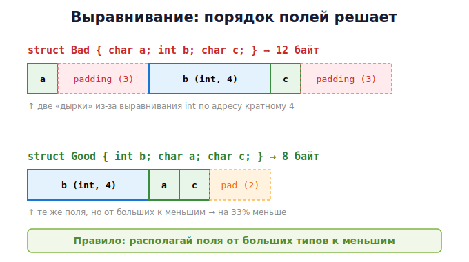

# 20 · Выравнивание, padding и Undefined Behavior 🖼️⭐

> 🎯 **Цель блока:** понять, почему `sizeof` структуры больше суммы полей, что такое
> выравнивание, и почему **undefined behavior** — самый коварный враг C-программиста.

---

## 📖 Выравнивание (alignment) — почему железо привередливо

Процессор читает память не побайтно, а **блоками** (4, 8 байт). Он любит, чтобы данные
лежали по адресам, **кратным их размеру**:
- `int` (4 байта) — по адресам 0, 4, 8, 12…
- `double` (8 байт) — по адресам 0, 8, 16…

Если `int` лежит по «кривому» адресу — на одних процессорах это медленнее, на других
(ARM старых) — **краш**. Поэтому компилятор **выравнивает** данные.

---

## ⭐ Padding — «дырки» в структурах

Из-за выравнивания компилятор вставляет **пустые байты** (padding) между полями.

```c
struct Bad {
    char  a;    // 1 байт
    int   b;    // 4 байта
    char  c;    // 1 байт
};
printf("%zu\n", sizeof(struct Bad));   // НЕ 6, а 12 !
```

🖼️ Как это лежит в памяти (и как починить порядком полей):



### 💡 Переставь поля — сэкономь память

```c
struct Good {
    int   b;    // 4 байта
    char  a;    // 1 байт
    char  c;    // 1 байт
};              // sizeof = 8 (а не 12!) — поля от больших к меньшим
```

🖼️

```
адрес:  0    1   2   3   4    5   6   7
       ┌─────────────────┬────┬────┬──────┐
       │       b         │ a  │ c  │ pad  │
       └─────────────────┴────┴────┴──────┘
```

> 💡 **Правило профи:** в структурах располагай поля от **больших** типов к **меньшим**.
> В больших массивах структур это экономит мегабайты и улучшает кэш.

### Узнать выравнивание

```c
#include <stdalign.h>
printf("%zu\n", alignof(int));      // 4
printf("%zu\n", alignof(double));   // 8
```

В аллокаторе из модуля 19 offset нужно выравнивать так:
```c
size_t align_up(size_t n, size_t align) {
    return (n + align - 1) & ~(align - 1);   // округлить вверх до кратного align
}
```

---

## ⭐ Undefined Behavior (UB) — главная ловушка C

**Undefined behavior** — это код, поведение которого стандарт C **не определяет**.
Компилятор может делать что угодно: вернуть мусор, «оптимизировать» твой код, удалить
проверки, уронить программу — и всё это **без предупреждения**.

> ⚠️ Самое опасное: UB может «работать» на твоей машине и ломаться у пользователя.
> Программа без UB — обязательное требование к качественному C-коду.

### Частые источники UB

```c
// 1. Выход за границы массива
int a[3]; a[5] = 1;              // UB

// 2. Разыменование NULL / висячего указателя
int *p = NULL; *p = 1;           // UB

// 3. Использование неинициализированной переменной
int x; printf("%d", x);          // UB

// 4. Переполнение знакового целого
int n = INT_MAX; n = n + 1;      // UB! (для unsigned — определено, заворачивается)

// 5. Деление на ноль
int z = 10 / 0;                  // UB

// 6. Чтение освобождённой памяти (use-after-free)
free(p); int v = *p;             // UB

// 7. Сдвиг на размер типа и больше
int y = 1 << 32;                 // UB для 32-битного int
```

🖼️ Почему UB коварен — компилятор «верит», что UB не случится, и оптимизирует:

```c
if (p != NULL) { ... }
*p = 5;     // если ниже разыменуешь p, компилятор может РЕШИТЬ, что p != NULL
            // всегда, и ВЫРЕЗАТЬ проверку выше! Классический источник дыр.
```

---

## ⭐ Квалификаторы: const, volatile, restrict

### `const` — «не изменяется»
```c
const int x = 5;                   // x менять нельзя
void print(const char *s);         // функция не изменит строку
```
Помогает компилятору оптимизировать и ловит ошибки на этапе компиляции.

### `volatile` — «не оптимизируй обращения»
```c
volatile int *reg = (int*)0x1000;  // регистр железа / меняется извне
```
Говорит компилятору: «значение может меняться вне программы (железо, другой поток,
прерывание), всегда читай из памяти, не кэшируй в регистре». Нужно в embedded и
драйверах.

> ⚠️ `volatile` — **не** про потокобезопасность! Для многопоточности нужны atomics
> (модуль 21). Частая ошибка — путать их.

### `restrict` — «указатели не пересекаются»
```c
void copy(int *restrict dst, const int *restrict src, size_t n);
```
Обещание компилятору, что `dst` и `src` не указывают на одну память → агрессивная
оптимизация.

---

## 🛠️ Инструмент: UndefinedBehaviorSanitizer (UBSan)

Как ASan ловит ошибки памяти, **UBSan** ловит undefined behavior:

```bash
gcc -fsanitize=undefined -g program.c -o program
./program
```

Поймает переполнение, кривые сдвиги, деление на 0, невыровненный доступ и др. Можно
совмещать: `-fsanitize=address,undefined`.

---

## ✅ Задачи

1. **Padding-детектив.** Создай 3 структуры с одинаковыми полями в разном порядке.
   Выведи `sizeof` каждой. Объясни разницу, нарисуй раскладку.
2. **Оптимизация структуры.** Дана структура с плохим порядком полей (sizeof = 24).
   Переставь поля, добейся минимума. Проверь `sizeof`.
3. **align_up.** Реализуй выравнивание вверх. Добавь выравнивание в arena-аллокатор из
   модуля 19.
4. **Поймай UB.** Напиши программу с переполнением знакового int и кривым сдвигом.
   Запусти под UBSan, прочитай отчёты.
5. ⭐ **const-correctness.** Возьми свой старый код, расставь `const` везде, где данные не
   меняются. Убедись, что компилируется.
6. ⭐⭐ **Сравнение раскладки.** Для массива из 1 000 000 структур посчитай экономию памяти
   при правильном порядке полей. Замерь реально.

---

## ❓ Проверь себя

1. Почему процессор требует выравнивания данных?
2. Что такое padding и почему `sizeof` бывает больше суммы полей?
3. Как уменьшить размер структуры, не убирая поля?
4. Что такое undefined behavior? Назови 4 источника.
5. Почему UB опасен даже когда «вроде работает»?
6. В чём разница между `const`, `volatile` и почему `volatile` ≠ потокобезопасность?
7. Как ловить UB автоматически?

---

## ✅ Чек-лист

- [ ] Понимаю выравнивание и padding, умею оптимизировать структуры
- [ ] Знаю главные источники UB и избегаю их
- [ ] Понимаю `const`, `volatile`, `restrict`
- [ ] Использую UBSan
- [ ] Выравниваю память в своём аллокаторе

➡️ Следующий: [21 · Многопоточность и атомарность](21-concurrency.md)
