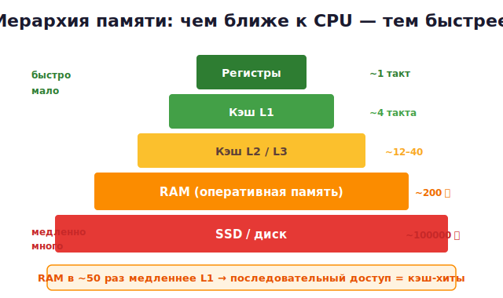

# 22 · Кэш и оптимизация 🖼️⭐

> 🎯 **Цель блока:** понять, почему **расположение данных в памяти** влияет на скорость в
> разы. Это вершина понимания памяти: ты научишься писать cache-friendly код, который
> летает.

---

## 📖 Иерархия памяти — почему RAM «медленная»

Помнишь из модуля 00 иерархию скорости? Разрыв между CPU и RAM **огромен**:



💡 Обращение к RAM в **~50 раз** дольше, чем к L1-кэшу. Если CPU постоянно ждёт RAM — он
простаивает. **Кэш** — маленькая быстрая память, куда CPU копирует «горячие» данные.

---

## ⭐ Cache line — память грузится блоками по 64 байта

CPU читает из RAM не по одному байту, а **целыми линиями по 64 байта** (cache line).
Запросил 1 байт → в кэш приехали 64 соседних байта.

🖼️

```
Запросил arr[0]:
  RAM ──► кэш приезжает СРАЗУ [arr[0]..arr[15]]  (64 байта = 16 int)

Теперь arr[1], arr[2]... arr[15] — уже в кэше! ⚡ (cache hit)
А arr[16] — снова поход в RAM 🐢 (cache miss)
```

💡 **Главный вывод:** если читать память **последовательно** — почти все обращения
попадают в кэш (hit). Если **прыгать** по памяти — постоянные промахи (miss) → медленно.

---

## ⭐ Демонстрация: порядок обхода матрицы

Один и тот же объём работы, но разница в скорости — в разы:

```c
#define N 4096
int matrix[N][N];

// ✅ БЫСТРО — по строкам (память идёт подряд)
for (int i = 0; i < N; i++)
    for (int j = 0; j < N; j++)
        sum += matrix[i][j];

// 🐢 МЕДЛЕННО — по столбцам (прыжки на N*4 байта каждый раз)
for (int j = 0; j < N; j++)
    for (int i = 0; i < N; i++)
        sum += matrix[i][j];
```

🖼️ Почему. Матрица в памяти лежит **по строкам** (row-major):

```
память: [строка0: 0,1,2,3...][строка1: ...][строка2: ...]

обход по строкам:   →→→→→→→→  идём подряд → кэш-хиты ⚡
обход по столбцам:  ↓ прыжок ↓ прыжок ↓    → каждый раз новая линия 🐢
```

> 💡 На больших матрицах разница достигает **5–10 раз** — без единого изменения алгоритма,
> только порядок доступа. Замерь сам в задачах!

---

## ⭐ AoS vs SoA — раскладка данных

Как хранить коллекцию объектов? Два подхода:

```c
// AoS — Array of Structures (массив структур)
struct Particle { float x, y, z; float vx, vy, vz; };
struct Particle particles[1000];

// SoA — Structure of Arrays (структура массивов)
struct Particles {
    float x[1000], y[1000], z[1000];
    float vx[1000], vy[1000], vz[1000];
};
```

🖼️ Если нужно обработать **только x** у всех частиц:

```
AoS:  [x y z vx vy vz][x y z vx vy vz]...
       ↑           ↑                     берём только x → кэш тащит и ненужные y,z,v
       нужное   мусор в кэше → промахи

SoA:  [x x x x x x x x ...][y y y ...]...
       ↑↑↑↑↑↑↑↑                          все x подряд → идеальные кэш-хиты ⚡
```

💡 **SoA** выигрывает, когда обрабатываешь одно-два поля у многих объектов (типично для
игр, симуляций, обработки данных). **AoS** удобнее, когда работаешь с объектом целиком.

---

## 📖 Другие приёмы оптимизации (но сначала — замеряй!)

```c
// Inline-подсказка для маленьких функций
static inline int square(int x) { return x * x; }

// Флаги оптимизации компилятора — часто дают больше, чем ручные трюки
gcc -O2 program.c -o program      // -O2 разумный дефолт, -O3 агрессивнее
```

| Приём | Эффект |
|-------|--------|
| Последовательный доступ к памяти | главный фактор скорости |
| `-O2` / `-O3` | компилятор оптимизирует за тебя |
| Меньше выделений памяти (arena/pool) | меньше промахов, меньше malloc |
| Избегать лишних копирований | передавай по указателю |
| Предсказуемые ветвления | помогает branch predictor |

> ⚠️ **Золотое правило оптимизации:** сначала **измерь**, потом оптимизируй. «Преждевременная
> оптимизация — корень всех зол» (Кнут). Узкое место часто не там, где кажется.

---

## 🛠️ Как измерять

```c
#include <time.h>

clock_t start = clock();
// ... код, который измеряем ...
clock_t end = clock();
double sec = (double)(end - start) / CLOCKS_PER_SEC;
printf("Время: %.3f сек\n", sec);
```

Профессиональные инструменты:
- **`perf`** (Linux) — счётчики CPU, кэш-промахи: `perf stat ./program`.
- **Valgrind `cachegrind`** — симуляция кэша, показывает промахи по строкам кода.
- **gprof** — профилировщик: где программа проводит время.

---

## ✅ Задачи

1. **Матрица: строки vs столбцы.** Замерь сумму элементов матрицы 4096×4096 двумя
   способами обхода. Запиши разницу во времени. Объясни.
2. **Размер имеет значение.** Повтори измерение для матриц 256×256, 1024×1024,
   8192×8192. Где разница больше и почему (когда данные перестают влезать в кэш)?
3. **AoS → SoA.** Реализуй симуляцию 1 000 000 частиц обоими способами. Обнови только
   координату x у всех. Сравни время.
4. **Влияние -O2.** Скомпилируй тяжёлый цикл с `-O0` и `-O2`, сравни скорость.
5. ⭐ **cachegrind.** Прогони матричный обход под `valgrind --tool=cachegrind`, найди
   строку с максимумом кэш-промахов.
6. ⭐⭐ **Оптимизация реального кода.** Возьми свою прошлую программу (например обработку
   массива), измерь, оптимизируй раскладку данных, докажи ускорение цифрами.

---

## ❓ Проверь себя

1. Во сколько раз RAM медленнее кэша L1? Зачем нужен кэш?
2. Что такое cache line и почему его размер важен?
3. Почему обход матрицы по строкам быстрее, чем по столбцам?
4. В чём разница AoS и SoA? Когда что выбрать?
5. Почему «сначала измерь, потом оптимизируй»?
6. Чем измерять производительность и кэш-промахи?

---

## ✅ Чек-лист

- [ ] Понимаю иерархию памяти и роль кэша
- [ ] Знаю про cache line и последовательный доступ
- [ ] Доказал на замерах разницу строки/столбцы
- [ ] Понимаю AoS vs SoA
- [ ] Умею измерять время и кэш-промахи
- [ ] Использую `-O2`

➡️ Следующий: [23 · Системное программирование](23-systems.md)
