# 🇨 Дорожная карта по языку C

Полный путь от «никогда не программировал» до «понимаю память как Senior».
Иди по блокам **строго по порядку** — каждый следующий опирается на предыдущий.

---

## 🗺️ Карта курса

```mermaid
flowchart TD
    Start([🥚 Старт: я ничего не умею]) --> S0

    subgraph LVL0 [🥚 Уровень 0 — Подготовка]
        S0[00 · Как устроен компьютер и память]
        S1[01 · Установка компилятора и редактора]
        S2[02 · Первая программа и как её собрать]
    end

    subgraph LVL1 [🐣 Уровень 1 — Junior: основы синтаксиса]
        B1[03 · Переменные и типы данных]
        B2[04 · Ввод-вывод]
        B3[05 · Операторы и условия]
        B4[06 · Циклы]
        B5[07 · Функции]
    end

    subgraph LVL2 [🐥 Уровень 2 — ПАМЯТЬ ⭐ ядро курса]
        M1[08 · Модель памяти: stack / heap / data / text]
        M2[09 · Указатели — фундамент]
        M3[10 · Массивы и строки]
        M4[11 · Динамическая память: malloc / free]
        M5[12 · Ошибки памяти и инструменты]
    end

    subgraph LVL3 [🐥 Уровень 3 — Middle]
        D1[13 · Структуры, union, enum]
        D2[14 · Структуры данных: списки, стек, очередь]
        D3[15 · Указатели на функции]
        D4[16 · Препроцессор и модульность]
        D5[17 · Работа с файлами]
        D6[18 · Битовые операции]
    end

    subgraph LVL4 [🦅 Уровень 4 — Senior]
        Z1[19 · Аллокаторы: arena, pool]
        Z2[20 · Выравнивание, padding, UB]
        Z3[21 · Многопоточность и атомики]
        Z4[22 · Кэш и оптимизация]
        Z5[23 · Системное программирование]
        Z6[24 · Отладка и профилирование]
    end

    S0 --> S1 --> S2 --> B1
    B1 --> B2 --> B3 --> B4 --> B5 --> M1
    M1 --> M2 --> M3 --> M4 --> M5 --> D1
    D1 --> D2 --> D3 --> D4 --> D5 --> D6 --> Z1
    Z1 --> Z2 --> Z3 --> Z4 --> Z5 --> Z6 --> Done

    Done([🦅 Senior C developer])
```

---

## 📂 Содержание

### 🥚 Уровень 0 — Подготовка
- [00 · Как устроен компьютер и память](00-setup/00-how-computer-works.md)
- [01 · Установка компилятора и редактора](00-setup/01-installation.md)
- [02 · Первая программа и компиляция](00-setup/02-first-program.md)

### 🐣 Уровень 1 — Junior (основы)
- [03 · Переменные и типы данных](01-basics/03-variables-types.md)
- [04 · Ввод и вывод](01-basics/04-io.md)
- [05 · Операторы и условия](01-basics/05-operators-conditions.md)
- [06 · Циклы](01-basics/06-loops.md)
- [07 · Функции](01-basics/07-functions.md)
- ✅ [Задачи уровня 1](01-basics/TASKS.md)
- 🚀 [Пет-проект: консольный калькулятор](01-basics/PROJECT.md)

### 🐥 Уровень 2 — ПАМЯТЬ ⭐
- [08 · Модель памяти](02-memory/08-memory-model.md)
- [09 · Указатели](02-memory/09-pointers.md)
- [10 · Массивы и строки](02-memory/10-arrays-strings.md)
- [11 · Динамическая память](02-memory/11-dynamic-memory.md)
- [12 · Ошибки памяти и инструменты](02-memory/12-memory-errors-tools.md)
- ✅ [Задачи уровня 2](02-memory/TASKS.md)
- 🚀 [Пет-проект: свой динамический массив (vector)](02-memory/PROJECT.md)

### 🐥 Уровень 3 — Middle
- [13 · Структуры, union, enum](03-middle/13-structs.md)
- [14 · Структуры данных на указателях](03-middle/14-data-structures.md)
- [15 · Указатели на функции](03-middle/15-function-pointers.md)
- [16 · Препроцессор и модульность](03-middle/16-preprocessor-modularity.md)
- [17 · Работа с файлами](03-middle/17-files.md)
- [18 · Битовые операции](03-middle/18-bitwise.md)
- ✅ [Задачи уровня 3](03-middle/TASKS.md)
- 🚀 [Пет-проект: менеджер задач](03-middle/PROJECT.md)

### 🧩 Раздел — Проекты и API
- [1 · Структура проекта: разделяем на файлы](03b-projects-api/01-project-structure.md)
- [2 · Проектирование API библиотеки](03b-projects-api/02-designing-api.md)
- [3 · Работа с внешними API (HTTP/JSON)](03b-projects-api/03-external-api.md)
- ✅ [Задачи раздела](03b-projects-api/TASKS.md)
- 🚀 [Мини-проект: библиотека с чистым API](03b-projects-api/PROJECT.md)

### 🦅 Уровень 4 — Senior
- [19 · Свои аллокаторы памяти](04-senior/19-allocators.md)
- [20 · Выравнивание, padding и UB](04-senior/20-alignment-ub.md)
- [21 · Многопоточность и атомарность](04-senior/21-concurrency.md)
- [22 · Кэш и оптимизация](04-senior/22-cache-optimization.md)
- [23 · Системное программирование](04-senior/23-systems.md)
- [24 · Отладка и профилирование](04-senior/24-debugging-profiling.md)
- ✅ [Задачи уровня 4](04-senior/TASKS.md)
- 🚀 [Финальные пет-проекты](04-senior/PROJECT.md)

---

## 🧭 Легенда значков

| Значок | Значение |
|--------|----------|
| 📖 | Теория |
| 🖼️ | Схема / картинка памяти |
| 🛠️ | Практическое действие (установить, запустить) |
| 💡 | Важная мысль / лайфхак |
| ⚠️ | Частая ошибка / опасность |
| ✅ | Задача для самостоятельного решения |
| 🚀 | Пет-проект |
| ❓ | Вопрос для самопроверки |

---

Начни здесь 👉 [00 · Как устроен компьютер и память](00-setup/00-how-computer-works.md)
