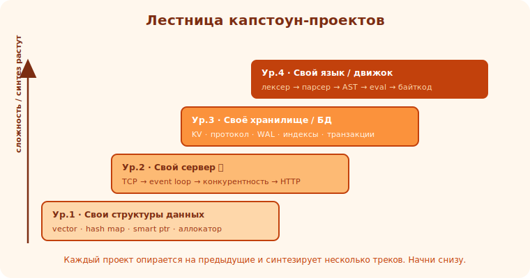

# 00 · Зачем капстоун-проекты 🖼️⭐

> 🎯 **Цель блока:** понять, почему большие самостоятельные проекты — главный способ превратить
> знания в навык, и как они отличают Senior от «прошёл туториалы».

---

## 📖 Туториалы дают знание, проекты — навык

```
   прошёл курс по C++ ≠ умеешь писать на C++. знание становится навыком только когда ты САМ
   строишь что-то нетривиальное, упираешься в реальные проблемы и решаешь их.
   капстоун-проект = большой проект, синтезирующий многое сразу, доведённый до работающего результата.
```

💡 ⭐ «Туториальный ад»: можно бесконечно проходить уроки и не уметь строить. Прорыв — когда
закрываешь учебник и делаешь **свой** проект с нуля. Там вылезает всё, что туториал прятал:
проектирование, отладка, интеграция, доведение. Это и есть настоящее обучение.

---

## ⭐ Что дают капстоун-проекты

```
   🧩 СИНТЕЗ — соединяешь треки: память + структуры данных + сеть + ОС + архитектура в ОДНОМ проекте.
   🔬 ГЛУБИНА — «свой vector» учит памяти глубже, чем 10 уроков про vector.
   🐛 РЕАЛЬНЫЕ ПРОБЛЕМЫ — отладка, краевые случаи, интеграция, производительность.
   💼 ПОРТФОЛИО — рабочий проект > сертификата; показывает, что ты МОЖЕШЬ.
   🧠 УВЕРЕННОСТЬ — «я построил БД/сервер/интерпретатор» меняет самовосприятие.
   📚 ПОНИМАНИЕ ИНСТРУМЕНТОВ — написал свой vector/allocator/сервер → понимаешь настоящие изнутри.
```

🖼️
```
   туториалы:     [урок][урок][урок]  →  знаю отдельные вещи
   капстоун:      [ ПРОЕКТ, где всё вместе ]  →  УМЕЮ строить системы
                   ↑ память+структуры+сеть+ОС+архитектура+отладка сразу
```

💡 ⭐ «Напиши свой X» — мощнейший приём обучения: построив упрощённую версию настоящего инструмента
(vector, malloc, Redis, БД), ты понимаешь его глубоко — и заодно понимаешь, почему «настоящий»
устроен сложнее (краевые случаи, оптимизации, которые ты прочувствуешь сам).

---

## ⭐⭐ Лестница проектов этого трека

```
   от простого к сложному, каждый опирается на предыдущие:

   1. СВОИ СТРУКТУРЫ ДАННЫХ (Ур.1) — vector, hash map, smart pointer, allocator.
      учит: память, указатели, RAII, локальность. фундамент для всего.

   2. СВОЙ СЕРВЕР (Ур.2) ⭐ — TCP → event loop → HTTP.
      учит: сокеты, ОС, конкурентность, сети. классическая senior-веха.

   3. СВОЁ ХРАНИЛИЩЕ / БД (Ур.3) — key-value, персистентность, индексы.
      учит: структуры данных на масштабе, I-O, надёжность.

   4. СВОЙ ЯЗЫК / ДВИЖОК (Ур.4) — интерпретатор (лексер→парсер→eval).
      учит: тулчейн изнутри, парсинг, архитектура; вершина понимания.
```



💡 ⭐⭐ Эти проекты — не случайны: они покрывают [Блок 9 твоего роадмапа](../../ROADMAP.md) и каждый
синтезирует несколько треков. Пройдя их, ты докажешь (себе и работодателю), что владеешь системным
программированием — не на уровне «знаю синтаксис», а «строю работающие системы».

---

## 📖 Главное правило: строй САМ

```
   ❌ скопировал готовый код проекта → ничего не понял, навык не вырос.
   ✅ строишь сам, упираешься в проблему, ищешь решение, отлаживаешь → вот где обучение.
   гайды этого трека дают НАПРАВЛЕНИЕ (этапы, ключевые решения, на что смотреть), но КОД пишешь ты.
   застрял — это нормально и полезно: разберись, и знание останется навсегда.
```

> 🧭 Это [Senior-ownership](../../Senior/04-leadership/21-ownership.md) и [ремесло](../../Senior/01-craft/05-refactoring.md):
> довести до результата, упираясь и решая, а не «посмотреть, как делают другие».

---

## ⚠️ Ловушки

- ❌ Бесконечно проходить туториалы вместо строительства своего.
- ❌ Копировать готовый проект целиком (навык не растёт).
- ❌ Браться за слишком большое сразу (начни с vector, не с БД).
- ❌ Бросать на 80% (доведение — часть навыка; незаконченное не считается).
- ❌ Гнаться за «идеально», не дойдя до «работает» (сначала MVP — модуль 01).

---

## ✅ Упражнения на размышление

1. **Туториальный ад.** Ловил ли себя на «прошёл, но не умею»? Что построил бы, чтобы перейти к навыку?
2. **Лестница.** Какой проект из 4 тиров тебе ближе всего? С какого начнёшь (рекомендую с Ур.1)?
3. **Портфолио.** Какой из этих проектов сильнее всего показал бы твой уровень работодателю?

---

## ❓ Проверь себя

1. Почему туториалы дают знание, а проекты — навык?
2. Что синтезирует каждый из 4 тиров проектов?
3. Почему «строй сам», а не копируй?
4. Как капстоун связан с Блоком 9 роадмапа?

---

## ✅ Чек-лист

- [ ] Понимаю, что навык растёт на проектах, не туториалах
- [ ] Знаю лестницу проектов трека (структуры → сервер → БД → язык)
- [ ] Принимаю правило «строй сам»
- [ ] Готов довести проект до работающего результата

➡️ Следующий: [01 · Методология больших проектов](01-methodology.md)
