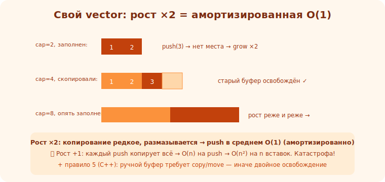

# 03 · Свой dynamic array (vector) 🖼️⭐⭐

> 🎯 **Проект:** реализуй свой динамический массив (как `std::vector`) — фундаментальная структура,
> которая учит управлению памятью, амортизации и обобщениям.

> 🛠️ Язык: C++ (идеально — учит RAII/move) или C (учит ручной памяти). Применяешь:
> [C/память](../../C/02-memory/11-dynamic-memory.md), [⚙️ раскладка/кэш](../../ComputerScience/01-hardware/08-cache.md),
> [Алгоритмы/массивы](../../Algorithms/01-structures/03-arrays.md).

---

## 📖 Что строим и зачем

```
   ДИНАМИЧЕСКИЙ МАССИВ — массив, который растёт автоматически при заполнении. внутри: непрерывный
   буфер в куче + размер (size) + ёмкость (capacity). при заполнении — выделяет больше, копирует, освобождает.
   почему первый проект: учит ВСЁ важное о памяти, и ты используешь vector каждый день — поймёшь изнутри.
```

🖼️
```
   data ──► [ 1 ][ 2 ][ 3 ][   ][   ]   capacity=5, size=3
   push(4): [ 1 ][ 2 ][ 3 ][ 4 ][   ]   size=4
   push(...) пока size<capacity — просто кладём.
   заполнилось (size==capacity) → выделить НОВЫЙ буфер ×2, скопировать, освободить старый, добавить.
```



---

## ⭐ Milestones (от MVP к полному)

```
   MVP: хранит int, push_back и оператор [] работают (фиксированная ёмкость).
   1. ПОЛЯ: указатель на буфер, size, capacity. конструктор/деструктор (выделить/освободить).
   2. push_back: если size<capacity — клади; иначе grow().
   3. grow(): выдели буфер ×2 (или ×1.5), скопируй старые, освободи старый, обнови указатель/capacity.
   4. operator[] и at() (с проверкой границ), size(), capacity().
   5. ШАБЛОН: сделай vector<T> для любого типа (template).
   6. ПРАВИЛО 5 (C++): деструктор, копирующие конструктор/присваивание, move конструктор/присваивание.
   7. ИТЕРАТОРЫ: begin()/end() — чтобы работал range-for и алгоритмы STL.
   8. pop_back, insert/erase, reserve, clear.
   готово: работает как std::vector в маленькой программе, проходит тесты, без утечек (ASan/Valgrind).
```

---

## ⭐⭐ Ключевые решения и подводные камни

```
   📈 СТРАТЕГИЯ РОСТА — почему ×2 (или ×1.5), а не +1?
      рост ×2 даёт АМОРТИЗИРОВАННУЮ O(1) на push (редкие дорогие копирования размазываются).
      рост +1 → каждое push копирует всё → O(n) на push → O(n²) на n вставок. КАТАСТРОФА.
      (связь: [амортизация в Алгоритмах](../../Algorithms/02-complexity/12-tradeoffs.md))

   🧠 УПРАВЛЕНИЕ ПАМЯТЬЮ:
      • не забудь освободить старый буфер при grow и в деструкторе (иначе утечка).
      • копирование элементов: для не-POD типов — вызывай конструкторы (placement new в продвинутой версии).

   ⚠️ ПРАВИЛО 5 (C++): если есть ручной ресурс (буфер), компилятор-генерируемые copy/move сломают
      (двойное освобождение, поверхностная копия). реализуй сам ИЛИ используй RAII-обёртки.
      (связь: [Rule of 3/5 в C++](../../Cpp/03-middle/13-classes.md))

   💥 КРАЕВЫЕ СЛУЧАИ: пустой вектор, capacity=0 (×2 от 0 = 0! начни с 1), self-assignment, выход за границы.
```

💡 ⭐⭐ Главный урок: **рост ×2 → амортизированная O(1)**. Это «магия» vector, которую ты прочувствуешь,
реализовав. И правило 5: ручное владение ресурсом требует определить копирование/перемещение, иначе
крэш. Эти два урока — фундамент для всех последующих проектов.

---

## 📖 Как проверить (тесты)

```
   ✅ push_back N элементов → size==N, все читаются [i].
   ✅ рост: push больше начальной ёмкости → capacity вырос, данные целы.
   ✅ copy: скопировал вектор → независимая копия (изменение одного не трогает другой).
   ✅ move: переместил → исходный пуст, данные у нового.
   ✅ краевые: пустой, [out of range] (at кидает), pop из пустого.
   ✅ ПАМЯТЬ: ASan/Valgrind — НЕТ утечек и обращений к освобождённому.
```

---

## 🌟 Расширения

```
   🥚 reserve()/shrink_to_fit() — управление ёмкостью.
   🐣 emplace_back (конструирование на месте), insert/erase в середину.
   🦅 exception safety: что если конструктор элемента кинул при росте? (strong guarantee)
   🚀 small-buffer optimization (хранить мало элементов на стеке) — как в реальных реализациях.
   🚀 сравни производительность своего и std::vector (профайлер) — насколько близко?
```

---

## ⚠️ Ловушки

- ❌ Рост +1 вместо ×2 → O(n²), «почему так медленно?».
- ❌ Забыть освободить старый буфер при grow → утечка.
- ❌ capacity ×2 от 0 = 0 (начни с 1 или спец-обработка).
- ❌ Не реализовать правило 5 при ручном буфере (C++) → крэши при копировании.
- ❌ Поверхностная копия (копируешь указатель, не данные) → двойное освобождение.
- ❌ Не проверять границы в at()/забыть про пустой вектор.

---

## ✅ Задачи

1. **MVP.** Реализуй vector для int: push_back, [], size, capacity, авторост ×2. Тесты на рост.
2. **Шаблон.** Обобщи до vector<T>. Проверь на int, string, своей структуре.
3. ⭐ **Правило 5 (C++).** Реализуй copy/move конструкторы и присваивания. Тесты на копию/перемещение.
4. **Память.** Прогони под ASan/Valgrind — устрани все утечки/ошибки.
5. ⭐ **Бенчмарк.** Сравни push_back своего и std::vector на 10млн элементов. Насколько медленнее? Почему?

---

## ❓ Проверь себя

1. Как устроен динамический массив (буфер/size/capacity)?
2. Почему рост ×2 даёт амортизированную O(1), а +1 — нет?
3. Зачем правило 5 и что сломается без него?
4. Какие краевые случаи надо покрыть тестами?

---

## ✅ Чек-лист

- [ ] Реализовал vector<T> с авторостом ×2
- [ ] Понял амортизированную O(1) на практике
- [ ] Реализовал правило 5 (C++) / корректное владение
- [ ] Покрыл тестами, включая краевые случаи
- [ ] Чисто под ASan/Valgrind (нет утечек)

➡️ Следующий: [04 · Свой связный список / стек / очередь](04-linked-list.md)
