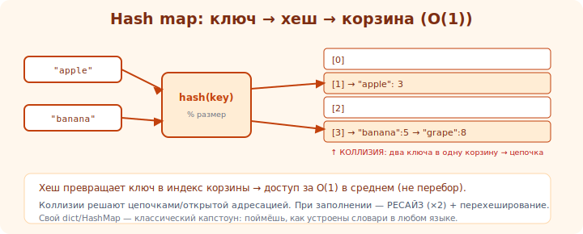

# 05 · Своя hash map 🖼️⭐⭐

> 🎯 **Проект:** реализуй хеш-таблицу (как `unordered_map`/`dict`) — учит хешированию, коллизиям и
> почему доступ O(1) в среднем.

> 🛠️ Применяешь: [Алгоритмы/хеш-таблицы](../../Algorithms/01-structures/06-hash-tables.md),
> предыдущие проекты (массив + список для цепочек), [⚙️ локальность](../../ComputerScience/01-hardware/08-cache.md).

---

## 📖 Что строим

```
   ХЕШ-ТАБЛИЦА — отображение ключ→значение с доступом ~O(1):
   • массив «корзин» (buckets).
   • хеш-функция: ключ → число → индекс корзины (hash(key) % размер).
   • коллизии (разные ключи в одну корзину) — разрешаем цепочками (список) или открытой адресацией.

   put(key,val): индекс = hash(key)%N → положить в корзину.
   get(key): индекс = hash(key)%N → найти в корзине по ключу.
```

🖼️
```
   "Анна" ─hash─► корзина 1 ──► [Анна:25]
   "Иван" ─hash─► корзина 3 ──► [Иван:30]──► [Пётр:19]  ← коллизия: цепочка
   "Олег" ─hash─► корзина 4 ──► [Олег:41]
   доступ: посчитал хеш → прыгнул в корзину → (короткий поиск в цепочке).
```

---



## ⭐ Milestones

```
   MVP: map<string,int> — put/get, фиксированный размер, коллизии цепочками.
   1. КОРЗИНЫ: массив цепочек (vector<list<pair<K,V>>> или свои из прошлых проектов).
   2. ХЕШ-ФУНКЦИЯ: для строк — например, полиномиальный хеш; для int — само число. % размер → индекс.
   3. put(k,v): найти корзину → если ключ есть, обновить; иначе добавить в цепочку.
   4. get(k): корзина → линейный поиск в цепочке по ключу.
   5. remove(k), contains(k), size().
   6. РЕСАЙЗИНГ (rehash): когда load factor (size/buckets) высок (~0.75) → удвоить корзины,
      перехешировать всё. КЛЮЧЕВОЕ для сохранения O(1).
   7. ШАБЛОН map<K,V> с настраиваемой хеш-функцией.
   готово: работает как unordered_map в программе, тесты, без утечек, доступ ~O(1) на больших данных.
```

---

## ⭐⭐ Ключевые решения и уроки

```
   🎲 ХЕШ-ФУНКЦИЯ — должна РАВНОМЕРНО распределять ключи по корзинам.
      плохая (например, hash = длина строки) → все в нескольких корзинах → длинные цепочки → O(n).
      хорошая → ключи разбросаны → короткие цепочки → O(1). это сердце производительности.

   💥 КОЛЛИЗИИ неизбежны (ключей больше корзин). два подхода:
      • ЦЕПОЧКИ (chaining) — корзина = список. проще, гибче. (начни с этого)
      • ОТКРЫТАЯ АДРЕСАЦИЯ — ищем следующую свободную корзину. компактнее (лучше кэш), но сложнее
        (удаление, кластеризация).

   📈 LOAD FACTOR и РЕСАЙЗИНГ — когда корзин мало относительно элементов, цепочки длинные → деградация.
      следи за load factor, перехешируй при превышении. БЕЗ ЭТОГО O(1) превращается в O(n).
      (это амортизированная стоимость, как рост vector — модуль 03)

   ⚠️ КРАЕВЫЕ: коллизия, обновление существующего ключа, удаление из цепочки, пустая таблица, ресайз.
```

💡 ⭐⭐ Два главных урока: (1) **качество хеш-функции определяет всё** — равномерность = O(1),
перекос = O(n); (2) **ресайзинг по load factor** держит O(1) при росте (как ×2 у vector). Реализовав,
ты понимаешь, почему `dict`/`unordered_map` быстры — и когда они деградируют (плохие хеши, атаки
hash-flooding — связь с [безопасностью](../../Security/02-vulnerabilities/14-owasp-top10.md)).

---

## 📖 Как проверить

```
   ✅ put/get N пар → все читаются правильно.
   ✅ коллизии: подбери ключи в одну корзину → всё равно корректно get/remove.
   ✅ обновление: put существующего ключа → значение обновилось, size не вырос.
   ✅ ресайз: вставь много → корзины удвоились, все данные целы, доступ быстр.
   ✅ распределение: проверь длины цепочек — равномерны? (диагностика хеш-функции)
   ✅ память: ASan/Valgrind чисто.
```

---

## 🌟 Расширения

```
   🥚 итераторы для обхода всех пар.
   🐣 открытая адресация (linear/quadratic probing) — сравни с цепочками по скорости/памяти.
   🦅 сравни производительность своей и std::unordered_map (бенчмарк).
   🚀 устойчивость к hash-flooding (рандомизированный seed хеша) — защита.
```

---

## ⚠️ Ловушки

- ❌ Плохая хеш-функция → длинные цепочки → O(n) «почему медленно?».
- ❌ Нет ресайзинга → деградация при росте.
- ❌ Забыть обновлять существующий ключ (дубликаты в цепочке).
- ❌ Утечки при remove/ресайзе/в деструкторе.
- ❌ Деление по модулю на размер не-степень-2 без понимания (или плохой выбор размера).
- ❌ Не покрыть коллизии тестами (специально подбери коллизирующие ключи).

---

## ✅ Задачи

1. **MVP.** map<string,int> с цепочками: put/get/remove/contains. Тесты, включая коллизии.
2. **Ресайз.** Добавь rehash по load factor. Проверь, что данные целы и доступ остаётся быстрым.
3. ⭐ **Хеш-качество.** Сравни хорошую и плохую хеш-функции: длины цепочек, скорость get. Вывод.
4. ⭐ **Открытая адресация.** Реализуй вариант с probing. Сравни с цепочками.
5. **Бенчмарк.** Сравни с std::unordered_map на 1млн операций.

---

## ❓ Проверь себя

1. Как хеш-таблица даёт доступ ~O(1)?
2. Что такое коллизия и два способа её разрешения?
3. Почему нужен ресайзинг по load factor?
4. Как качество хеш-функции влияет на производительность?

---

## ✅ Чек-лист

- [ ] Реализовал хеш-таблицу с разрешением коллизий
- [ ] Сделал ресайзинг по load factor (держит O(1))
- [ ] Понял роль хеш-функции (равномерность)
- [ ] Покрыл тестами коллизии и краевые случаи
- [ ] Чисто под ASan/Valgrind

➡️ Следующий: [06 · Свой smart pointer](06-smart-pointer.md)
