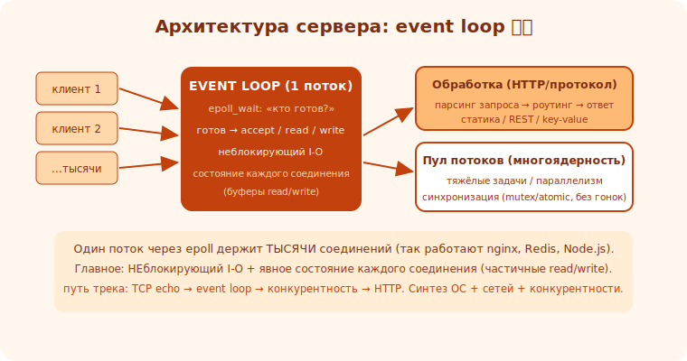

# 08 · Архитектура сервера и сокеты 🖼️⭐⭐

> 🎯 **Цель блока:** понять, из чего состоит сетевой сервер и как работают сокеты, — фундамент для
> построения собственного. Это ядро трека.

> 🛠️ Применяешь: [Сети/сокеты](../../Network/03-application/17-sockets-programming.md),
> [ОС/процессы](../../OS/01-processes/03-process.md), [⚙️ syscalls](../../ComputerScience/03-execution/15-loader.md).

---

## 📖 Что такое сервер по сути

```
   СЕРВЕР — программа, которая ЖДЁТ подключений клиентов, ОБРАБАТЫВАЕТ их запросы и ОТВЕЧАЕТ.
   бесконечный цикл: принять соединение → прочитать запрос → обработать → отправить ответ → повторить.
   всё общение — через СОКЕТЫ (программный «конец» сетевого соединения).
```

🖼️
```
   [клиент] ──TCP-соединение──► [СЕРВЕР]
                                  цикл: accept → read → обработать → write → (close/keep-alive)
   несколько клиентов одновременно → нужна КОНКУРЕНТНОСТЬ (модуль 11).
```



💡 ⭐⭐ Сервер — это «принимай и обрабатывай в цикле». Вся сложность — в деталях: как принимать
МНОГО клиентов одновременно (event loop/потоки), как не блокироваться, как разобрать протокол. Эти
детали и делают сервер senior-проектом, синтезирующим ОС + сети + конкурентность.

---

## ⭐ Сокеты: системные вызовы по шагам

```
   сервер на TCP (POSIX) — последовательность syscalls:
   1. socket()   — создать сокет (конечную точку). возвращает файловый дескриптор (fd).
   2. bind()     — привязать к адресу:порту (на каком порту слушаем).
   3. listen()   — перевести в режим прослушивания (готов принимать).
   4. accept()   — ЖДАТЬ и принять входящее соединение → новый fd для ЭТОГО клиента.
   5. read()/recv() и write()/send() — обмен данными с клиентом через его fd.
   6. close()    — закрыть соединение.

   клиент: socket() → connect(адрес сервера) → read/write → close.
```

🖼️
```
   СЕРВЕР: socket → bind → listen → ┌─ accept (ждёт клиента) ─┐
                                    │   read → обработать → write │ ← на каждого клиента
                                    └─ close ──────────────────┘
                                    (повторять для следующих)
```

💡 ⭐ Ключевое: **всё — файловые дескрипторы**. В Unix сокет — это fd, как файл; read/write работают
и с файлами, и с сокетами («всё есть файл»). accept() даёт НОВЫЙ fd на каждого клиента — слушающий
сокет остаётся для приёма следующих.

---

## ⭐⭐ Модели конкурентности (обзор — детали в модуле 11)

```
   главный вопрос архитектуры: как обслуживать МНОГО клиентов сразу?

   1. ОДИН КЛИЕНТ ЗА РАЗ (blocking, последовательно) — простейшее, но второй ждёт первого. только для учёбы.
   2. ПОТОК НА КЛИЕНТА (thread-per-connection) — на каждого accept — новый поток. просто, но потоки
      дороги; не масштабируется на тысячи (C10K проблема).
   3. СОБЫТИЙНЫЙ ЦИКЛ (event loop, epoll) — ОДИН поток обслуживает ТЫСЯЧИ соединений через
      неблокирующий I-O + epoll (модуль 10). масштабируемо. так работают nginx, Redis, Node.js.
   4. ГИБРИД — пул потоков + event loop на каждом (масштаб + многоядерность).
```

💡 ⭐⭐ Это центральное архитектурное решение сервера — классический [trade-off](../../Senior/02-decisions/08-tradeoffs.md):
простота (поток на клиента) против масштаба (event loop). Понимание моделей конкурентности —
главное, что даёт этот проект. Начни с простого (один за раз → поток на клиента), дорасти до event
loop.

---

## 📖 План построения (milestones трека)

```
   путь этого уровня (от простого к мощному):
   модуль 09: TCP echo-сервер — один клиент, blocking. освой socket/bind/listen/accept/read/write.
   модуль 10: событийный цикл — неблокирующий I-O + epoll, много клиентов в одном потоке.
   модуль 11: конкурентность — потоки/пул, многоядерность, синхронизация.
   модуль 12: HTTP-сервер — разбор HTTP поверх TCP, ответы, статика/роуты.
   → к концу: свой HTTP-сервер, держащий много соединений.
```

> 🧭 Сетевая теория (TCP, порты, протоколы) — [трек Сети](../../Network/02-transport/08-ports-sockets.md);
> здесь — практика построения. ОС-сторона (fd, syscalls, epoll) — [трек ОС](../../OS/01-processes/07-ipc.md).

---

## ⚠️ Ловушки

- ❌ Не обрабатывать ошибки syscalls (каждый может failed — проверяй возврат).
- ❌ Забыть close() → утечка файловых дескрипторов (лимит fd!).
- ❌ Сразу браться за epoll, не освоив базовый blocking-сервер.
- ❌ Думать, что read() читает «всё сообщение» — TCP это ПОТОК байтов, read даёт сколько есть
  (надо читать в цикле/по протоколу — модуль 09).
- ❌ Игнорировать выбор модели конкурентности (это главное решение).

---

## ✅ Упражнения на размышление

1. **Последовательность.** Выпиши syscalls сервера и клиента по порядку. Что делает каждый?
2. **fd.** Почему accept() возвращает новый fd? Что было бы без этого?
3. **Модели.** Для «чат на 10000 пользователей» какая модель конкурентности? Почему не поток-на-клиента?
4. **План.** Распиши свой путь: echo → event loop → HTTP. Что MVP каждого шага?

---

## ❓ Проверь себя

1. Что делает сервер по сути (цикл)?
2. Назови syscalls сервера по порядку (socket→…→close).
3. Почему «всё есть файл» (сокет = fd)?
4. Какие модели конкурентности и их trade-off?

---

## ✅ Чек-лист

- [ ] Понимаю сервер как цикл accept→read→обработать→write
- [ ] Знаю последовательность сокет-syscalls
- [ ] Понимаю, что сокет — это fd, TCP — поток байтов
- [ ] Знаю модели конкурентности и их trade-off
- [ ] Имею план: echo → event loop → HTTP

➡️ Следующий: [09 · TCP echo-сервер](09-tcp-echo.md)
