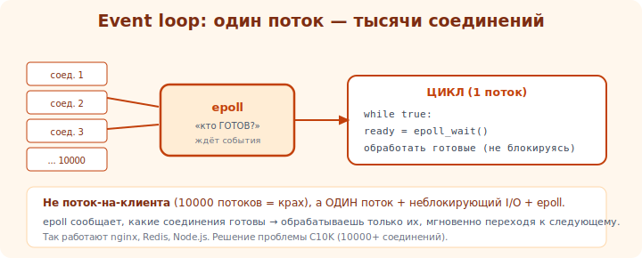

# 10 · Событийный цикл (epoll) 🖼️⭐⭐

> 🎯 **Проект:** перестрой сервер на событийный цикл — обслуживай ТЫСЯЧИ соединений в одном потоке
> через неблокирующий I-O и epoll. Так работают nginx, Redis, Node.js.

> 🛠️ Linux (epoll). Применяешь: [ОС/I-O](../../OS/03-sync/17-io.md), неблокирующий I-O.

---

## 📖 Проблема blocking-сервера и идея event loop

```
   blocking-сервер (модуль 09): accept/read БЛОКИРУЮТ → один клиент за раз. поток-на-клиента дорог
   (тысячи потоков = много памяти/переключений). это «проблема C10K» (10000 соединений).

   ИДЕЯ EVENT LOOP: один поток, НЕблокирующие сокеты + механизм «скажи мне, КОГДА сокет ГОТОВ»
   (есть данные / можно писать). поток не ждёт каждого — он реагирует на ГОТОВЫЕ.
```

🖼️
```
   blocking:    поток ждёт клиента A (read блокирует) → B,C,D ждут. неэффективно.
   event loop:  ┌─ epoll_wait: «кто готов?» ─┐
                │  готов A → обработать чуть   │  один поток «жонглирует» тысячами,
                │  готов C → обработать чуть   │  реагируя только на готовые
                └─ повторить ─────────────────┘
   никто не блокирует — поток всегда занят полезным.
```



💡 ⭐⭐ Ключевой сдвиг: вместо «жди на каждом сокете» — «спроси ОС, какие сокеты готовы, и обработай
их». Один поток эффективно обслуживает тысячи соединений, потому что не простаивает в ожидании. Это
основа высокопроизводительных серверов.

---

## ⭐ epoll: как это работает

```
   epoll (Linux) — эффективный механизм «мониторь много fd, скажи, какие готовы»:
   1. epoll_create() — создать epoll-инстанс.
   2. epoll_ctl(ADD) — добавить fd (слушающий сокет, клиентские) для мониторинга нужных событий
      (готов к чтению/записи).
   3. epoll_wait() — БЛОКИРУЕТ, пока КАКИЕ-ТО fd не станут готовы; возвращает СПИСОК готовых.
   4. обработать каждый готовый: слушающий готов → accept; клиентский готов → read/write.
   5. повторить epoll_wait.

   + НЕблокирующие сокеты (O_NONBLOCK): read/write не блокируют, возвращают сразу (EAGAIN если не готов).
```

💡 ⭐ epoll масштабируется (O(готовых), не O(всех fd)) — в отличие от старого select/poll
(O(всех)). Поэтому epoll держит десятки тысяч соединений. (kqueue на BSD/Mac, IOCP на Windows —
аналоги; [io_uring](23-whats-next.md) — новее.)

---

## ⭐⭐ Milestones

```
   1. ПЕРЕВЕДИ сокеты в неблокирующий режим (O_NONBLOCK).
   2. СОЗДАЙ epoll, добавь слушающий сокет (событие «готов к чтению» = есть входящее соединение).
   3. ЦИКЛ epoll_wait:
      • слушающий готов → accept (в цикле — может быть несколько), новые клиенты → добавь в epoll.
      • клиентский готов к чтению → read (в цикле до EAGAIN), обработай, подготовь ответ.
      • клиентский готов к записи → write (если не всё влезло сразу).
   4. УПРАВЛЯЙ СОСТОЯНИЕМ каждого соединения (буферы чтения/записи) — т.к. read/write частичные.
   5. УДАЛЯЙ из epoll и close при разрыве/завершении.
   6. (⭐) edge-triggered vs level-triggered режим — пойми разницу (ET требует читать до EAGAIN).
   готово: один поток держит много соединений; echo/простой протокол работает для всех параллельно.
```

---

## 📖 Главная сложность: управление состоянием

```
   в blocking-сервере состояние клиента было «на стеке» функции-обработчика.
   в event loop ОДИН поток прыгает между клиентами → состояние каждого надо хранить ЯВНО:
   • что уже прочитано (буфер чтения, не дочитанное сообщение).
   • что осталось отправить (буфер записи, не до конца записанный ответ).
   • в какой фазе протокола клиент.
   → структура «соединение» с буферами и состоянием на каждый fd. это усложнение — плата за масштаб.
```

💡 ⭐⭐ Это главный урок event loop: **явное управление состоянием соединений**. Неблокирующий read
даёт «сколько есть» → копи в буфер, проверяй, собралось ли сообщение. write может записать не всё →
дозаписывай, когда сокет снова готов. Эта машина состояний — суть асинхронного сервера (и причина,
почему async/await придумали — он прячет эту машину).

---

## ⚠️ Ловушки

- ❌ Забыть O_NONBLOCK → read/write всё равно блокируют, event loop ломается.
- ❌ Не читать до EAGAIN в edge-triggered → «теряешь» данные/события.
- ❌ Не хранить состояние соединений (буферы) → частичные read/write ломают логику.
- ❌ Не обрабатывать частичный write (сокет занят) → теряешь часть ответа.
- ❌ Не удалять fd из epoll при close → ошибки/утечки.
- ❌ Блокирующая операция (файл/БД/долгий расчёт) в event loop → весь сервер встал.

---

## ✅ Задачи

1. **Неблокирующий echo на epoll.** Переведи свой echo-сервер на epoll. Держит много клиентов в
   одном потоке?
2. **Состояние соединений.** Реализуй буферы чтения/записи на каждый fd. Корректны частичные read/write?
3. ⭐ **Нагрузка.** Подключи сотни клиентов одновременно (скрипт). Один поток справляется?
4. ⭐ **ET vs LT.** Попробуй edge-triggered, обработай требование «читать до EAGAIN». Сравни с level-triggered.
5. **Устойчивость.** Разрывы, медленные клиенты — сервер стабилен?

---

## ❓ Проверь себя

1. В чём проблема blocking/поток-на-клиента (C10K)?
2. Как event loop обслуживает тысячи соединений одним потоком?
3. Как работает epoll (create/ctl/wait)?
4. Почему в event loop надо явно хранить состояние соединений?

---

## ✅ Чек-лист

- [ ] Перестроил сервер на epoll + неблокирующий I-O
- [ ] Один поток держит много соединений
- [ ] Управляю состоянием/буферами каждого соединения
- [ ] Обрабатываю частичные read/write
- [ ] Не блокирую event loop долгими операциями

➡️ Следующий: [11 · Конкурентность](11-concurrency.md)
