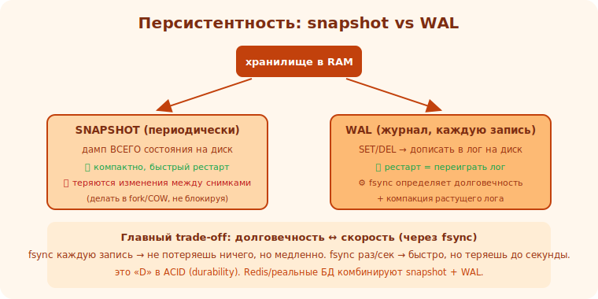

# 15 · Персистентность: snapshot и WAL 🖼️⭐⭐

> 🎯 **Проект:** сделай так, чтобы хранилище переживало перезапуск — сохранение на диск через
> snapshot и журнал (WAL). Учит надёжности, I-O и фундаментальному компромиссу долговечности.

> 🛠️ Применяешь: [C/файлы/mmap](../../C/04-senior/23-systems.md), [ОС/I-O/ФС](../../OS/03-sync/16-filesystems.md).

---

## 📖 Проблема: память не переживает рестарт

```
   in-memory хранилище быстро, но при перезапуске/сбое ВСЁ теряется (RAM не сохраняется).
   ПЕРСИСТЕНТНОСТЬ — сохранение данных на ДИСК, чтобы пережить рестарт. два классических подхода
   (Redis использует оба):
   • SNAPSHOT (RDB) — периодически сохранять ВСЁ состояние на диск.
   • WAL / журнал (AOF) — записывать КАЖДУЮ изменяющую операцию в журнал.
```

🖼️
```
   SNAPSHOT: [состояние в памяти] ──периодически──► дамп на диск.
             рестарт → загрузить дамп. но изменения МЕЖДУ снимками теряются при сбое.
   WAL:      каждая SET/DEL ──сразу──► дописать в журнал на диске.
             рестарт → проиграть журнал заново → восстановить состояние. теряется максимум последнее.
```



---

## ⭐ Snapshot (точечный снимок)

```
   идея: сериализовать ВСЁ состояние хранилища в файл периодически (или по команде SAVE).
   1. сериализация: пройти хранилище → записать ключи/значения/типы в файл (свой формат или известный).
   2. при старте: прочитать файл → восстановить хранилище.
   ✅ компактно (только текущее состояние), быстрый рестарт.
   ❌ изменения между снимками теряются при сбое; снимок большого хранилища — дорогая операция (блокировка/fork).
   приём: делать снимок в форкнутом процессе (copy-on-write), чтобы не блокировать (как Redis RDB).
```

---

## ⭐⭐ WAL (Write-Ahead Log) — журнал операций

```
   WAL (журнал упреждающей записи) — ЗАПИСЫВАЙ каждую изменяющую операцию НА ДИСК ПЕРЕД/ПРИ её
   применении. при рестарте — ПЕРЕИГРАЙ журнал → восстановишь состояние.

   SET name Аня → дописать "SET name Аня" в лог-файл → применить в памяти.
   рестарт → прочитать лог построчно → выполнить каждую операцию → состояние восстановлено.

   ⚙️ ГАРАНТИЯ ДОЛГОВЕЧНОСТИ зависит от fsync:
      • писать в лог и сразу fsync (на диск физически) → надёжно, но МЕДЛЕННО (диск).
      • писать в буфер ОС, fsync периодически → быстро, но при сбое теряется последнее.
      это ТОТ САМЫЙ trade-off долговечность ↔ скорость (Redis: appendfsync always/everysec/no).
```

💡 ⭐⭐ Главный урок: **долговечность ↔ скорость** — фундаментальный компромисс хранилищ. fsync на
каждую запись = не потеряешь ничего, но медленно (ждёшь диск). fsync раз в секунду = быстро, но при
сбое теряешь до секунды. Понимание этого + WAL — основа того, как работают реальные БД (это «D» в
ACID — durability). WAL также основа крэш-восстановления и репликации.

---

## 📖 Milestones и компакция

```
   1. WAL: при каждой изменяющей команде — дописать в лог-файл. при старте — переиграть лог.
   2. fsync-стратегия: выбери (always/everysec) — пойми trade-off.
   3. SNAPSHOT: команда/таймер для дампа всего состояния; загрузка при старте.
   4. КОМПАКЦИЯ лога: лог растёт бесконечно (миллион SET одного ключа = миллион строк). периодически
      переписывай лог в компактный (только текущее состояние) — snapshot + новый короткий лог.
   5. КОМБИНАЦИЯ (как Redis): snapshot как база + WAL для изменений после него → быстрый рестарт + минимум потерь.
   6. ОБРАБОТКА СБОЕВ: частично записанная последняя запись в логе (crash во время записи) → детектируй/откинь.
   готово: хранилище переживает рестарт; данные на диске; понятен trade-off долговечности.
```

---

## ⚠️ Ловушки

- ❌ Думать, что write() = «на диске» (данные в буфере ОС; нужен fsync для гарантии).
- ❌ fsync на каждую запись без понимания (медленно) ИЛИ никогда (теряешь данные при сбое).
- ❌ Лог растёт бесконечно без компакции.
- ❌ Не обрабатывать частично записанную последнюю запись после краша.
- ❌ Блокировать сервер на время большого снимка (используй fork/COW).
- ❌ Свой хрупкий формат без версии (не прочитать старый дамп после изменений).

---

## ✅ Задачи

1. **WAL.** Записывай изменяющие команды в лог; восстанавливай при старте проигрыванием. Проверь:
   рестарт сохраняет данные.
2. **fsync trade-off.** Замерь скорость SET при fsync-always vs everysec. Объясни компромисс.
3. **Snapshot.** Реализуй дамп всего состояния + загрузку. Рестарт из снимка.
4. ⭐ **Компакция.** Перепиши разросшийся лог в компактную форму. Проверь корректность после.
5. ⭐ **Крэш-устойчивость.** Симулируй краш во время записи; восстановись, откинув битую запись.

---

## ❓ Проверь себя

1. Чем snapshot отличается от WAL?
2. Что такое fsync и почему он определяет долговечность?
3. В чём trade-off долговечность ↔ скорость?
4. Зачем нужна компакция лога?

---

## ✅ Чек-лист

- [ ] Реализовал WAL (журнал + проигрывание при старте)
- [ ] Понял роль fsync и trade-off долговечность/скорость
- [ ] Реализовал snapshot и загрузку
- [ ] Сделал компакцию лога
- [ ] Хранилище переживает рестарт и краши

➡️ Следующий: [16 · Индексы и storage engine](16-storage-engine.md)
