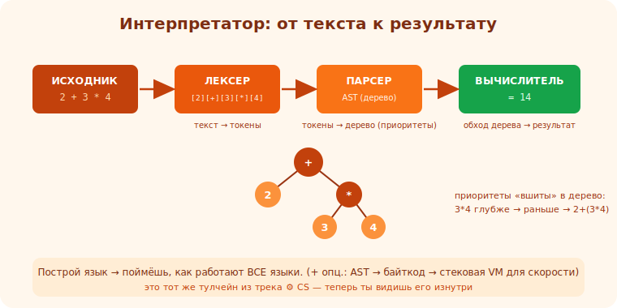

# 18 · Интерпретатор: лексер 🖼️⭐⭐

> 🎯 **Проект:** начни строить интерпретатор своего языка с лексера — превращения текста программы
> в поток токенов. Учит тулчейну изнутри (то, что в [⚙️ CS](../../ComputerScience/02-toolchain/09-build-stages.md)
> ты видел снаружи).

> 🛠️ Любой язык (Python/C++/Rust/Go — на выбор; высокоуровневый проще для первого). Цель — понять, не оптимизировать.

---

## 📖 Что строим: интерпретатор

```
   ИНТЕРПРЕТАТОР — программа, которая читает код на (твоём) языке и СРАЗУ ВЫПОЛНЯЕТ его. это
   вершина капстоунов: соединяет парсинг, структуры данных, рекурсию, архитектуру.

   конвейер интерпретатора (как мини-компилятор):
   ИСХОДНЫЙ КОД ──ЛЕКСЕР──► ТОКЕНЫ ──ПАРСЕР──► AST ──ВЫЧИСЛИТЕЛЬ──► РЕЗУЛЬТАТ
   (текст)              (атомы)         (дерево)            (исполнение)

   начни с простого: язык-калькулятор (выражения), потом переменные, потом функции/условия.
```

🖼️
```
   "2 + 3 * 4"  ──ЛЕКСЕР──►  [NUM(2)][PLUS][NUM(3)][STAR][NUM(4)]  (этот модуль)
                ──ПАРСЕР──►  дерево с приоритетами (модуль 19)
                ──EVAL──►    14  (модуль 20)
```



💡 ⭐⭐ Построить интерпретатор — мощнейший проект: ты понимаешь, как работают ВСЕ языки, парсинг
(нужен везде — конфиги, протоколы, форматы), и применяешь структуры данных/рекурсию по-настоящему.
И это демистифицирует [тулчейн из ⚙️ CS](../../ComputerScience/02-toolchain/09-build-stages.md).

---

## ⭐ Лексер: текст → токены

```
   ЛЕКСЕР (tokenizer/scanner) — читает текст символ за символом и группирует в ТОКЕНЫ —
   атомарные «слова» языка с типом:
   "x = 12 + y" →  [IDENT "x"][ASSIGN "="][NUMBER 12][PLUS "+"][IDENT "y"]

   типы токенов: числа, идентификаторы (имена), ключевые слова (if/while), операторы (+,-,*,=),
   скобки, строки, конец строки/файла.
   лексер выбрасывает пробелы/комментарии — они не нужны парсеру.
```

---

## ⭐⭐ Milestones лексера

```
   1. ВХОД: строка с кодом + позиция (текущий символ).
   2. ЦИКЛ: пока не конец — смотри текущий символ:
      • цифра → читай всё число (несколько цифр/точку) → токен NUMBER.
      • буква → читай идентификатор → ключевое слово или IDENT.
      • оператор/скобка → соответствующий токен.
      • пробел/комментарий → пропусти.
      • неизвестный символ → ошибка лексера (понятная: позиция + символ).
   3. ВЫХОД: список токенов (+ токен EOF в конце).
   4. ПОЗИЦИИ: храни строку/столбец в токене → для понятных ошибок («ошибка в строке 3:5»).
   готово: "2 + 3 * (4 - 1)" → корректный поток токенов; кривой ввод → понятная ошибка.
```

---

## 📖 Ключевые решения

```
   🔤 ДЛИННЫЕ ТОКЕНЫ: число/идентификатор — несколько символов. читай «жадно», пока подходят
      (peek следующий символ, не «съедая» лишнее).
   🔑 КЛЮЧЕВЫЕ СЛОВА vs ИДЕНТИФИКАТОРЫ: прочитал слово → проверь, не ключевое ли (if/while/let) →
      иначе обычное имя. (таблица ключевых слов)
   ⚠️ КРАЕВЫЕ: конец ввода посреди токена, незакрытая строка, неизвестный символ → понятные ошибки.
   📐 МНОГОСИМВОЛЬНЫЕ ОПЕРАТОРЫ: ==, <=, != — смотри следующий символ (= после < → <=).
```

💡 ⭐ Лексер — самая простая фаза, отличное начало. Главный приём — **peek (заглянуть, не съедая)**:
решаешь по текущему символу, докуда читать. Это тот же навык парсинга, что в протоколе хранилища
(модуль 14) и HTTP (модуль 12) — лексер обобщает его.

---

## ⚠️ Ловушки

- ❌ «Съедать» символ, который относится к следующему токену (используй peek).
- ❌ Не различать ключевые слова и идентификаторы.
- ❌ Падать на неизвестном символе вместо понятной ошибки с позицией.
- ❌ Забыть токен EOF (парсеру нужен признак конца).
- ❌ Не хранить позиции → невнятные ошибки для пользователя языка.
- ❌ Усложнять язык сразу — начни с арифметики, добавляй постепенно.

---

## ✅ Задачи

1. **MVP лексер.** Токенизируй арифметику: числа, + - * /, скобки. "2+3*4" → токены. EOF в конце.
2. **Идентификаторы и ключевые слова.** Добавь имена и пару ключевых слов (let/if). Различай их.
3. **Многосимвольные операторы.** Поддержи ==, <=, >=, != (peek следующего символа).
4. ⭐ **Ошибки с позицией.** Неизвестный символ/незакрытая строка → ошибка «строка:столбец».
5. **Строки/комментарии.** Добавь строковые литералы и комментарии (пропускай).

---

## ❓ Проверь себя

1. Что делает лексер и что такое токен?
2. Как читать длинные токены (числа/идентификаторы)?
3. Как отличить ключевое слово от идентификатора?
4. Зачем нужен peek и позиции токенов?

---

## ✅ Чек-лист

- [ ] Построил лексер: текст → поток токенов
- [ ] Различаю числа/имена/ключевые слова/операторы
- [ ] Использую peek, обрабатываю многосимвольные операторы
- [ ] Даю понятные ошибки с позицией
- [ ] Добавил EOF, готов к парсеру

➡️ Следующий: [19 · Парсер и AST](19-parser-ast.md)
