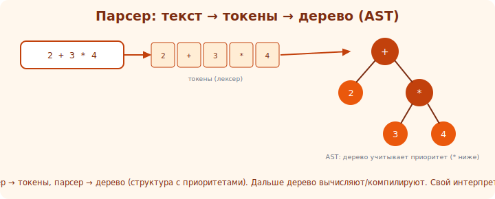

# 19 · Парсер и AST 🖼️⭐⭐

> 🎯 **Проект:** построй парсер — превращение потока токенов в дерево (AST), отражающее структуру
> программы с правильными приоритетами. Сердце интерпретатора.

> 🛠️ Применяешь: рекурсию ([Алгоритмы](../../Algorithms/03-algorithms/15-recursion.md)), деревья,
> предыдущий лексер.

---

## 📖 От токенов к дереву (AST)

```
   ПАРСЕР берёт ПЛОСКИЙ поток токенов и строит ДЕРЕВО — AST (Abstract Syntax Tree), которое отражает
   СТРУКТУРУ и ПРИОРИТЕТЫ. плоский список не знает, что «*» сильнее «+»; дерево — знает.

   "2 + 3 * 4" — токены плоские, но смысл: 2 + (3*4), не (2+3)*4. дерево это кодирует:
            [+]
           /   \
         [2]   [*]
              /   \
            [3]   [4]
   обход дерева снизу → 3*4=12, 2+12=14. приоритеты «вшиты» в структуру.
```



💡 ⭐⭐ AST — центральная структура: вся семантика программы в дереве, которое потом вычисляешь
(модуль 20) или компилируешь (модуль 21). Парсер — про то, как из линейного текста получить
правильную вложенную структуру. Это применение рекурсии и деревьев в чистом виде.

---

## ⭐ Грамматика и приоритеты

```
   язык описывается ГРАММАТИКОЙ — правилами, что из чего состоит. для арифметики (с приоритетами):
   expr    := term (('+' | '-') term)*          ← сложение/вычитание (низкий приоритет)
   term    := factor (('*' | '/') factor)*      ← умножение/деление (выше)
   factor  := NUMBER | '(' expr ')'             ← число или скобки (высший)

   приоритет «вшит» в УРОВНИ грамматики: expr вызывает term, term вызывает factor.
   умножение «глубже» → вычислится раньше → выше приоритет. скобки сбрасывают на верх.
```

---

## ⭐⭐ Recursive descent — простой и мощный парсер

```
   РЕКУРСИВНЫЙ СПУСК (recursive descent) — на КАЖДОЕ правило грамматики — СВОЯ ФУНКЦИЯ. функции
   вызывают друг друга по структуре грамматики (отсюда рекурсия). самый понятный способ написать парсер.

   parse_expr():  узел = parse_term(); пока след. токен +/-: взять оператор, right=parse_term(),
                  узел = BinaryOp(узел, оператор, right). вернуть узел.
   parse_term():  аналогично через parse_factor() для */.
   parse_factor(): если NUMBER → узел-число; если '(' → parse_expr() → ожидать ')'.

   приоритеты получаются АВТОМАТИЧЕСКИ из структуры вызовов. красиво.
```

🖼️
```
   parse_expr ──► parse_term ──► parse_factor ──► NUMBER / (expr)
        ↑ +,-          ↑ *,/            ↑ скобки рекурсивно наверх
   вложенность вызовов = вложенность дерева = приоритеты операций.
```

💡 ⭐⭐ Главный урок: **рекурсивный спуск превращает грамматику в код почти 1:1** — каждое правило в
функцию, приоритеты из структуры. Это элегантнейшее применение рекурсии. Поняв его на арифметике,
ты расширяешь на переменные, условия, функции — добавляя правила/функции.

---

## 📖 Milestones

```
   MVP: парсить арифметические выражения с +,-,*,/ и скобками в AST.
   1. УЗЛЫ AST: число (литерал), бинарная операция (left, op, right), (далее: переменная, вызов...).
   2. recursive descent: parse_expr / parse_term / parse_factor. приоритеты через уровни.
   3. ОБРАБОТКА ОШИБОК: неожиданный токен («ожидал ')', получил...») с позицией — не падать.
   4. РАСШИРЕНИЕ языка (постепенно):
      • унарный минус, сравнения; переменные (присваивание let x = ...; чтение x).
      • операторы (statements): if/else, while; блоки {}.
      • функции: объявление и вызов.
   5. печать AST (для отладки) — увидеть дерево.
   готово: парсит выражения/программы в AST; кривой синтаксис → понятная ошибка.
```

> 🧭 Это в точности шаг «компилятор» из [тулчейна ⚙️ CS](../../ComputerScience/02-toolchain/09-build-stages.md):
> там компилятор парсит C; здесь ты делаешь это сам для своего языка.

---

## ⚠️ Ловушки

- ❌ Игнорировать приоритеты (всё на одном уровне) → 2+3*4 посчитается как (2+3)*4.
- ❌ Не обрабатывать скобки (рекурсивный возврат на верх грамматики).
- ❌ Падать на синтаксической ошибке вместо понятного сообщения.
- ❌ Левая рекурсия в наивном виде (expr := expr + term) → бесконечный цикл; используй итерацию в правиле.
- ❌ Браться за весь язык сразу — расширяй грамматику постепенно.
- ❌ Не печатать AST — труднее отлаживать.

---

## ✅ Задачи

1. **MVP парсер.** Recursive descent для +,-,*,/ и скобок → AST. Проверь приоритеты (2+3*4 → 14 после eval).
2. **Печать AST.** Выведи дерево (скобочно/с отступами) для отладки.
3. **Ошибки.** Незакрытая скобка/лишний токен → понятная ошибка с позицией.
4. ⭐ **Переменные.** Добавь let x = expr и использование x. Расширь грамматику/AST.
5. ⭐ **Управление.** Добавь if/else и while (операторы, блоки).

---

## ❓ Проверь себя

1. Что такое AST и зачем дерево вместо плоского списка?
2. Как грамматика кодирует приоритеты операций?
3. Как работает рекурсивный спуск?
4. Как обрабатывать синтаксические ошибки?

---

## ✅ Чек-лист

- [ ] Построил парсер (recursive descent) → AST
- [ ] Приоритеты и скобки работают правильно
- [ ] Обрабатываю синтаксические ошибки понятно
- [ ] Печатаю AST для отладки
- [ ] (⭐) расширил язык: переменные, управление

➡️ Следующий: [20 · Вычислитель (evaluator)](20-evaluator.md)
