# 🔨 Трек · Капстоун-проекты (Блок 9)

> **Знания превращаются в навык только на больших проектах.** Этот трек — пошаговые гайды по
> senior-проектам, каждый из которых **синтезирует несколько треков** курса: свои структуры
> данных и аллокатор, сетевой сервер, хранилище/БД, интерпретатор языка.

> 🧭 Это финал [Roadmap системного разработчика](../ROADMAP.md): сначала фундамент (треки 1–8 +
> безопасность), потом — построй «по-настоящему», понимая, что под капотом. Здесь не учат новую
> теорию, а **доводят проекты до работающего результата**, применяя всё изученное.

---

## 🗺️ Дорожная карта

```mermaid
graph TD
    subgraph L0 [🥚 Уровень 0 — Как строить большое]
        A0[00 · Зачем капстоун-проекты]
        A1[01 · Методология больших проектов]
        A2[02 · Выбор и планирование]
    end
    subgraph L1 [🐣 Уровень 1 — Свои структуры данных]
        B0[03 · Свой dynamic array]
        B1[04 · Свой связный список / стек / очередь]
        B2[05 · Своя hash map]
        B3[06 · Свой smart pointer]
        B4[07 · Свой аллокатор]
    end
    subgraph L2 [🐥 Уровень 2 — Свой сетевой сервер ⭐ ядро]
        C0[08 · Архитектура сервера и сокеты ⭐⭐]
        C1[09 · TCP echo-сервер]
        C2[10 · Событийный цикл epoll]
        C3[11 · Конкурентность]
        C4[12 · HTTP-сервер]
    end
    subgraph L3 [🦅 Уровень 3 — Своё хранилище / БД]
        D0[13 · Key-value in-memory]
        D1[14 · Протокол и команды]
        D2[15 · Персистентность: snapshot и WAL]
        D3[16 · Индексы и storage engine]
        D4[17 · Транзакции и конкурентный доступ]
    end
    subgraph L4 [🚀 Уровень 4 — Свой язык / движок]
        E0[18 · Интерпретатор: лексер]
        E1[19 · Парсер и AST]
        E2[20 · Вычислитель]
        E3[21 · Байткод-VM и компиляция]
        E4[22 · Игровой движок: цикл и ECS]
        E5[23 · Куда расти дальше]
    end
    L0 --> L1 --> L2 --> L3 --> L4 --> Done([🔨 Строю большие системы])
```

---

## 🎯 Ядро трека — свой сетевой сервер

> **Сетевой сервер — классическая senior-веха:** он синтезирует [ОС](../OS/README.md) (сокеты,
> процессы, epoll), [Сети](../Network/README.md) (TCP/HTTP), конкурентность ([C++](../Cpp/README.md)/
> [Rust](../Rust/README.md)), производительность ([⚙️ CS](../ComputerScience/README.md)) и
> архитектуру ([🏛️ ООП](../OOP/README.md)). Построив его, ты доказываешь, что владеешь системным
> программированием.

Поэтому центр трека (Уровень 2) — путь от сокета до полноценного HTTP-сервера на событийном цикле.

---

## 📂 Содержание

### 🥚 Уровень 0 — Как строить большое
- [00 · Зачем капстоун-проекты](00-intro/00-why-capstone.md)
- [01 · Методология больших проектов](00-intro/01-methodology.md)
- [02 · Выбор и планирование проекта](00-intro/02-planning.md)

### 🐣 Уровень 1 — Свои структуры данных
- [03 · Свой dynamic array (vector)](01-data-structures/03-dynamic-array.md)
- [04 · Свой связный список / стек / очередь](01-data-structures/04-linked-list.md)
- [05 · Своя hash map](01-data-structures/05-hash-map.md)
- [06 · Свой smart pointer](01-data-structures/06-smart-pointer.md)
- [07 · Свой аллокатор](01-data-structures/07-allocator.md)
- ✅ [Задачи уровня 1](01-data-structures/TASKS.md) · 🚀 [Проект](01-data-structures/PROJECT.md)

### 🐥 Уровень 2 — Свой сетевой сервер ⭐ ядро
- [08 · Архитектура сервера и сокеты ⭐⭐](02-server/08-architecture-sockets.md)
- [09 · TCP echo-сервер](02-server/09-tcp-echo.md)
- [10 · Событийный цикл (epoll)](02-server/10-event-loop.md)
- [11 · Конкурентность](02-server/11-concurrency.md)
- [12 · HTTP-сервер](02-server/12-http-server.md)
- ✅ [Задачи уровня 2](02-server/TASKS.md) · 🚀 [Проект](02-server/PROJECT.md)

### 🦅 Уровень 3 — Своё хранилище / БД
- [13 · Key-value in-memory (Redis-подобное)](03-storage/13-kv-store.md)
- [14 · Протокол и команды](03-storage/14-protocol-commands.md)
- [15 · Персистентность: snapshot и WAL](03-storage/15-persistence.md)
- [16 · Индексы и storage engine](03-storage/16-storage-engine.md)
- [17 · Транзакции и конкурентный доступ](03-storage/17-transactions.md)
- ✅ [Задачи уровня 3](03-storage/TASKS.md) · 🚀 [Проект](03-storage/PROJECT.md)

### 🚀 Уровень 4 — Свой язык / движок
- [18 · Интерпретатор: лексер](04-language/18-lexer.md)
- [19 · Парсер и AST](04-language/19-parser-ast.md)
- [20 · Вычислитель (evaluator)](04-language/20-evaluator.md)
- [21 · Байткод-VM и компиляция](04-language/21-bytecode-vm.md)
- [22 · Игровой движок: цикл и ECS](04-language/22-game-engine.md)
- [23 · Куда расти дальше](04-language/23-whats-next.md)
- ✅ [Задачи уровня 4](04-language/TASKS.md) · 🚀 [Проект](04-language/PROJECT.md)

---

## 🧭 Как проходить

Каждый модуль — **гайд к построению**: цель, этапы (milestones), ключевые решения, какие треки
применяешь, как проверить. Не копируй готовый код — **строй сам**, упираясь в проблемы и решая их
(так и учатся). Язык — на выбор (C/C++/Rust для системного; Python/др. ок для интерпретатора).
Идёт после фундамента (Roadmap фазы 1–5).

➡️ Начни с [00 · Зачем капстоун-проекты](00-intro/00-why-capstone.md)
