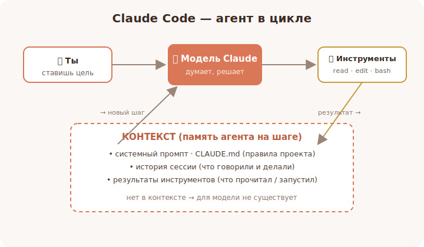

# 00 · Что такое Claude Code и зачем он 🖼️

> 🎯 **Цель блока:** понять, чем Claude Code отличается от обычного «чат-бота» и
> автодополнения, и почему это **агент**, а не просто подсказчик.

---

## 📖 Не автодополнение, а агент

Большинство ИИ-инструментов в редакторе — это **автодополнение**: они дописывают строчку
за тебя. Claude Code устроен иначе. Это **агент** — он работает в **цикле**:

```
   ты ставишь задачу → агент думает → вызывает инструменты (читает файлы,
   запускает команды, правит код) → смотрит результат → снова думает → ...
   → пока задача не решена
```

🖼️


💡 Ключевое отличие: Claude Code **сам решает**, какие файлы прочитать, какие команды
выполнить, что изменить. Ты задаёшь цель — он выстраивает путь. Это похоже на то, как
младший разработчик получает задачу и идёт её делать, а не диктует тебе по одной строке.

---

## 📖 Где он живёт

Claude Code — один и тот же агент, доступный в нескольких местах:

```
   ⌨️  Терминал (CLI)        — основной способ: команда `claude` в папке проекта
   🧩  IDE-расширение        — VS Code, JetBrains (тот же агент внутри редактора)
   🖥️  Desktop-приложение    — Mac / Windows
   🌐  Web                    — claude.ai/code (в браузере)
```

💡 Это всё **одна и та же «голова»** (модель Claude) с одним и тем же набором инструментов.
Меняется только «обёртка» — где ты с ней разговариваешь. Мы будем в основном опираться на
CLI: он самый полный и наглядный.

---

## ⭐ Что он умеет «из коробки»

- **Читать и понимать проект** — находить нужные файлы, разбираться в структуре.
- **Писать и править код** — создавать файлы, делать точечные правки.
- **Запускать команды** — тесты, сборку, линтеры, git.
- **Искать в интернете** и читать страницы (когда нужно).
- **Работать в цикле** — пробовать, проверять результат, исправлять.

А дальше его можно **расширять**: давать новые инструменты (MCP), навыки (Skills),
команды, хуки, агентов — этому и посвящён весь трек.

---

## 📖 Зачем он нужен (что меняется в работе)

| Без агента | С Claude Code |
|---|---|
| Сам ищешь файлы по проекту | Просишь: «найди, где обрабатывается логин» — найдёт |
| Пишешь бойлерплейт руками | Описываешь, что нужно — получаешь черновик |
| Переключаешься между задачами/доками | Агент держит контекст и делает несколько шагов |
| Рутина (тесты, рефактор, переименования) на тебе | Делегируешь, проверяешь результат |

⚠️ Но это **не «магия»**: агент ошибается, может пойти не туда, может «выдумать». Поэтому
весь трек — про то, как **направлять** его, **проверять** и **ограничивать**. Хороший
результат = хороший инструмент + дисциплина пользователя.

---

## 🛠️ Практика (без установки, пока на пальцах)

1. Сформулируй вслух **3 задачи** из твоей реальной работы, которые ты бы делегировал
   агенту (например: «написать тесты к этому модулю», «разобраться, почему падает сборка»).
2. Для каждой реши: это **одно действие** (как автодополнение) или **многошаговая задача**
   (как для агента)? Многошаговые — идеальны для Claude Code.

---

## ⚠️ Частые заблуждения

- ❌ «Это просто чат с ИИ». → На деле он **действует**: читает, пишет, запускает.
- ❌ «Он всё сделает сам». → Нужны чёткая задача, контекст и проверка с твоей стороны.
- ❌ «Чем больше попрошу за раз, тем лучше». → Часто наоборот: дроби задачи (см. уровень 1).

---

## ✅ Задачи

1. **Своими словами** объясни разницу между автодополнением и агентом.
2. **Перечисли** 4 действия, которые Claude Code делает «из коробки».
3. **Придумай** 3 многошаговые задачи из своей практики под делегирование агенту.
4. **Подумай**, где из четырёх «обёрток» (CLI/IDE/desktop/web) тебе удобнее начать и почему.

---

## ❓ Проверь себя

1. Почему Claude Code называют агентом, а не автодополнением?
2. Что значит «агент работает в цикле»?
3. В каких местах доступен Claude Code?
4. Чем результат зависит от пользователя, а не только от модели?

---

## ✅ Чек-лист

- [ ] Понимаю, что Claude Code — это агент, работающий в цикле
- [ ] Знаю, какие действия он умеет «из коробки»
- [ ] Понимаю, что его можно расширять (MCP, Skills, команды, хуки, агенты)
- [ ] Осознаю, что качество = инструмент + дисциплина пользователя

➡️ Следующий: [01 · Anthropic и семейство моделей Claude](01-models.md)
