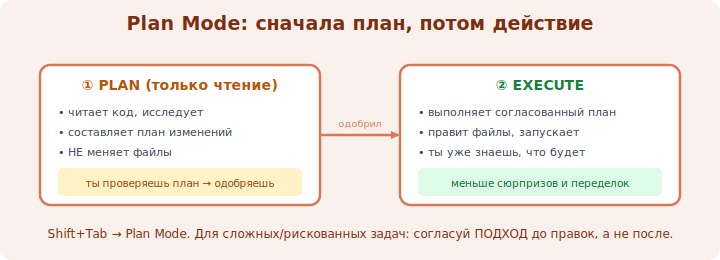

# 05 · Plan Mode и планирование 🖼️⭐

> 🎯 **Цель блока:** освоить **Plan Mode** — режим, в котором агент сначала составляет план
> и НЕ трогает файлы, пока ты его не утвердишь. Это главный приём безопасной работы.

---

## 📖 Зачем планировать отдельно

Если задача сложная или рискованная, опасно сразу пускать агента «в бой» — он может пойти
не туда и наломать дров. Решение: разделить **думать** и **делать**.

```
   обычный режим:   задача → агент СРАЗУ правит файлы
   Plan Mode:       задача → агент составляет ПЛАН (только читает, не пишет)
                    → ты проверяешь/правишь план → утверждаешь → агент исполняет
```

🖼️
```
   ┌─ Plan Mode ───────────────────────────────────┐
   │ агент: читает код, изучает, НЕ меняет ничего   │
   │ агент: «Вот план: 1)… 2)… 3)…»                 │
   │ ты:    «п.2 не так — сделай иначе» / «ок, го»  │
   └──────────────────┬─────────────────────────────┘
                      ▼  утвердил
              агент исполняет план (теперь правит файлы)
```



💡 Plan Mode = «семь раз отмерь». Ты видишь намерения агента **до** того, как он что-то
изменит. Для крупных задач это экономит часы и нервы.

---

## 🛠️ Как включить

В Claude Code режимы переключаются клавишами (обычно **Shift+Tab** циклически меняет режим:
обычный → авто-принятие правок → Plan Mode). Текущий режим виден в интерфейсе.

```
   Shift+Tab → ... → "plan mode on"
```

💡 Точное сочетание и набор режимов сверяй в `/help` — интерфейс развивается. Идея важнее
конкретной клавиши: найди, как включить «сначала план, без правок».

---

## ⭐ Когда обязательно планировать

- Крупный рефакторинг или изменение, затрагивающее много файлов.
- Незнакомый или чужой код, где легко что-то сломать.
- Что-то рискованное (миграции, удаление, изменение конфигов).
- Когда ты сам не до конца уверен в подходе — план покажет, как агент это видит.

А вот для мелочи («поправь опечатку», «добавь лог») план — лишняя церемония.

---

## 📖 Хороший план — это диалог

Не принимай первый план молча. Это момент, когда **дёшево** поменять направление:

```
   «В плане ты создаёшь новый сервис — не нужно, встрой в существующий.»
   «Добавь в план шаг с тестами.»
   «Пункт 3 рискованный — сделаем отдельно, пока пропусти.»
```

💡 Правка плана стоит копейки. Правка уже сделанного кода — дорого. Вкладывайся в план.

---

## ⚠️ Ловушки

- ❌ Гонять всё через Plan Mode, включая мелочь → лишняя бюрократия.
- ❌ Утверждать план не читая → теряется весь смысл режима.
- ❌ Не выйти из Plan Mode и удивляться, что агент «ничего не делает» (он ждёт утверждения).

---

## 🛠️ Практика

1. Включи Plan Mode и дай среднюю задачу — получи план, **разбери** его по пунктам.
2. **Поменяй** один пункт плана через уточнение, утверди, посмотри исполнение.
3. Сравни: та же задача без плана vs с планом — где меньше переделок?

---

## ✅ Задачи

1. **Объясни**, что разделяет Plan Mode (думать vs делать) и зачем.
2. **Назови** 4 ситуации, где план обязателен, и 2, где он лишний.
3. **Проведи** задачу через Plan Mode с правкой плана.
4. **Сформулируй**, почему правка плана дешевле правки кода.

---

## ❓ Проверь себя

1. Что агент делает и НЕ делает в Plan Mode?
2. Как примерно переключают режимы в Claude Code?
3. Когда планировать обязательно, а когда — лишнее?
4. Почему план стоит обсуждать, а не утверждать вслепую?

---

## ✅ Чек-лист

- [ ] Понимаю смысл Plan Mode (разделение думать/делать)
- [ ] Умею включить режим планирования
- [ ] Знаю, когда план нужен, а когда нет
- [ ] Обсуждаю и правлю план до утверждения

➡️ Следующий: [06 · Итерации: строим по фичам](06-iterate.md)
