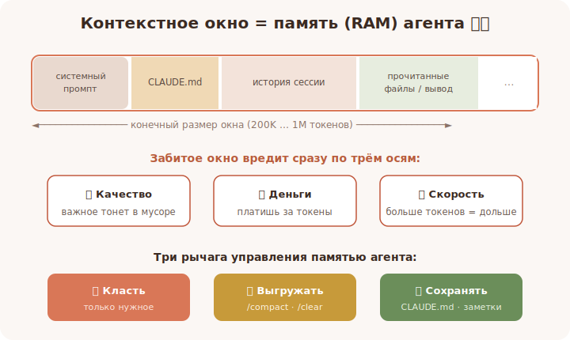

# 09 · Контекстное окно — память агента 🖼️⭐⭐

> 🎯 **Цель блока (ЯДРО трека):** понять, что **контекстное окно — это оперативная память
> агента**, как она устроена, заполняется и переполняется — и почему это главный навык.

---

## 📖 Главная аналогия курса

Весь курс — про память. Вот как она выглядит в каждом треке:

```
   C         → байты, стек и куча (память вручную)
   C++       → RAII, умные указатели (память с инструментами)
   Python    → ссылки, сборщик мусора (память автоматически)
   Rust      → владение, borrow checker (память без GC, доказано)
   ИИ        → контекстное окно (память модели)
   Claude Code → контекстное окно агента ⭐⭐ (ровно то же, в работе)
```

🖼️


💡 **Контекстное окно** — это вся информация, которую модель удерживает «в голове»
одновременно: системный промпт, CLAUDE.md, твои сообщения, прочитанные файлы, вывод команд.
Это её **RAM**. Размер окна — 200K (Haiku) или 1M (Opus/Sonnet) токенов.

---

## ⭐⭐ Окно конечно — и это меняет всё

Память агента **ограничена**. Как у компьютера RAM: положишь слишком много — что-то
вытеснится или замедлит работу.

```
   ┌──────────── окно контекста (например, 1M токенов) ────────────┐
   │ [системный промпт][CLAUDE.md][история][файлы][вывод команд]... │
   │                                          ▲ заполняется по ходу │
   └────────────────────────────────────────────────────────────────┘
                                              когда близко к пределу →
                                              срабатывает компакция (модуль 10)
```

💡 Каждое действие что-то **кладёт** в окно: прочитал большой файл — заняли память; запустил
шумную команду — заняли память; долго болтали — заняли память. Окно — общий ресурс.

---

## ⭐⭐ Чем плохо «забитое» окно

Переполненный или замусоренный контекст вредит **сразу по трём осям**:

```
   1) КАЧЕСТВО ↓ — важное теряется среди мусора, модель путается, «забывает»
   2) ДЕНЬГИ ↑   — ты платишь за токены контекста на каждом шаге
   3) СКОРОСТЬ ↓ — больше токенов обрабатывать = дольше
```

💡 Поэтому опытный пользователь **держит окно чистым**: кладёт только нужное и вовремя
выгружает лишнее. «Меньше, но по делу» почти всегда лучше, чем «всё подряд на всякий случай».

---

## 📖 Что съедает контекст быстрее всего

- **Чтение огромных файлов целиком** (логи, дампы, сгенерированный код).
- **Шумные команды** (вывод сборки на тысячи строк).
- **Очень длинные сессии** без чистки.
- **Куча приложенного «на всякий случай»** контекста, который не пригодился.

⚠️ Большое окно (1M) — не повод тащить туда всё. Это как 32 ГБ RAM: приятно, но забивать
мусором всё равно вредно.

---

## ⭐⭐ Три рычага управления памятью агента

```
   📥 что КЛАСТЬ:   давай по делу — нужные файлы, точную ошибку, ясную задачу
   🧹 что ВЫГРУЖАТЬ: /compact (сжать суть) и /clear (стереть) — модуль 10
   💾 что СОХРАНИТЬ: CLAUDE.md и память — на диск, между сессиями — модуль 11
```

💡 Это прямая параллель с управлением памятью в программах: выделяй разумно (что класть),
освобождай вовремя (что выгружать), сохраняй важное в долговременное хранилище (на диск).
Тот же принцип, что malloc/free — только для контекста.

---

## 🛠️ Практика

1. В долгой сессии следи за индикатором контекста (`/status`/интерфейс). Заметь, как чтение
   большого файла резко «съедает» окно.
2. Сравни два подхода к одной задаче: (а) скинул агенту весь огромный файл; (б) попросил
   прочитать только нужную функцию. Оцени, как изменились качество/скорость.
3. Сформулируй своё правило: «в контекст кладу только то, что реально нужно сейчас».

---

## ⚠️ Ловушки

- ❌ «Окно большое, можно не думать» → забитый мусором контекст хуже маленького чистого.
- ❌ Скидывать гигантские файлы целиком вместо нужного фрагмента.
- ❌ Вести бесконечную сессию без `/compact`/`/clear`.
- ❌ Надеяться, что важное «само запомнится» между сессиями (нет — нужен CLAUDE.md).

---

## ✅ Задачи

1. **Объясни** аналогию «контекстное окно = RAM агента».
2. **Перечисли** три оси вреда от забитого контекста.
3. **Назови** 4 главных «пожирателя» контекста.
4. **Опиши** три рычага: что класть / что выгружать / что сохранять.

---

## ❓ Проверь себя

1. Что такое контекстное окно и почему это память модели?
2. Почему окно конечно и что происходит при приближении к пределу?
3. Чем вредит замусоренный контекст (3 оси)?
4. Какие три рычага управляют памятью агента?

---

## ✅ Чек-лист

- [ ] Понимаю контекстное окно как RAM агента
- [ ] Знаю, что окно конечно и как это влияет на качество/деньги/скорость
- [ ] Знаю главных пожирателей контекста
- [ ] Освоил три рычага: класть / выгружать / сохранять

➡️ Следующий: [10 · Управление сессией: /compact и /clear](10-session-management.md)
