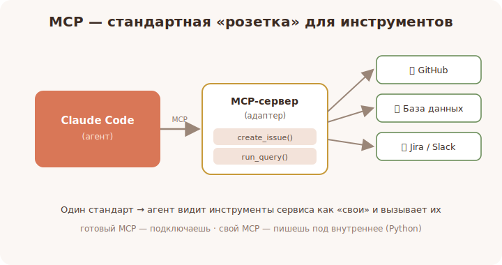

# 13 · MCP-серверы — что это и зачем 🖼️⭐

> 🎯 **Цель блока:** понять, что такое MCP (Model Context Protocol) — стандартный способ
> дать агенту **новые инструменты и доступ к внешним системам**.

---

## 📖 Проблема: агент знает только то, что внутри

«Из коробки» Claude Code умеет работать с файлами, командами и кодом. Но он **не умеет**
сам ходить в твой Jira, базу данных, Slack, GitHub-API, внутренний сервис. Как дать ему эти
способности, не переписывая сам Claude Code под каждый сервис?

Ответ — **MCP (Model Context Protocol)**: единый стандарт «розетки», в которую втыкаются
внешние инструменты.

🖼️


```
            ┌──────────────┐   MCP    ┌─────────────────┐
   Claude   │  Claude Code │◄────────►│  MCP-сервер     │── GitHub
   (мозг) ──┤  (агент)     │ протокол │  (адаптер)      │── БД
            └──────────────┘          └─────────────────┘── Jira / Slack / ...
                                       даёт инструменты:
                                       list_issues, run_query, ...
```

💡 **MCP-сервер** — это адаптер: он сообщает агенту «вот мои инструменты» (например,
`create_issue`, `search_docs`, `run_sql`), и агент может их вызывать так же, как встроенные.
Один стандарт — любые внешние возможности.

---

## ⭐ Почему это важно

- Агент перестаёт быть «заперт» в файлах проекта — он видит твою реальную инфраструктуру.
- Не нужно копировать данные в чат вручную: агент сам спросит у нужного сервиса.
- Экосистема: уже есть **готовые** MCP-серверы под популярные сервисы — подключаешь и
  пользуешься.

🖼️
```
   без MCP: ты вручную копируешь тикеты/логи/данные в чат
   с MCP:   агент сам: get_issue(123) → видит тикет → действует
```

---

## 📖 Как агент использует MCP-инструменты

Для модели MCP-инструмент выглядит как обычный инструмент: у него есть имя, описание и
параметры. Агент сам решает, когда его вызвать, исходя из задачи.

```
   ты: «закрой тикет PROJ-42 и сошлись на коммит abc123»
   агент: вызывает MCP-инструмент close_issue(id="PROJ-42", comment="fixed in abc123")
   MCP-сервер: ходит в трекер, закрывает, возвращает результат
   агент: «готово, тикет закрыт»
```

💡 Качество описания инструмента (что он делает, когда вызывать) сильно влияет на то,
насколько уместно агент им пользуется. Хорошее правило для своих инструментов — писать в
описании **когда** их звать, а не только **что** они делают.

---

## ⚠️ Ловушки

- ❌ Подключать всё подряд «на всякий случай»: каждый сервер добавляет инструменты в
  контекст и может запутать агента. Подключай нужное.
- ❌ Давать MCP-серверу доступ к секретам/проду без понимания, что он может.
- ❌ Думать, что MCP — это «магия»: за каждым инструментом стоит реальный код/API со своими
  правами и рисками.

---

## 🛠️ Практика

1. Выпиши 3 внешних системы из твоей работы (трекер, БД, мессенджер), к которым было бы
   полезно дать агенту доступ.
2. Для каждой придумай 2 инструмента, которые ты бы хотел (`list_*`, `create_*`, `search_*`).
3. Сформулируй, какие из них **безопасно** разрешать автоматически, а какие — только вручную.

---

## ✅ Задачи

1. **Объясни** своими словами, что такое MCP и зачем он.
2. **Нарисуй** схему «Claude Code ↔ MCP-сервер ↔ внешняя система».
3. **Приведи** пример задачи, где MCP-инструмент экономит ручное копирование.
4. **Назови** риски бездумного подключения серверов.

---

## ❓ Проверь себя

1. Что такое MCP-сервер и какую проблему он решает?
2. Как MCP-инструмент выглядит для модели?
3. Почему не стоит подключать много серверов «на всякий случай»?
4. Что влияет на уместность вызова инструмента агентом?

---

## ✅ Чек-лист

- [ ] Понимаю MCP как стандарт подключения инструментов
- [ ] Вижу, как агент вызывает MCP-инструменты
- [ ] Осознаю риски и принцип «подключай нужное»
- [ ] Понимаю роль хорошего описания инструмента

➡️ Следующий: [14 · Подключение MCP-серверов](14-mcp-connect.md)
