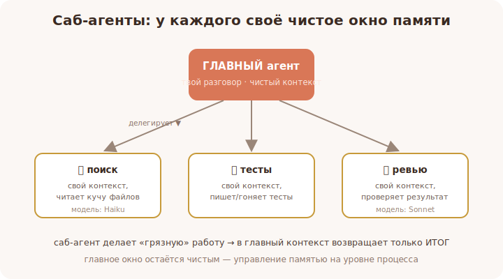

# 18 · Агенты и саб-агенты 🖼️⭐

> 🎯 **Цель блока:** понять саб-агентов — отдельных «помощников» со своим контекстом — и
> многоагентные процессы, где главный агент делегирует подзадачи.

---

## 📖 Зачем дробить агента на агентов

Один агент в одной сессии копит **весь** контекст: и поиск по проекту, и правки, и
размышления — всё в одном окне. Для больших задач это: (1) забивает контекст, (2) смешивает
разные подзадачи. Решение — **саб-агенты**.

🖼️


```
   ГЛАВНЫЙ агент (твой разговор)
        │ делегирует подзадачу
        ├──► саб-агент "поиск"   — свой ЧИСТЫЙ контекст, ищет, возвращает итог
        ├──► саб-агент "тесты"   — свой контекст, пишет/гоняет тесты
        └──► саб-агент "ревью"   — свой контекст, проверяет
        ▼
   главный получает только ИТОГИ (не весь их «мусор»)
```

💡 Ключевое: у саб-агента **своё отдельное окно контекста**. Он делает грязную работу (читает
кучу файлов, перебирает варианты), а в главный контекст возвращает **только результат**.
Главное окно остаётся чистым. Это прямое управление памятью на уровне процесса.

---

## ⭐ Когда делегировать

```
   ✅ параллельные/независимые куски (прочитать 10 файлов, проверить N вариантов)
   ✅ «грязный» поиск/исследование, чей мусор не нужен в главном контексте
   ✅ отдельная роль (ревьюер, тестировщик) со своими правилами
   ❌ мелочь, которую быстрее сделать прямо (один grep, одна правка) — не делегируй
```

💡 Новые модели склонны делегировать **бережно** — для одиночных простых действий работают
сами. Если хочешь больше делегирования (или меньше) — скажи об этом явно в инструкциях.

---

## ⭐ Свои саб-агенты

Саб-агента можно описать как файл с ролью, набором инструментов и (опционально) своей моделью:

```
   .claude/agents/
   └── reviewer.md
```

```markdown
---
name: reviewer
description: Строгий ревьюер кода. Вызывать для проверки изменений.
tools: Read, Grep, Bash
model: sonnet
---

Ты — придирчивый, но конструктивный ревьюер. Ищи баги, проблемы
безопасности и нарушения правил проекта. Сообщай обо всём с severity.
```

💡 Можно дать саб-агенту **другую модель** (например, дешёвую Haiku для простого массового
поиска, мощную — для сложного ревью) и **ограниченный набор инструментов**. Управлять
агентами помогает команда `/agents`. Точный формат — в документации.

🖼️
```
   главный (Opus) ──► поиск (Haiku, только Read/Grep)   ← дёшево и быстро
                 └──► ревью (Sonnet, Read/Grep/Bash)    ← качественно
```

---

## 📖 Многоагентные процессы

Из саб-агентов строят процессы: один **координирует**, другие выполняют роли. Например:
«исследователь» собирает контекст → «архитектор» предлагает план → «исполнитель» делает →
«ревьюер» проверяет. Каждый — со своим чистым контекстом и зоной ответственности.

⚠️ Не усложняй ради усложнения. Многоагентность оправдана, когда подзадачи реально
независимы или требуют разных ролей/моделей. Для линейной работы хватит одного агента.

---

## ⚠️ Ловушки

- ❌ Делегировать мелочь → накладные расходы больше пользы.
- ❌ Строить «оркестр» там, где хватит одного агента.
- ❌ Дать саб-агенту лишние инструменты/права «на всякий случай».
- ❌ Ждать, что саб-агенты делят контекст между собой — у каждого он свой.

---

## 🛠️ Практика

1. Дай главному агенту задачу с явной просьбой делегировать поиск саб-агенту; заметь, что в
   главный контекст вернулся только итог.
2. Создай своего саб-агента (`.claude/agents/reviewer.md`) с ограниченными инструментами.
3. Дай ему другую (дешевле) модель и сравни скорость/качество на простой задаче.
4. Попробуй простую цепочку: поиск → правка → ревью разными агентами.

---

## ✅ Задачи

1. **Объясни**, почему у саб-агента своё окно контекста и чем это полезно.
2. **Назови**, когда делегировать, а когда нет.
3. **Создай** своего саб-агента с ролью, инструментами и моделью.
4. **Опиши** простой многоагентный процесс из 3 ролей.

---

## ❓ Проверь себя

1. Что возвращает саб-агент в главный контекст и почему это важно для памяти?
2. Когда делегирование оправдано?
3. Как задать саб-агенту свою модель и набор инструментов?
4. Делят ли саб-агенты контекст между собой?

---

## ✅ Чек-лист

- [ ] Понимаю саб-агента как отдельный чистый контекст
- [ ] Знаю, когда делегировать, а когда нет
- [ ] Умею описать своего саб-агента (роль, инструменты, модель)
- [ ] Понимаю смысл многоагентных процессов и их меру

➡️ Дальше: [Задачи уровня 3](TASKS.md) · затем [Пет-проект уровня 3](PROJECT.md)
