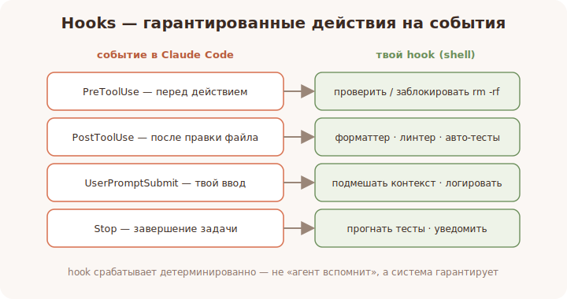

# 19 · Hooks — автоматизация рутины 🖼️⭐

> 🎯 **Цель блока:** освоить hooks — скрипты, которые Claude Code сам запускает в нужные
> моменты (до/после действия), чтобы автоматизировать проверки и рутину.

---

## 📖 Что такое hook

**Hook** — это твоя команда (shell), которую Claude Code выполняет **автоматически** в
определённый момент жизненного цикла: перед инструментом, после правки файла, при отправке
промпта, в конце работы и т.д. Это способ встроить **гарантированные** действия, не надеясь,
что агент сам про них вспомнит.

🖼️


```
   событие в Claude Code              твой hook (shell-команда)
   ─────────────────────────────────────────────────────────────
   перед вызовом инструмента  ──►  проверить/заблокировать действие
   после правки файла         ──►  прогнать форматтер / линтер
   при отправке промпта       ──►  подмешать контекст / залогировать
   завершение задачи          ──►  запустить тесты / уведомить
```

💡 Разница с навыком/командой: hook срабатывает **детерминированно** — это не «агент решит»,
а «система гарантированно сделает». Идеально для дисциплины: форматирование, проверки,
логирование, уведомления.

---

## ⭐ Где живут хуки

Хуки настраивают в `settings.json` (проектном `.claude/settings.json` или личном). Каждый
хук привязан к событию и содержит команду:

```jsonc
// .claude/settings.json (упрощённо; точные имена событий — в документации)
{
  "hooks": {
    "PostToolUse": [
      {
        "matcher": "Edit|Write",
        "hooks": [
          { "type": "command", "command": "npx prettier --write \"$FILE\"" }
        ]
      }
    ]
  }
}
```

В этом примере: **после каждой правки файла** автоматически запускается форматтер. Агенту не
нужно про это помнить — система сделает сама.

⚠️ Имена событий, формат и доступные переменные сверяй с документацией — они развиваются.
Идея неизменна: «на событие X выполнить команду Y».

---

## 📖 Типичные события и применения

```
   PreToolUse    — перед действием: проверить/запретить (напр. блок `rm -rf`)
   PostToolUse   — после действия: форматтер, линтер, авто-тесты затронутого
   UserPromptSubmit — на твой ввод: подмешать контекст, залогировать
   Stop / SubagentStop — завершение: финальные проверки, уведомление
   SessionStart  — старт сессии: подготовка окружения
   PreCompact    — перед сжатием: сохранить что-то важное
```

💡 8 типичных применений хуков: **авто-форматирование, линтер после правок, авто-тесты,
блокировка опасных команд, логирование действий, подмешивание контекста, уведомления о
завершении, защита чувствительных файлов.**

---

## ⭐ Хуки vs другие расширения

```
   hook   → ГАРАНТИРОВАННОЕ действие на событие (детерминированно, без участия модели)
   MCP    → инструмент, который агент вызывает ПО РЕШЕНИЮ
   Skill  → знание, которое агент подтягивает ПО НУЖДЕ
```

💡 Если что-то должно происходить **всегда** (форматирование, проверка) — это hook, а не
просьба к агенту. Просьбу агент может забыть; hook — нет.

---

## ⚠️ Ловушки

- ❌ Тяжёлый/долгий hook на частое событие → тормозит каждую правку.
- ❌ Hook, который молча меняет файлы неожиданно для тебя → путаница.
- ❌ Неэкранированные пути/ввод в команде → ошибки и риски. Аккуратнее с shell.
- ❌ Полагаться на агента там, где нужна гарантия — используй hook.

---

## 🛠️ Практика

1. Добавь `PostToolUse`-hook, форматирующий файл после правок; проверь, что он срабатывает.
2. Добавь `PreToolUse`-hook, который блокирует опасную команду (например, `rm -rf`).
3. Добавь уведомление о завершении задачи (`Stop`).
4. Сравни: «попросил агента форматировать» vs «hook форматирует сам» — где надёжнее.

---

## ✅ Задачи

1. **Объясни**, чем hook отличается от навыка/команды (детерминизм).
2. **Настрой** авто-форматирование через `PostToolUse`.
3. **Заблокируй** опасную команду через `PreToolUse`.
4. **Перечисли** 6 полезных применений хуков.

---

## ❓ Проверь себя

1. Что такое hook и когда он срабатывает?
2. Где настраиваются хуки?
3. Чем hook надёжнее, чем просьба к агенту?
4. Какие риски у плохо написанного хука?

---

## ✅ Чек-лист

- [ ] Понимаю hooks как детерминированные действия на события
- [ ] Настроил авто-форматирование и блокировку опасного
- [ ] Различаю hook / MCP / Skill
- [ ] Знаю риски тяжёлых/небезопасных хуков

➡️ Следующий: [20 · Автономные циклы и фоновые задачи](20-autonomous.md)
