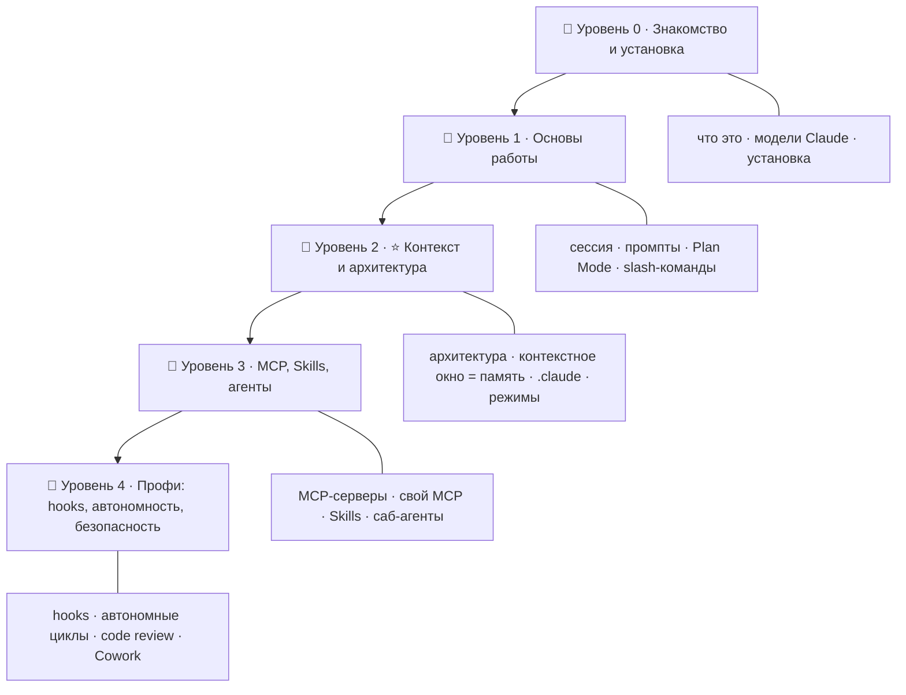

# ⚡ Дорожная карта: Claude Code — от новичка до эксперта

> 🎯 **Цель трека:** научиться превращать Claude Code из «умного автодополнения» в
> полноценную **рабочую среду агента**: настраивать его, давать ему инструменты (MCP),
> навыки (Skills), команды, хуки, агентов — и при этом понимать **главный ресурс агента:
> его память — контекстное окно**.

Это **седьмой трек** курса. Он не про язык программирования, а про **инструмент** —
Claude Code (CLI/IDE/desktop от Anthropic) — и про то, как с его помощью работать
эффективнее в десятки раз.

🧠 **Связь с темой курса.** У языков ядро — память (ручная → RAII → GC → borrow checker).
У ИИ ядро — **контекст**. У Claude Code ядро ровно то же: **контекстное окно — это
оперативная память агента**. Кто умеет ею управлять (что положить, что выгрузить, что
сохранить на диск через `CLAUDE.md` и память) — тот управляет качеством и стоимостью работы.

---

## 🗺️ Карта трека

| Уровень | Папка | О чём |
|--------|-------|-------|
| 🥚 0 · Знакомство | `00-setup` | Что такое Claude Code, семейство моделей Claude, установка и доступ. |
| 🐣 1 · Основы | `01-basics` | Первая сессия, дисциплина промптов, Plan Mode, итерации по фичам, slash-команды. |
| 🐥 2 · ⭐ Контекст и архитектура | `02-context` | Как устроен агент, **контекстное окно = память**, `/compact`, `.claude` и `CLAUDE.md`, режимы. |
| 🦅 3 · Расширение | `03-extend` | MCP-серверы, свой MCP на Python, Skills, агенты и саб-агенты. |
| 🚀 4 · Профи | `04-pro` | Hooks, автономные циклы, code review и безопасность, Connectors, Cowork и второй мозг, лимиты. |

---

## 🎯 Чему ты научишься

- Настраивать и эффективно использовать **Claude Code** (CLI, IDE, desktop).
- Понимать **семейство моделей Claude** и осознанно выбирать модель/режим.
- Управлять **контекстным окном** — главным ресурсом агента — и сессиями.
- Создавать и подключать **MCP-серверы** (готовые и свои на Python).
- Разрабатывать собственные **Skills** и **саб-агентов**, строить многоагентные процессы.
- Автоматизировать рутину через **slash-команды** и **hooks**.
- Запускать **автономные циклы**, делать **code review** и думать о **безопасности**.
- Строить «второй мозг» (долговременная память, заметки) и работать с **Connectors/Cowork**.
- Понимать **границы и лимиты** инструмента — и инженерную дисциплину вокруг ИИ.

---

## 👥 Для кого

- Для разработчиков любого уровня, кто хочет выжать максимум из ИИ-ассистента.
- Программировать почти не нужно — кроме блока «Свой MCP-сервер» (Python) и хуков (shell).
- Базовое понимание терминала/git помогает, но не обязательно для старта.

---

## 🧩 Как устроен каждый модуль

1. **📖 Теория** — простым языком, со схемами.
2. **🖼️ Схема** — как это работает «под капотом».
3. **🛠️ Практика** — конкретные команды и шаги.
4. **⚠️ Ловушки** — где обычно ошибаются.
5. **✅ Задачи** и **❓ Проверка себя**.
6. **Чек-лист** «готов идти дальше».

➡️ Начать: [00 · Что такое Claude Code](00-setup/00-what-is-claude-code.md)

> ⚠️ Claude Code развивается быстро. Команды и флаги могли измениться — всегда сверяйся
> с официальной документацией (`claude` → `/help`, или docs.claude.com / platform.claude.com).
