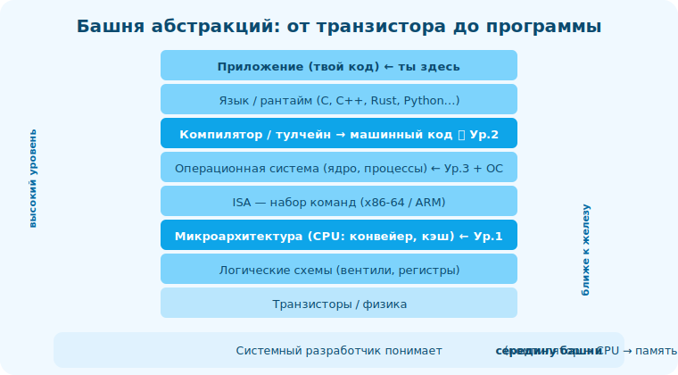

# 01 · Слои абстракции: от транзистора до программы 🖼️⭐⭐

> 🎯 **Цель блока:** увидеть всю «стопку» уровней, из которых состоит компьютер, — чтобы понимать,
> где ты находишься и что лежит под и над тобой.

---

## 📖 Компьютер — это башня абстракций

```
   каждый слой СКРЫВАЕТ сложность нижнего и ДАЁТ интерфейс верхнему. ты обычно работаешь на
   2-3 слоях, но проблемы и скорость определяются всеми.
```

🖼️
```
   ┌─────────────────────────────────────────┐ ← ТЫ обычно здесь
   │ Приложение (твой код на языке)           │
   ├─────────────────────────────────────────┤
   │ Язык / рантайм (C, C++, Rust, Python…)   │
   ├─────────────────────────────────────────┤
   │ Компилятор / тулчейн → машинный код      │ ← Уровень 2 трека (ядро)
   ├─────────────────────────────────────────┤
   │ Операционная система (ядро, процессы)    │ ← трек ОС + Уровень 3
   ├─────────────────────────────────────────┤
   │ Архитектура набора команд (ISA: x86/ARM) │
   ├─────────────────────────────────────────┤
   │ Микроархитектура (CPU: конвейер, кэш)    │ ← Уровень 1 трека
   ├─────────────────────────────────────────┤
   │ Логические схемы (вентили, регистры)     │
   ├─────────────────────────────────────────┤
   │ Транзисторы / физика                     │
   └─────────────────────────────────────────┘
```



💡 ⭐⭐ Главная идея: **между твоим кодом и транзисторами — много слоёв**, и каждый можно понять.
Ты не обязан знать физику, но «компилятор → машинный код → CPU → память» (середина башни) — это
ровно то, что отделяет системного разработчика, и это познаваемо.

---

## ⭐ Ключевые границы

```
   ИСХОДНЫЙ КОД ↔ МАШИННЫЙ КОД — граница компиляции. высокоуровневое превращается в инструкции
      процессора. (компилируемые языки) или интерпретируется на лету (Python/JS).

   ПРОГРАММА ↔ ОС — граница системных вызовов. программа просит ОС о ресурсах (память, файлы,
      сеть) через syscalls; ОС управляет железом за неё. (трек ОС)

   ISA ↔ МИКРОАРХИТЕКТУРА — ISA это «контракт» (какие инструкции есть, x86-64/ARM); микроархитектура
      это как конкретный CPU их исполняет (конвейер, кэш, спекуляция) — невидимо для программы, но
      определяет скорость.
```

💡 ⭐ Полезное различие: **ISA** (набор команд) — стабильный интерфейс, на который компилирует
компилятор. **Микроархитектура** — внутренняя реализация CPU, скрытая, но критичная для
производительности (Уровень 1). Программа «видит» ISA, а «чувствует» микроархитектуру через скорость.

---

## ⭐⭐ Зачем знать про слои

```
   • ЛОКАЛИЗАЦИЯ проблемы: тормозит — на каком слое? (алгоритм? кэш? syscall? сеть?)
   • ПРАВИЛЬНЫЙ инструмент: профайлер для CPU, strace для syscalls, дизассемблер для кода.
   • ОБОСНОВАННЫЕ решения: понимаешь цену перехода между слоями (вызов syscall дорогой; промах
     кэша дорогой; ветвление может быть дорогим).
   • ОБУЧАЕМОСТЬ: новый язык/платформа ложатся на ту же башню — учишь быстрее.
```

> 🧭 Это [системное мышление Senior](../../Senior/00-mindset/01-middle-vs-senior.md): видеть не
> только свой слой, а всю систему и связи между слоями.

---

## 📖 Цена пересечения границ

```
   переходы между слоями НЕ бесплатны (примерные порядки, «почувствовать масштаб»):
   • инструкция CPU            — доли наносекунды
   • попадание в кэш L1        — ~1 нс
   • промах кэша → RAM         — ~100 нс  (в ~100 раз дороже!)
   • системный вызов           — ~микросекунды
   • запрос по сети            — ~миллисекунды (в миллионы раз дороже инструкции)
   → понимая эти масштабы, ты знаешь, что реально дорого, и где оптимизировать.
```

💡 Эти «числа, которые должен знать каждый» — интуиция о стоимости. Промах кэша дороже инструкции
в ~100 раз; сеть — в миллионы. Поэтому «уменьшить число запросов к БД/сети» обычно важнее
микрооптимизаций инструкций.

---

## ⚠️ Ловушки

- ❌ Считать, что «всё одинаково быстро» — переходы между слоями отличаются на порядки.
- ❌ Путать ISA (интерфейс) и микроархитектуру (реализация).
- ❌ Оптимизировать верхний слой, когда проблема на нижнем (или наоборот).
- ❌ Думать, что нужно знать физику/транзисторы — достаточно середины башни.

---

## ✅ Упражнения на размышление

1. **Где я.** На каких слоях башни ты обычно работаешь? Какие для тебя «чёрные ящики»?
2. **Числа.** Запомни порядки: L1 ~1нс, RAM ~100нс, syscall ~мкс, сеть ~мс. Во сколько раз RAM
   дороже L1? Сеть дороже инструкции?
3. **Локализация.** Возьми «тормозящую» задачу. На каком слое, по-твоему, проблема? Как проверить?

---

## ❓ Проверь себя

1. Назови основные слои от транзистора до приложения.
2. Чем ISA отличается от микроархитектуры?
3. Почему важно знать порядки стоимости (L1/RAM/syscall/сеть)?
4. Какие три ключевые границы (компиляция, syscall, ISA↔микроарх)?

---

## ✅ Чек-лист

- [ ] Представляю башню абстракций целиком
- [ ] Различаю ISA и микроархитектуру
- [ ] Знаю порядки стоимости переходов между слоями
- [ ] Умею прикинуть, на каком слое проблема

➡️ Следующий: [02 · Инструменты](02-tools.md)
