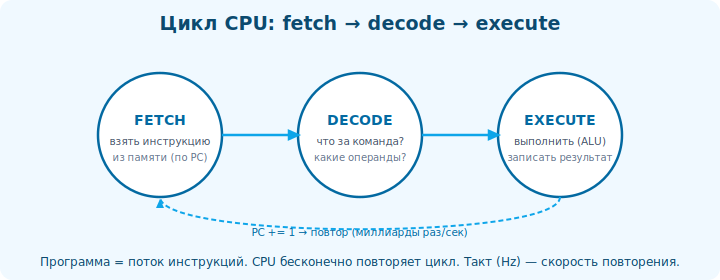

# 03 · CPU: цикл fetch-decode-execute 🖼️⭐⭐

> 🎯 **Цель блока:** понять, как процессор на самом деле исполняет программу — простой повторяющийся
> цикл, лежащий в основе всего.

---

## 📖 CPU просто повторяет один цикл

```
   процессор не «понимает» твой код — он бесконечно повторяет три шага над машинными инструкциями:

   1. FETCH (выборка)  — взять следующую инструкцию из памяти (по адресу в счётчике команд).
   2. DECODE (декод)   — разобрать, что это за инструкция и что делать.
   3. EXECUTE (исполн) — выполнить (сложить, переместить, сравнить, перейти…).
   → повторить. миллиарды раз в секунду.
```



💡 ⭐⭐ Вся работа компьютера — это **этот цикл** над потоком простых инструкций. Программа = длинный
список инструкций в памяти; CPU идёт по ним одну за другой (пока инструкция перехода не отправит
его в другое место). Никакой магии — выборка, декод, исполнение, повтор.

🖼️
```
   ┌──────────────────────────────────────────┐
   │  PC (счётчик команд) → адрес инструкции   │
   │            ↓ FETCH                          │
   │  [ инструкция из памяти ]                  │
   │            ↓ DECODE                         │
   │  «это ADD регистров R1 и R2»               │
   │            ↓ EXECUTE                         │
   │  R1 = R1 + R2 ; PC → следующая             │
   └──────────────┬───────────────────────────┘
                  └──► повторить (миллиарды раз/сек)
```

---

## ⭐ Из чего состоит CPU (упрощённо)

```
   🧮 ALU (арифметико-логическое устройство) — считает: сложение, вычитание, И/ИЛИ, сравнение.
   📋 РЕГИСТРЫ — крошечная сверхбыстрая память внутри CPU (модуль 04).
   🎯 PC / Instruction Pointer — адрес следующей инструкции.
   🔀 Управление — декодирует инструкции, дирижирует.
   💾 КЭШ — быстрая память рядом с ядром (модуль 08).
   ⏱️ ТАКТ — «пульс» CPU; частота (ГГц) = миллиарды тактов в секунду.
```

💡 ⭐ Тактовая частота (например, 3 ГГц = 3 млрд тактов/сек) — «скорость пульса». Но
производительность ≠ только частота: важно, сколько полезного делается за такт (конвейер, кэш,
параллелизм — дальше). Поэтому современные CPU не гонятся только за ГГц.

---

## ⭐⭐ Инструкции — это очень простые операции

```
   CPU умеет только ПРОСТОЕ. твоё `x = a + b * c;` превращается в НЕСКОЛЬКО инструкций:
   • загрузи b в регистр
   • загрузи c в регистр
   • умножь
   • загрузи a
   • сложи
   • сохрани результат в x (память)

   типы инструкций (немного категорий):
   • перемещение данных (load/store: память↔регистр)
   • арифметика/логика (add, sub, mul, and, or…)
   • сравнение и переходы (cmp, jump — основа if/циклов!)
   • вызовы функций (call/ret — основа функций, модуль 17)
```

💡 ⭐⭐ Важное осознание: **высокоуровневые конструкции — это комбинации простых инструкций**. `if` =
сравнение + условный переход. Цикл = переход назад. Функция = call/ret + стек. Понимая это, ты
видишь, во что превращается твой код (Уровень 2 — увидишь буквально, в ассемблере).

---

## 📖 Один поток инструкций, но не строго по очереди

```
   логически CPU идёт по инструкциям по порядку. но РЕАЛЬНО современный CPU хитрее:
   • КОНВЕЙЕР — выполняет части нескольких инструкций одновременно (модуль 06).
   • ВНЕ ПОРЯДКА (out-of-order) — может переставлять независимые инструкции для скорости.
   • СПЕКУЛЯЦИЯ — угадывает ветвления и выполняет наперёд (модуль 06).
   снаружи результат как будто «по порядку», внутри — параллелизм ради скорости.
```

⚠️ Это создаёт разрыв: твоя ментальная модель «инструкция за инструкцией» верна для РЕЗУЛЬТАТА, но
скорость определяется тем, насколько хорошо код ложится на эти хитрости (Уровни 1, 4).

---

## ⚠️ Ловушки

- ❌ Думать, что CPU «понимает» язык — он исполняет простые машинные инструкции.
- ❌ Считать, что одна строка кода = одна инструкция (обычно несколько).
- ❌ Мерить CPU только частотой (ГГц) — важна работа за такт.
- ❌ Считать исполнение строго последовательным (конвейер/out-of-order).

---

## ✅ Упражнения

1. **Разложи выражение.** Возьми `y = (a + b) * c;`. Распиши на «инструкции» (загрузки, умножение,
   сложение, сохранение). Сколько шагов?
2. **godbolt.** Напиши эту функцию, посмотри ассемблер. Совпало с твоим разложением?
3. **if в переходы.** Подумай, как `if (a > b) x = 1; else x = 2;` выражается через сравнение +
   переход. Проверь в godbolt.
4. **Частота.** Если CPU 3 ГГц и инструкция ~1 такт, сколько инструкций в секунду (порядок)?

---

## ❓ Проверь себя

1. Из каких трёх шагов состоит базовый цикл CPU?
2. Что такое PC (счётчик команд) и регистры/ALU?
3. Почему одна строка кода — это обычно несколько инструкций?
4. Почему реальное исполнение не строго последовательно?

---

## ✅ Чек-лист

- [ ] Понимаю цикл fetch-decode-execute
- [ ] Знаю основные части CPU (ALU, регистры, PC, кэш, такт)
- [ ] Вижу, что высокоуровневое = комбинации простых инструкций
- [ ] Знаю, что CPU исполняет с конвейером/вне порядка ради скорости

➡️ Следующий: [04 · Регистры](04-registers.md)
